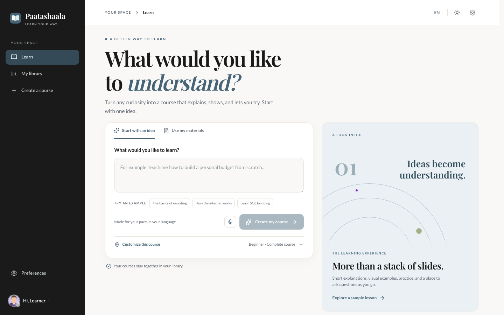

# Paatashaala

[Visit the website](https://kaushik-holla.github.io/paatashaala/) · [Explore the code](https://github.com/kaushik-holla/paatashaala)

Create a course from a question or your own material, then learn through slides, practice, quizzes, and an interactive classroom. Paatashaala focuses on English-first learners in the United States and India, with a calm ivory, charcoal, and steel-blue interface across the entire learning flow.

Paatashaala is an independent project with its own interface and product direction. Its open-source foundation and license notices are acknowledged in [Credits and license](#credits-and-license).

## See Paatashaala

Start with a topic, then learn by trying things yourself. These are screenshots of the app running locally. The [sample lesson](http://localhost:3000/sample-lesson) works without an AI provider after setup.

**Create a course · light mode**



**Explore a sample lesson · light and dark modes**

| Light mode | Dark mode |
| --- | --- |
|  |  |

## What you can do

- Start with a topic, a PDF, or other supported course material.
- Choose a lesson length and review the outline before building.
- Learn with an interactive classroom, quizzes, tutor chat, and a visual editor.
- Resume your courses from the home screen.
- Connect a ChatGPT account with OpenAI’s device-code sign-in, or bring an API key. Choose the default model in **Settings → AI providers**; API-key providers can fetch their available models, and any provider can accept a model ID manually.
- Try the [sample lesson](http://localhost:3000/sample-lesson) without setting up an AI provider.

The setup interface offers ChatGPT sign-in, OpenAI API, Azure OpenAI, Anthropic, Amazon Bedrock, Google Gemini, xAI, OpenRouter, and self-hosted Ollama/Lemonade for text. Media, speech, search, and document options are similarly narrowed to services suitable for a US/India-focused setup. Provider access and individual model availability still depend on your account, region, and the provider's current terms. Existing imported courses can retain legacy provider references; new setup does not promote those services.

## Run locally

Requires Node.js 22.19 or newer and pnpm 10 or newer.

```bash
git clone https://github.com/kaushik-holla/paatashaala.git
cd paatashaala
pnpm install
cp .env.example .env.local
pnpm dev
```

Open [localhost:3000](http://localhost:3000). To use ChatGPT, enable device code sign-in in your [ChatGPT Security Settings](https://learn.chatgpt.com/docs/auth#preferred-device-code-authentication-beta), set `CHATGPT_SESSION_SECRET` in `.env.local` to a random value from `openssl rand -hex 32`, then open **Settings → AI providers → ChatGPT** and enter the one-time code on OpenAI’s sign-in page. Managed workspaces may require an admin to allow device code sign-in. Choose a default model there. Alternatively, paste an API key for another provider, fetch its models, and choose your default. You can also configure a server-managed key in `.env.local`:

```env
OPENAI_API_KEY=your-api-key
DEFAULT_MODEL=openai:gpt-6-sol
```

Leave `OPENAI_MODELS` unset to fetch and manage models from the UI. An operator can set it to pin an approved list for a shared deployment; pinned models remain selectable as the default but cannot be edited by visitors.

Other commonly used choices include `ANTHROPIC_API_KEY`, `GOOGLE_API_KEY`, `GROK_API_KEY`, and `OPENROUTER_API_KEY`; see [.env.example](.env.example). The app supports separate optional image, video, speech, search, and storage configuration. Local Ollama and Lemonade do not require an API key, but do require their own running service and an explicit base URL.

**ChatGPT sign-in:** The device-code flow opens an OpenAI page in your browser and connects your ChatGPT account for text generation through the account-backed model transport. Device code sign-in must be enabled on your account; it is distinct from the normal browser callback used by OpenAI’s local CLI. It does not supply credentials to image, speech, or other separately configured services. Each browser gets its own session; the access and refresh tokens are encrypted in local server storage and are never placed in browser settings. Keep the same `CHATGPT_SESSION_SECRET` in `.env.local` across restarts or you will need to sign in again.

## Local use

Clone the repository and run it on your own computer with `pnpm dev`, following the steps above. Keep `.env.local`, provider keys, course exports, and local data outside Git. Browser-stored courses are tied to the browser profile and site address; export any course you want to keep.

For macOS start/stop scripts and backup notes, see [Paatashaala local setup](PAATASHAALA-LOCAL-GUIDE.md).

## Credits and license

Paatashaala builds on [OpenMAIC](https://github.com/THU-MAIC/OpenMAIC) and the research described in [From MOOC to MAIC](https://doi.org/10.1007/s11390-025-6000-0). We thank the original authors for the open-source classroom foundation. Paatashaala is not affiliated with or endorsed by THU-MAIC. The original THU-MAIC copyright and MIT permission notice remain in [LICENSE](LICENSE). The main application remains under MIT, subject to the separate terms of the bundled components below. Contributions are welcome through this repository.

Bundled components retain their own notices and terms:

- [`packages/mathml2omml`](packages/mathml2omml/LICENSE): LGPL-3.0-or-later.
- [`packages/pptxgenjs`](packages/pptxgenjs/LICENSE): MIT; copyright Brent Ely, with source attribution to OfficeGen in the [PptxGenJS source header](packages/pptxgenjs/src/pptxgen.ts).
- Bundled renderer font licenses are in [`packages/@paatashaala/renderer/font-licenses`](packages/@paatashaala/renderer/font-licenses).
