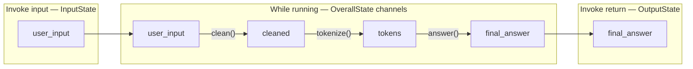
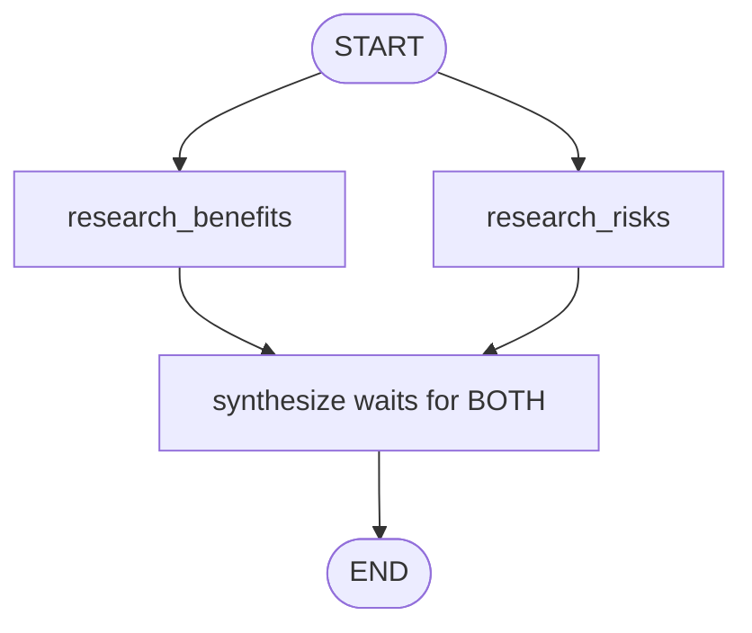
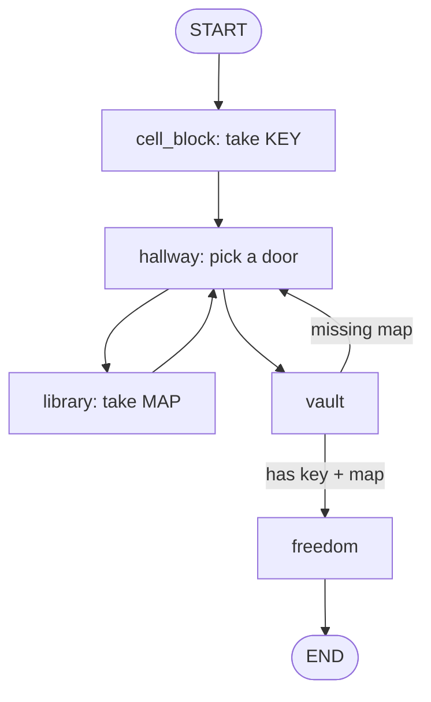
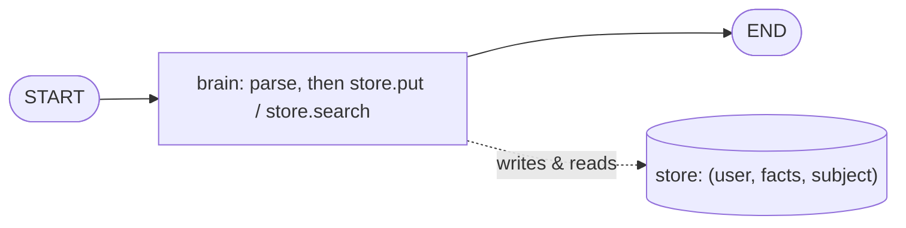
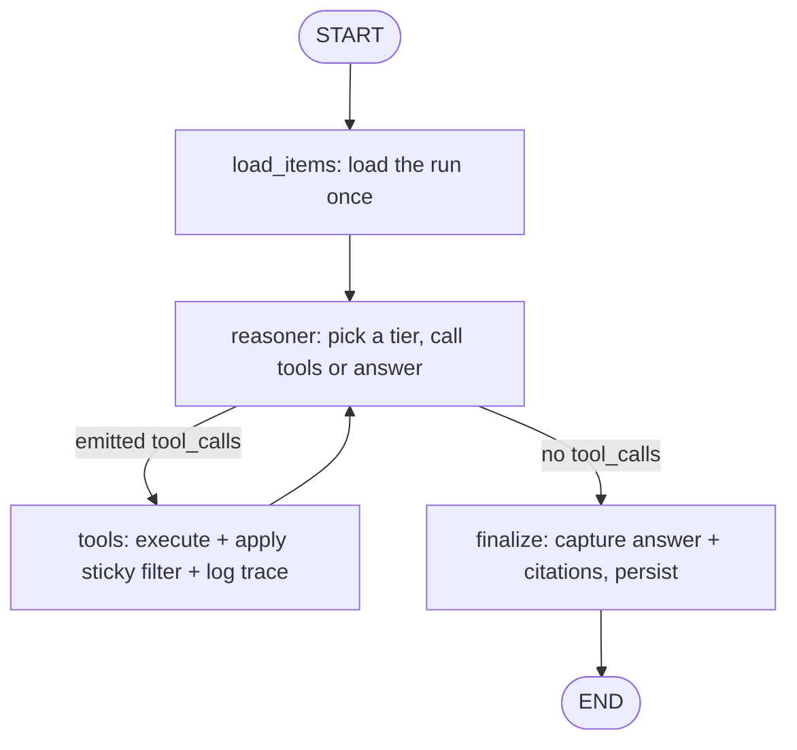
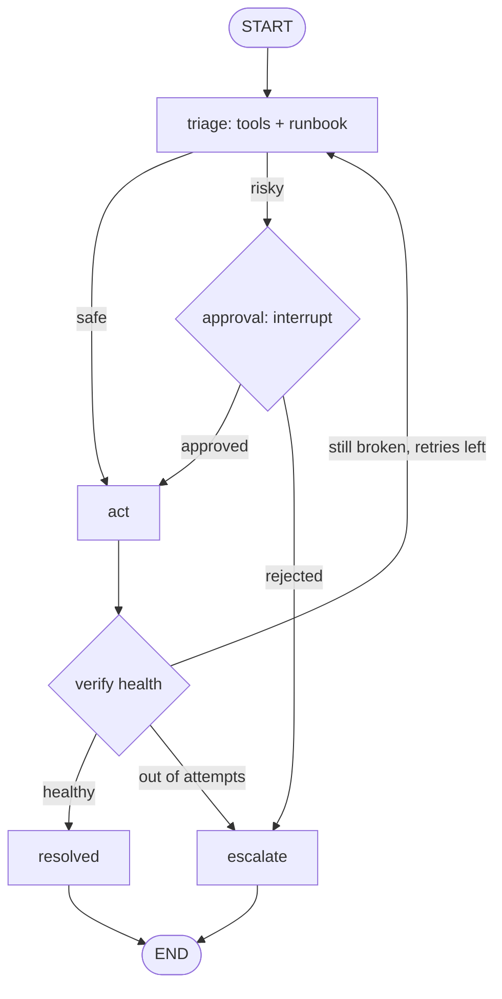
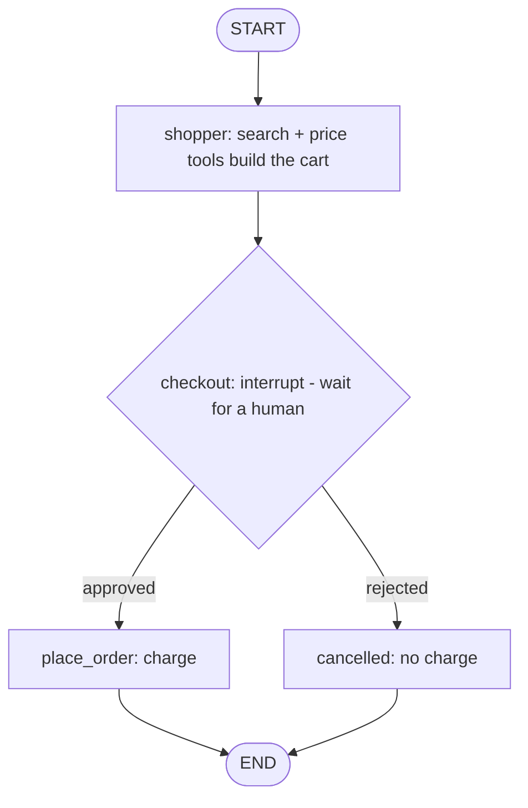
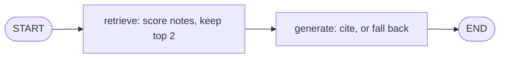
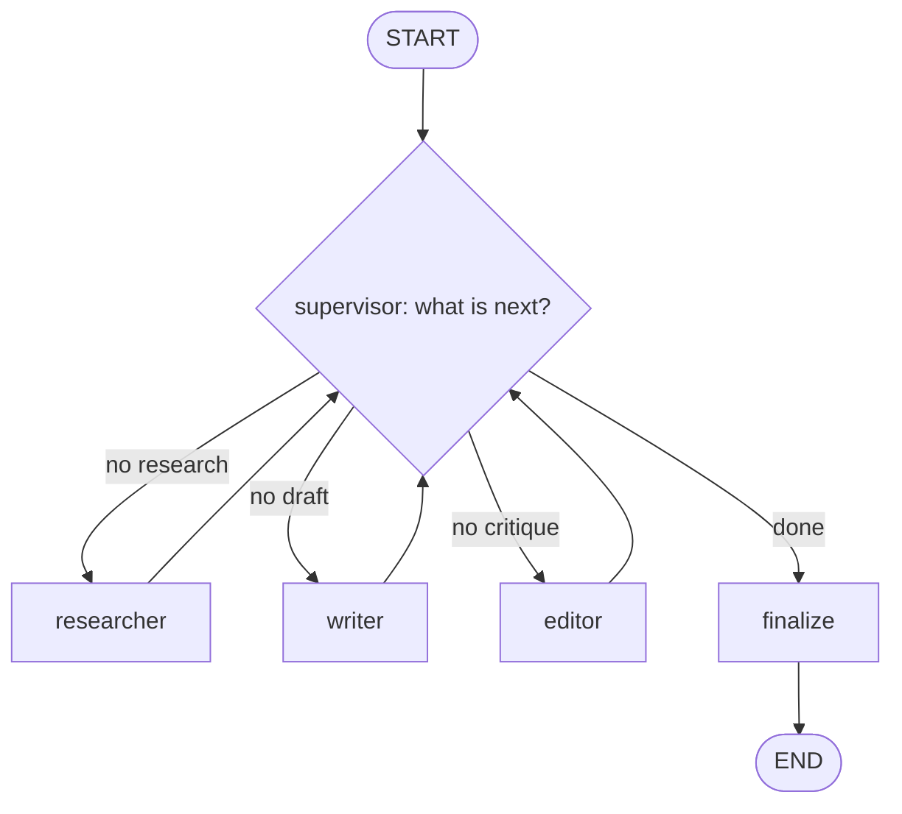

<!-- Converted from LangGraph_1x_Complete_Guide.ipynb; Markdown and code cells preserved for reference upload. -->

<a id="intro"></a>

# LangGraph 1.x Complete Guide: Zero To Application Builder

This notebook is a complete, practical guide to **LangGraph 1.x**. It is designed to be the one notebook you can study when you want to understand LangGraph deeply enough to build real applications: chatbots, tool-using agents, RAG agents, human-approval workflows, planning workflows, and multi-agent systems.

This is intentionally not a minimal notebook. Each major pattern includes:

1. Concept and mental model.
2. Runnable code.
3. State trace and expected output.
4. Common mistakes.
5. Production guidance.
6. Interview and application-building notes.

**Target version:** LangGraph 1.x using the current docs at `https://docs.langchain.com/oss/python/langgraph/overview`.

**Notebook style:** cells are saved unexecuted. API-dependent examples are guarded so the notebook can be opened and studied even without provider keys.

## What Is Different From Older LangGraph Tutorials?

LangGraph 1.x emphasizes several patterns that older tutorials often miss:

| Area | 1.x pattern used in this notebook |
|---|---|
| Checkpointing | `InMemorySaver`, SQLite/Postgres/Redis/Mongo checkpointers for production |
| State | `MessagesState`, explicit reducers, input/output/private state schemas |
| Runtime config | `context_schema` plus `Runtime`, not ad hoc globals in graph state |
| Streaming | `version="v2"` StreamPart format with `type`, `ns`, and `data` |
| Interrupts | Dynamic `interrupt()` plus `Command(resume=...)` |
| Routing | Conditional edges when only routing, `Command` when updating and routing |
| Map-reduce | `Send` for dynamic parallel fan-out |
| Memory | Checkpointer for thread memory, store for cross-thread long-term memory |
| Agents | `langchain.agents.create_agent` for common agents; Graph API for custom orchestration |
| Functional workflows | `@entrypoint` and `@task` for durable procedural workflows |

## How To Study

1. Run Sections 0-6 first. These teach the core runtime without requiring an LLM key.
2. Add a model provider and run Sections 9-14. These teach LLM agents and tools.
3. Study Sections 15-19 when building applications.
4. Use Section 20 as the FAQ/debugging reference while coding.

When you explain LangGraph, always be able to answer four questions: what is in state, which node runs next, how updates merge, and why execution stops.

## Table of Contents

Click any link to jump to that section in this notebook.

- [Introduction](#intro)

**[Section 0: Environment, Version, And Model Setup](#section-0)**
  - [0.1 Version And API Guard](#section-0-1)
  - [0.2 Model Factory For Guarded LLM Examples](#section-0-2)
  - [0.3 Observability: LangSmith, MLflow, Traces, And Spans](#section-0-3)
  - [0.4 MLflow Tracing Setup](#section-0-4)
  - [0.5 First MLflow Trace: Plain Python](#section-0-5)
  - [0.6 Parent And Child Spans](#section-0-6)
  - [0.7 Searching Traces](#section-0-7)
  - [0.8 Tiny LangGraph With MLflow Autologging](#section-0-8)
  - [0.9 Manual Spans Inside LangGraph Nodes](#section-0-9)
  - [0.10 Failure And Safe Tracing](#section-0-10)

**[Section 1: Mental Model Of LangGraph 1.x](#section-1)**
  - [1.1 Hello World Graph](#section-1-1)
  - [1.2 MessagesState: The Common Chat State](#section-1-2)
  - [1.3 Graph API vs Functional API vs `create_agent`](#section-1-3)

**[Section 2: State Schemas And Reducers](#section-2)**
  - [2.1 TypedDict State](#section-2-1)
  - [2.2 Dataclass State with Defaults](#section-2-2)
  - [2.3 Pydantic State in LangGraph](#section-2-3)
  - [2.5 Reducer With `Annotated`](#section-2-5)
  - [2.6 `add_messages`: Message-Aware Reducer](#section-2-6)
  - [2.7 `Overwrite`: Bypass A Reducer](#section-2-7)
  - [2.8 Input, output, and private state](#section-2-8)

**[Section 3: Nodes, Edges, Branches, Loops, And Super-Steps](#section-3)**
  - [3.1 Sequential Graph With `add_sequence`](#section-3-1)
  - [3.2 Conditional Edges And Routing Functions](#section-3-2)
  - [3.3 Parallel Fan-Out And Fan-In](#section-3-3)
  - [3.4 Loops And Recursion Limits](#section-3-4)

**[Section 4: `Command`, `Send`, And Dynamic Control Flow](#section-4)**
  - [4.1 `Command`: Update And Route Together](#section-4-1)
  - [4.2 `Send`: Dynamic Map-Reduce](#section-4-2)
  - [4.3 Routing Decision Guide](#section-4-3)

**[Section 5: Runtime Context, Config, And Execution Info](#section-5)**
  - [5.1 `context_schema` And `Runtime`](#section-5-1)
  - [5.2 Config And `thread_id`](#section-5-2)
  - [5.3 Execution Metadata In Nodes](#section-5-3)

**[Section 6: Streaming In LangGraph 1.x](#section-6)**
  - [6.1 `updates` And `values`](#section-6-1)
  - [6.2 Custom Streaming With `get_stream_writer`](#section-6-2)
  - [6.3 Streaming LLM Tokens With `messages`](#section-6-3)
  - [6.4 Streaming Debug Modes](#section-6-4)

**[Section 7: Persistence, Checkpointing, And Time Travel](#section-7)**
  - [7.1 Short-Term Memory With `InMemorySaver`](#section-7-1)
  - [7.2 Inspect Current State And History](#section-7-2)
  - [7.3 `update_state`](#section-7-3)
  - [7.4 Durable Checkpointers In Production](#section-7-4)

**[Section 8: Memory: Short-Term State vs Long-Term Store](#section-8)**
  - [8.1 Long-Term Store With Runtime Context](#section-8-1)
  - [8.2 Managing Long Conversations](#section-8-2)

**[Section 9: Tools And Tool Calling From First Principles](#section-9)**
  - [9.1 Define Tools](#section-9-1)
  - [9.2 Manual Tool Executor Without An LLM](#section-9-2)
  - [9.3 Bind Tools To A Model](#section-9-3)

**[Section 10: Build A ReAct Agent With The Graph API](#section-10)**
  - [10.1 Deterministic ReAct Skeleton Without LLM](#section-10-1)
  - [10.2 Real Tool-Calling Graph Agent](#section-10-2)
  - [10.3 Agent Loop Failure Modes](#section-10-3)
  - [11.1 Approval Workflow — Tutorial](#section-11-1)

**[Section 11: Human-In-The-Loop With `interrupt`](#section-11)**
  - [11.1 Approval Workflow](#section-11-1)
  - [11.2 Review And Edit State](#section-11-2)
  - [11.3 Static Interrupts For Debugging](#section-11-3)

**[Capstone Project: AI Incident Commander (On-Call SRE Copilot)](#capstone-incident-commander)**

**[Section 12: Functional API With `@entrypoint` And `@task`](#section-12)**
  - [12.1 Simple Durable Functional Workflow](#section-12-1)
  - [12.2 Short-Term Memory With `previous`](#section-12-2)
  - [12.3 Return Value vs Saved Value With `entrypoint.final`](#section-12-3)
  - [12.4 Functional Human-In-The-Loop](#section-12-4)

**[Section 13: `create_agent` And When To Use It](#section-13)**
  - [13.1 Minimal `create_agent`](#section-13-1)
  - [13.2 MLflow Tracing For `create_agent`](#section-13-2)
  - [13.3 Middleware Concepts](#section-13-3)

**[Section 14: RAG And Research Agent Blueprint](#section-14)**
  - [14.1 Deterministic RAG Without External Services](#section-14-1)
  - [14.2 RAG Production Notes](#section-14-2)

**[Section 15: Planning And Workflow Agents](#section-15)**
  - [15.1 Deterministic Planner/Executor](#section-15-1)
  - [15.2 When To Use Planning](#section-15-2)

**[Section 16: Multi-Agent Systems](#section-16)**
  - [16.1 Deterministic Supervisor Pattern](#section-16-1)
  - [16.2 Multi-Agent Pattern Selection](#section-16-2)

**[Section 17: Deep Agents Framework And OKF](#section-17)**
  - [17.1 What Deep Agents Gives You Out Of The Box](#section-17-1)
  - [17.2 Minimal `create_deep_agent`](#section-17-2)
  - [17.3 OKF Files: Portable Knowledge Bundles](#section-17-3)
  - [17.4 Mounting OKF With Deep Agents (`OKFBackend`)](#section-17-4)
  - [17.5 Decision Guide: Improve Your Workflows With Deep Agents + OKF](#section-17-5)

**[Section 18: Application Blueprints](#section-18)**
  - [18.1 Customer Support App Blueprint](#section-18-1)
  - [18.2 Production Agent Checklist](#section-18-2)

**[Section 19: Testing And Debugging](#section-19)**
  - [19.1 Minimal Test Examples](#section-19-1)
  - [19.2 Debugging Playbook](#section-19-2)
  - [19.3 MLflow Trace Search Patterns](#section-19-3)

**[Section 20: Deployment And Production Hardening](#section-20)**
  - [20.1 Graph Migration Guidance](#section-20-1)
  - [20.2 Security Checklist](#section-20-2)
  - [20.3 MLflow Production Tracing Checklist](#section-20-3)

**[Section 21: FAQ And Interview Answers](#section-21)**

**[Section 22: Capstone Architecture](#section-22)**
  - [22.1 Final Build Checklist](#section-22-1)

## This Is Also A Build-Along: 6 Projects You Ship As You Learn

Reference docs are useful, but you remember what you *build*. So this notebook is laced with **6 hands-on projects** (including a mid-course capstone), each one dropped right after you have learned exactly enough to build it. Every project runs offline (no API key needed) and ends with a resume bullet you can actually use.

| # | After Section | Project | What it proves you can do |
|---|---|---|---|
| 1 | 6 (core runtime) | **Escape the Vault** - a text-adventure engine | Model anything as a graph: state, reducers, `Command` routing, loops, streaming |
| 2 | 8 (memory) | **Your AI Second Brain** - cross-session memory | Build assistants that remember users across sessions (checkpointer + store) |
| * | 11 (mid-course capstone) | **AI Incident Commander** - on-call SRE copilot | Fuse tools, memory, the ReAct loop, and human approval into one safe agent |
| 3 | 13 (agents + HITL) | **Shopping Agent that asks before it buys** | Tool-using agents with human-approval gates for risky actions |
| 4 | 14 (RAG) | **Chat With Your Notes** - mini RAG | Grounded Q&A over your documents, with citations and a no-hallucination fallback |
| 5 | 16 (multi-agent) | **Autonomous Content Studio** - a team of agents | Supervisor/worker multi-agent systems that coordinate to finish a task |

**How to use them:** read the sections, then at each project hit "Run All" on the cells, read the output, and then attempt at least one "Level up" challenge before moving on. That loop, learn -> build -> extend, is what makes the concepts stick (and what makes you confident in an interview).

Look for the **Project** headers in the table of contents. They are your checkpoints.

<a id="section-0"></a>

# Section 0: Environment, Version, And Model Setup

LangGraph itself does not require an LLM key. Many examples in this notebook are deterministic Python graphs and run with only `langgraph` installed. LLM/tool-agent examples are guarded behind provider checks.

For the latest 1.x API, install or upgrade:

```bash
pip install -U langgraph langchain langchain-core
```

Optional integrations:

```bash
pip install -U langchain-openai langchain-anthropic langchain-groq langchain-ollama
pip install -U langgraph-checkpoint-sqlite langgraph-checkpoint-postgres
pip install -U mlflow
```

Important version notes:

| Feature | Minimum version guidance |
|---|---|
| Core Graph API | `langgraph>=1.0` |
| v2 streaming format | `langgraph>=1.1` |
| `Runtime.execution_info` | `langgraph>=1.1.5` |
| Some timeout/error-handler APIs | `langgraph>=1.2`, currently alpha in docs |

This notebook focuses on stable 1.x patterns and marks alpha features as optional notes.

```python
# Uncomment only when you need to install packages in the active notebook kernel.
# %pip install -U langgraph langchain langchain-core
# %pip install -U langchain-openai langchain-anthropic langchain-groq langchain-ollama
# %pip install -U langgraph-checkpoint-sqlite langgraph-checkpoint-postgres
# %pip install -U mlflow
# %pip install -U python-dotenv nest-asyncio
```

**Expected Output**

```text
No output unless installation lines are uncommented.
```

<a id="section-0-1"></a>

## 0.1 Version And API Guard

### What problem does this solve?

This notebook targets **LangGraph 1.x** APIs. Running it on 0.x packages will fail in confusing ways. This cell checks versions and sets convenience flags for later guarded examples.

### What the next code cell does

1. Loads `.env` if `python-dotenv` is available.
2. Prints versions for LangGraph, LangChain, providers, Pydantic, MLflow.
3. Sets flags like `LLM_AVAILABLE` / provider availability for skip-friendly cells later.

### Watch for

If `langgraph` prints `0.x`, upgrade before treating later cells as executable 1.x code.

```python
# Standard library imports for env loading, HTTP probes, and version checks.
import importlib.util
import os
import urllib.request
import json
from importlib.metadata import PackageNotFoundError, version

# Load .env so API keys and local settings are available to later cells.
# This is NOT LangGraph state/config/context — just process-level env vars.
try:
    from dotenv import load_dotenv
    load_dotenv()  # reads .env into os.environ before any LLM client is constructed
except Exception:
    pass  # notebook still runs offline if python-dotenv is missing


def package_version(package: str) -> str:
    # Return installed version, or a friendly message if the package is missing.
    try:
        return version(package)  # importlib.metadata lookup by PyPI distribution name
    except PackageNotFoundError:
        return "not installed"


# Core libraries this notebook expects — we print versions to catch mismatches early.
# LangGraph 1.x APIs differ from 0.x; version skew here often explains later import errors.
packages = [
    "langgraph",
    "langchain",
    "langchain-core",
    "langchain-openai",
    "langchain-anthropic",
    "langchain-groq",
    "langchain-ollama",
    "pydantic",
    "mlflow",
]

# One line per package so learners can compare their environment to the guide.
for package in packages:
    print(f"{package}: {package_version(package)}")

# These flags gate later cells: exercises skip gracefully when no provider is configured.
# They are module-level booleans, not graph state — later cells branch on them at import time.
OPENAI_AVAILABLE = bool(os.getenv("OPENAI_API_KEY"))
ANTHROPIC_AVAILABLE = bool(os.getenv("ANTHROPIC_API_KEY"))
GROQ_AVAILABLE = bool(os.getenv("GROQ_API_KEY"))


def list_ollama_models(base_url: str = "http://localhost:11434") -> list[str]:
    # Ask a local Ollama server which models are loaded (empty list if Ollama is down).
    try:
        # Short timeout keeps notebook startup fast when Ollama is not running.
        with urllib.request.urlopen(f"{base_url.rstrip('/')}/api/tags", timeout=1.5) as response:
            payload = json.load(response)
        return [model["name"] for model in payload.get("models", [])]
    except Exception:
        return []  # treat unreachable Ollama the same as "no models"


OLLAMA_MODELS = list_ollama_models()
# Ollama counts as available only when both the client library and at least one model exist.
OLLAMA_AVAILABLE = importlib.util.find_spec("langchain_ollama") is not None and bool(OLLAMA_MODELS)
# Any one working provider is enough for LLM-dependent lessons later in the notebook.
LLM_AVAILABLE = OPENAI_AVAILABLE or ANTHROPIC_AVAILABLE or GROQ_AVAILABLE or OLLAMA_AVAILABLE
# MLflow is optional observability — tracing cells check this before importing mlflow.
MLFLOW_AVAILABLE = importlib.util.find_spec("mlflow") is not None

# Human-readable summary of what the notebook can actually use at runtime.
print("OPENAI_API_KEY set:", OPENAI_AVAILABLE)
print("ANTHROPIC_API_KEY set:", ANTHROPIC_AVAILABLE)
print("GROQ_API_KEY set:", GROQ_AVAILABLE)
print("Ollama models:", OLLAMA_MODELS or "none")
print("Ollama available:", OLLAMA_AVAILABLE)
print("Any LLM available:", LLM_AVAILABLE)
print("MLflow available:", MLFLOW_AVAILABLE)

# LangGraph 1.x APIs differ from 0.x — warn if an old major version is installed.
if package_version("langgraph").startswith("0."):
    print("WARNING: This notebook targets LangGraph 1.x. Upgrade with `%pip install -U langgraph`.")
```

    **Expected Output**

    ```text
    langgraph: 1.x.x or not installed
langchain: 1.x.x or not installed
...
Any LLM available: True or False
    ```

<a id="section-0-2"></a>

## 0.2 Model Factory For Guarded LLM Examples

### What problem does this solve?

Tutorials that hard-code one provider break the moment your API key differs. Prefer a small factory that picks a model from environment variables.

### Mental model

```text
CHAT_MODEL_ID=openai:gpt-4o-mini
CHAT_MODEL_ID=anthropic:claude-3-5-haiku-latest
CHAT_MODEL_ID=groq:llama-3.3-70b-versatile
CHAT_MODEL_ID=ollama:llama3.1
```

`get_chat_model()` uses `init_chat_model`-style identifiers so later cells stay provider-agnostic. Cells that need an LLM check `LLM_AVAILABLE` and skip cleanly when nothing is configured.

### Watch for

Set keys in `courses/langgraph/.env` (see `.env.example`). You can still run most deterministic graph lessons without a provider.

```python
# Pick the first available chat model from env vars or installed providers.
def default_model_id() -> str | None:
    # Explicit override wins — lets learners swap models without editing code.
    if os.getenv("CHAT_MODEL_ID"):
        return os.getenv("CHAT_MODEL_ID")
    # Fall through a priority list of providers the notebook detected at import time.
    if ANTHROPIC_AVAILABLE:
        return "anthropic:claude-3-5-haiku-latest"
    if OPENAI_AVAILABLE:
        return "openai:gpt-5.4-mini"
    if GROQ_AVAILABLE:
        return "groq:llama-3.3-70b-versatile"
    if OLLAMA_AVAILABLE:
        return f"ollama:{OLLAMA_MODELS[0]}"
    return None


# Resolved once at module load so every cell shares the same default.
DEFAULT_MODEL_ID = default_model_id()


def get_chat_model(model_id: str | None = None, temperature: float = 0, streaming: bool = False):
    """Return a LangChain chat model using the current LangChain 1.x init API."""
    # Use the caller's model_id, or fall back to the notebook-wide default.
    selected_model = model_id or DEFAULT_MODEL_ID
    if not selected_model:
        raise RuntimeError("No model provider is configured. Set a key or CHAT_MODEL_ID.")
    # init_chat_model is the LangChain 1.x one-liner for any supported provider string.
    from langchain.chat_models import init_chat_model
    return init_chat_model(selected_model, temperature=temperature, streaming=streaming)


print("Default model id:", DEFAULT_MODEL_ID or "none")
```

**Expected Output**

```text
Default model id: provider:model or none
```

<a id="section-0-3"></a>

## 0.3 Observability: LangSmith, MLflow, Traces, And Spans

A LangGraph app is not one function call. It is a runtime that may route through nodes, call models, execute tools, retrieve documents, pause for humans, resume from checkpoints, and loop. Plain logs are still useful, but logs usually answer isolated questions such as `what did this line print?` Traces answer a larger question: `what happened during this whole request, in what order, how long did each step take, and where did it fail?`

A trace is the full execution tree for one request or business operation. A span is one timed operation inside that trace. Searchable fields are indexed labels or context values that let you find the right trace later without reading every log line.

Example execution tree:

```text
Trace: customer asks about refund policy
  Span: graph invocation
    Span: classify_intent node
    Span: retrieve_policy node
      Span: vector search
    Span: draft_answer node
      Span: chat model call
    Span: compliance_check node
```

Why this matters in real work:

1. If an answer is wrong, inspect the trace to see whether routing, retrieval, tool execution, or the model caused it.
2. If latency is high, inspect span durations to find the slow node, model, retriever, or external API.
3. If a user reports a production issue, search by request ID, user/session ID, tenant, environment, or thread ID.
4. If an agent loops, inspect the repeated model and tool spans instead of guessing from disconnected logs.
5. If sensitive data appears in traces, fix instrumentation and redaction before scaling traffic.

This notebook uses two observability paths:

| Tool | Best fit | How it connects to LangGraph |
|---|---|---|
| LangSmith | LangChain/LangGraph-native debugging, prompt iteration, datasets, evaluations | `LANGSMITH_TRACING=true` and LangChain callbacks |
| MLflow Tracing | Enterprise GenAI observability, self-hosting, trace search, feedback, production monitoring, OpenTelemetry compatibility | `mlflow.langchain.autolog(log_traces=True)` plus optional manual spans |

MLflow terminology you need before reading the code:

| Concept | Practical meaning | LangGraph example |
|---|---|---|
| Tracking URI | Address where the MLflow client writes and reads tracking data | Local `file:///.../mlruns`, company MLflow server, or Databricks URI |
| Backend store | Storage for experiments, runs, params, metrics, traces, and metadata | Local folder for learning; SQL-backed store for production search volume |
| Experiment | Project namespace that groups related MLflow records | `customer-support-agent-prod` or this notebook's `langgraph-1x-complete-guide` |
| Trace | One request-level execution tree | One `graph.invoke(...)`, one `create_agent.invoke(...)`, or one request handler |
| Span | One timed child operation inside a trace | Node, model call, tool call, retriever call, parser, validator, or custom block |
| Tags | Searchable labels for operations and ownership | `app`, `environment`, `team`, `example`, `risk_level` |
| Metadata | Request context for correlation | user, session, tenant, region, thread ID, deployment version |
| Inputs/outputs | Payloads attached to spans or traces | Useful for debugging, but dangerous if they contain prompts, documents, PII, or secrets |

How MLflow hooks into LangGraph: LangGraph runs through LangChain's Runnable/callback system. `mlflow.langchain.autolog(log_traces=True)` installs an MLflow callback tracer. When LangGraph, LangChain models, tools, or nested runnables emit callback events, MLflow can turn those events into spans. Manual `@mlflow.trace` or `mlflow.start_span()` spans are for business logic that framework callbacks cannot understand, such as permission checks, routing explanations, policy decisions, and data-quality validation.

Interview-level distinction: enabling tracing is not enough. A senior/principal engineer decides trace boundaries, span granularity, searchable metadata, redaction policy, sampling policy, retention, and how traces connect to incident response.

```python
# Turn on LangSmith tracing when an API key is present (either env var name works).
if os.getenv("LANGSMITH_API_KEY") or os.getenv("LANGCHAIN_API_KEY"):
    # setdefault only writes if the key is missing — won't override your .env.
    os.environ.setdefault("LANGSMITH_TRACING", "true")
    os.environ.setdefault("LANGSMITH_PROJECT", "langgraph-1x-complete-guide")
    print("LangSmith tracing enabled:", os.getenv("LANGSMITH_TRACING"))
else:
    # No key → skip tracing; the rest of the notebook still runs offline.
    print("LangSmith key not set. Tracing skipped.")
```

**Expected Output**

```text
LangSmith tracing enabled: true
or
LangSmith key not set. Tracing skipped.
```

<a id="section-0-4"></a>

## 0.4 MLflow Tracing Setup

Before tracing anything, MLflow needs two pieces of configuration. The first is a tracking URI, which answers `where should MLflow write data?` The second is an experiment, which answers `which project namespace should receive these traces?`

### Reader notes (FAQ): Tracking URI vs experiment

**"Project namespace"** is informal language for the **experiment**. The tracking URI is *where* MLflow stores data (local `mlruns` folder, company server, Databricks, and so on). The experiment is *which logical bucket* inside that backend should own these traces. Same warehouse (URI), many bins (experiments): `mlflow.set_experiment(...)` picks the bin so this notebook does not mix with unrelated work.

For this notebook, the default tracking URI is a local `./mlruns` folder. That keeps the tutorial self-contained. At work, your platform team will usually give you a remote `MLFLOW_TRACKING_URI` or Databricks-backed tracking configuration.

Read this setup cell as application startup code:

| Code | Meaning | Why you care |
|---|---|---|
| `MLFLOW_TRACKING_URI` | Destination for MLflow tracking data | Prevents traces going to an unexpected local default |
| `mlflow.set_tracking_uri(...)` | Tells the MLflow client where to send reads/writes | Without this, data may go to an unexpected default location |
| `mlflow.set_experiment(...)` | Chooses or creates a project namespace | Keeps traces for this app separate from unrelated experiments |
| `mlflow.langchain.autolog(...)` | Installs LangChain/LangGraph callback tracing | Later, graph/model/tool callback events can become MLflow spans |
| `MLFLOW_TRACING_ENABLED` | Notebook guard flag | Examples still run even if MLflow is unavailable |

### Reader notes (FAQ): `mlflow.langchain.autolog` parameters

The setup code calls `mlflow.langchain.autolog(log_traces=True, run_tracer_inline=True, silent=True)`:

- **`log_traces=True`** — Turns on trace capture from LangChain/LangGraph **callbacks** (Runnable/LCEL events become spans where supported).
- **`run_tracer_inline=True`** — Runs the tracer **in the same async context** as your app. Use this when mixing **async** LangGraph (`ainvoke`, and so on) with **manual** spans (`@mlflow.trace`, `mlflow.start_span`) so parent/child nesting stays coherent. Defaults in older setups were often `False` for backward compatibility.
- **`silent=True`** — Reduces MLflow console noise during autologging; traces still go to the tracking backend.

After running traced cells, you can start the local UI with:

```bash
mlflow ui --backend-store-uri ./mlruns
```

### Reader notes (FAQ): Opening the MLflow UI

1. Run the command from a directory where **`mlruns` exists** (or pass an absolute `file:///.../mlruns` URI). With the defaults in this notebook, the client resolves a `mlruns` folder next to the process **current working directory**; if the kernel cwd is this notebook folder, that is usually `courses/langgraph/notebooks/mlruns`.
2. Open a browser at **http://127.0.0.1:5000** (unless you set `--host` / `--port`).
3. In the UI, open the **experiment** you configured (for example `langgraph-1x-complete-guide`), then use the **Traces** view for that experiment to inspect spans, previews, tags, and metadata.

```python
# MLflow setup: tracking URI, experiment, and LangChain/LangGraph autolog for traces.
from pathlib import Path
from urllib.parse import unquote, urlparse

# Experiment name groups all traces from this notebook under one MLflow experiment.
MLFLOW_EXPERIMENT_NAME = os.getenv("MLFLOW_EXPERIMENT_NAME", "langgraph-1x-complete-guide")
# Where MLflow stores runs/traces — None means "use a local folder below".
MLFLOW_TRACKING_URI = os.getenv("MLFLOW_TRACKING_URI")
MLFLOW_TRACING_ENABLED = False  # flipped True only after successful setup below
MLFLOW_LOCAL_BACKEND_PATH = None

if not MLFLOW_AVAILABLE:
    print("MLflow not installed. Install with `%pip install -U mlflow`.")
else:
    import mlflow
    import mlflow.langchain

    try:
        # No URI in env → write traces to ./mlruns on disk.
        if not MLFLOW_TRACKING_URI:
            MLFLOW_LOCAL_BACKEND_PATH = Path("mlruns").resolve()
            MLFLOW_TRACKING_URI = MLFLOW_LOCAL_BACKEND_PATH.as_uri()
        elif MLFLOW_TRACKING_URI.startswith("file:"):
            # file:// URIs need decoding so we can print the real folder path.
            parsed_uri = urlparse(MLFLOW_TRACKING_URI)
            MLFLOW_LOCAL_BACKEND_PATH = Path(unquote(parsed_uri.path)).resolve()

        mlflow.set_tracking_uri(MLFLOW_TRACKING_URI)  # all subsequent traces go here
        experiment = mlflow.set_experiment(MLFLOW_EXPERIMENT_NAME)
        # autolog hooks LangChain/LangGraph callbacks so graph steps become MLflow spans.
        mlflow.langchain.autolog(log_traces=True, run_tracer_inline=True, silent=True)
        MLFLOW_TRACING_ENABLED = True  # later cells gate on this flag

        print("MLflow tracing enabled:", MLFLOW_TRACING_ENABLED)
        print("Tracking URI:", mlflow.get_tracking_uri())
        print("Backend kind:", "local file store" if MLFLOW_LOCAL_BACKEND_PATH else "remote/server store")
        if MLFLOW_LOCAL_BACKEND_PATH:
            print("Local backend path:", MLFLOW_LOCAL_BACKEND_PATH)
        print("Experiment:", experiment.name, experiment.experiment_id)
        print("Autologging:", "LangChain/LangGraph callbacks are enabled for traces")
    except Exception as exc:
        print("MLflow tracing setup failed:", type(exc).__name__, str(exc)[:300])
```

**Expected Output**

```text
MLflow tracing enabled: True
Tracking URI: file:///.../mlruns
Backend kind: local file store
Experiment: langgraph-1x-complete-guide <id>
Autologging: LangChain/LangGraph callbacks are enabled for traces
```

<a id="section-0-5"></a>

## 0.5 First MLflow Trace: Plain Python

Do not start with LangGraph. Start with one plain Python function. `@mlflow.trace` wraps a function call and records it as a traceable operation. If the function raises an exception, MLflow records the error. If it succeeds, MLflow records timing, inputs, outputs, and status.

In this first example, learn only three APIs:

| API | What it does |
|---|---|
| `@mlflow.trace(...)` | Creates a traced operation around a function call |
| `mlflow.update_current_trace(...)` | Adds request-level context to the active trace |
| `mlflow.search_traces(...)` | Reads traces back from MLflow so you can inspect or debug them |

Key idea: trace-level context should help you find the trace later. That is why we add `client_request_id`, `tags`, and `metadata`.

### Reader notes (FAQ): `SpanType` and optional `span_type`

`SpanType` labels **what kind of work** a span represents for the MLflow UI and for helpers such as `trace.search_spans(span_type=...)`. It does **not** change your function's return value or control flow. **`span_type` on `@mlflow.trace` is optional**; if you omit it, MLflow still records the trace, often with a generic default type, but setting it makes trees easier to read and filter.

Reference table (names follow [MLflow `SpanType`](https://mlflow.org/docs/latest/python_api/mlflow.entities.html); your installed package may add values—use `dir(SpanType)` to see all):

| SpanType | Role (one line) |
|---|---|
| `UNKNOWN` | Fallback when type is unset or unclear |
| `TASK` | Generic timed unit when nothing more specific fits |
| `CHAIN` | Composed pipeline / orchestrated steps (common **root** label for a workflow) |
| `WORKFLOW` | Similar orchestration; pick `CHAIN` or `WORKFLOW` and stay consistent |
| `AGENT` | Goal-directed loop with tools and decisions |
| `LLM` / `CHAT_MODEL` | Model inference (completion vs chat-shaped I/O) |
| `TOOL` | Callable integration (API, calculator, business function) |
| `RETRIEVER` | Context fetch (RAG, search, vector store) |
| `EMBEDDING` | Embedding vectors |
| `RERANKER` | Re-score or reorder retrieved candidates |
| `PARSER` | Structured extraction or output shaping |
| `MEMORY` | Read/write conversational or agent memory |
| `GUARDRAIL` | Policy, safety, PII checks |
| `EVALUATOR` | Scoring / judging another step's output |

### Reader notes (FAQ): `mlflow.update_current_trace` fields

Inside `answer_question`, `mlflow.update_current_trace(...)` enriches the **active trace** stored in MLflow. Those arguments are **for operators and APIs**, not for Python logic inside the function:

- **`client_request_id`** — Correlate this trace with an external id (HTTP request id, message id, ticket id). Search or join in ops tooling.
- **`request_preview` / `response_preview`** — Short strings shown in trace lists; use lengths, hashes, or redacted snippets instead of full prompts when privacy matters (this lesson uses `question_length=...` as a stand-in).
- **`metadata`** — Structured context; keys like `mlflow.trace.user` and `mlflow.trace.session` are recognized conventions for user and session in GenAI tracing.
- **`tags`** — Searchable labels; the code cell below demonstrates **use** via `mlflow.search_traces(filter_string="tag.lesson = 'plain-python'")`.

```python
# MLflow tracing demo — orthogonal to LangGraph state/config/context but useful for observability.
# Skip tracing demo when MLflow tracing was not enabled earlier in the notebook
if not MLFLOW_TRACING_ENABLED:
    print("Skipped: MLflow tracing is not enabled.")
else:
    from mlflow.entities import SpanType

    # @mlflow.trace wraps a plain function so each call becomes a traceable "chain" span
    @mlflow.trace(name="lesson-01-plain-python", span_type=SpanType.CHAIN)
    def answer_question(question: str) -> str:
        # Trace tags/metadata are NOT merged into graph state — they annotate the observability record.
        mlflow.update_current_trace(
            client_request_id="lesson-01-request",
            request_preview=f"question_length={len(question)}",
            metadata={
                "mlflow.trace.user": "student-local",
                "mlflow.trace.session": "mlflow-basics-session",
            },
            tags={
                "app": "langgraph-1x-complete-guide",
                "lesson": "plain-python",
                "environment": "notebook",
            },
        )
        # Business logic unrelated to LangGraph — shown before wiring traces around graph.invoke.
        response = f"I received {len(question.split())} words."
        # Attach output preview to the same span for search/debug in the MLflow UI.
        mlflow.update_current_trace(response_preview=response)
        return response

    print(answer_question("How does MLflow tracing work?"))

    # Search prior runs of this lesson — compare with searching LangGraph checkpoint threads by thread_id.
    traces = mlflow.search_traces(
        filter_string="tag.lesson = 'plain-python'",
        max_results=3,
        return_type="pandas",
    )
    print("plain-python traces found:", len(traces))
```

**What You Should Understand**

```text
I received 5 words.
plain-python traces found: 1
```

Open the trace in MLflow and look for these fields: trace name `lesson-01-plain-python`, status `OK`, request preview, response preview, tags, metadata, and the function input/output. This is the smallest complete MLflow tracing loop: create trace, add context, run code, search trace.

### Reader notes: tying logging to search

The line `plain-python traces found: 1` comes from `mlflow.search_traces(filter_string="tag.lesson = 'plain-python'", ...)`. That is the same **`tags` dict** passed into `mlflow.update_current_trace` in the previous cell: tags are not only for the UI; they are **indexed fields** you can query from code.

<a id="section-0-6"></a>

## 0.6 Parent And Child Spans

### What problem does this solve?

A **trace** is the whole request. A **span** is one operation inside it. Slow/failed requests become actionable when you can see *which step* was slow or failed.

### Mental model

```text
Trace: lesson-02-parent-child-spans
  Span: normalize-question
  Span: classify-question
```

`mlflow.start_span(...)` opens a child span. `span.set_inputs` / `span.set_outputs` control what appears in the UI.

### What the next code cell does

One root `@mlflow.trace` with two child spans for normalize and classify. Skipped if tracing is disabled.

### Watch for

Keep span I/O small and safe — prefer lengths and labels over raw secrets.

```python
# Skip this MLflow demo when tracing was not enabled in the setup cell
if not MLFLOW_TRACING_ENABLED:
    print("Skipped: MLflow tracing is not enabled.")
else:
    from mlflow.entities import SpanType

    # @mlflow.trace wraps the whole function as one parent trace (CHAIN = multi-step workflow)
    @mlflow.trace(name="lesson-02-parent-child-spans", span_type=SpanType.CHAIN)
    def route_question(question: str) -> dict:
        # Attach searchable metadata to the trace without logging the full raw question
        mlflow.update_current_trace(
            client_request_id="lesson-02-request",
            request_preview=f"question_length={len(question)}",
            tags={"app": "langgraph-1x-complete-guide", "lesson": "child-spans"},
            metadata={"mlflow.trace.session": "mlflow-basics-session"},
        )

        # Child span 1: normalize whitespace and casing (TOOL = a discrete processing step)
        with mlflow.start_span(name="normalize-question", span_type=SpanType.TOOL) as span:
            span.set_inputs({"raw_length": len(question), "word_count_before": len(question.split())})
            normalized = " ".join(question.lower().split())
            span.set_outputs({"normalized_length": len(normalized), "word_count_after": len(normalized.split())})

        # Child span 2: classify by keyword match — nested spans show the call hierarchy
        with mlflow.start_span(name="classify-question", span_type=SpanType.TOOL) as span:
            terms = ["mlflow", "trace", "span"]
            span.set_inputs({"terms_checked": terms})
            category = "observability" if any(term in normalized for term in terms) else "general"
            span.set_outputs({"category": category})

        answer = f"category={category}; words={len(normalized.split())}"
        mlflow.update_current_trace(response_preview=answer)
        return {"normalized": normalized, "category": category, "answer": answer}

    print(route_question("  How   does MLflow tracing fit LangGraph?  "))
```

**What You Should Inspect**

The MLflow UI should now show one trace with child spans. Click each child span and compare its inputs and outputs. This is the first real observability skill: the parent trace tells you the request story, while child spans explain the internal decisions.

Do not over-instrument every line in production. Add child spans when a step is expensive, risky, failure-prone, security-relevant, or important for debugging.

<a id="section-0-7"></a>

## 0.7 Searching Traces

### What problem does this solve?

Tracing only helps if you can **find** the right trace later — by request id, user/session, error status, latency, tag, or span name.

### Mental model

Production debugging usually starts from an id or tag, then drills into spans. The local file store is fine for learning; some span-level searches need a DB-backed tracking store.

### What the next code cell does

Runs several `mlflow.search_traces` filters from earlier lessons and prints what each query returns (or a clear unsupported-search message).

### Watch for

Do not assume every filter works on every backend. Catching unsupported search errors is intentional honesty for learners.

```python
# Only run trace searches when the notebook's MLflow tracing setup succeeded.
if not MLFLOW_TRACING_ENABLED:
    print("Skipped: MLflow tracing is not enabled.")
else:
    # Each tuple is a human label plus an MLflow filter string for search_traces.
    trace_queries = [
        ("plain Python lesson", "tag.lesson = 'plain-python'"),
        ("child span lesson", "tag.lesson = 'child-spans'"),
        ("successful traces", "trace.status = 'OK'"),
        ("specific session", "metadata.`mlflow.trace.session` = 'mlflow-basics-session'"),
        ("span name search", "span.name = 'classify-question'"),
    ]

    for label, filter_string in trace_queries:
        try:
            # return_type="pandas" gives a DataFrame you can inspect or count rows on.
            rows = mlflow.search_traces(
                filter_string=filter_string,
                max_results=5,
                return_type="pandas",
            )
            print(f"{label}: {len(rows)} trace(s)")
        except Exception as exc:
            # Graceful skip — some filters fail if no matching traces exist yet.
            print(f"{label}: search skipped ({type(exc).__name__}: {str(exc)[:140]})")
```

<a id="section-0-8"></a>

## 0.8 Tiny LangGraph With MLflow Autologging

### What problem does this solve?

You already traced plain Python. Now connect tracing to a **tiny LangGraph** so you see framework spans under your request span.

### Mental model

```text
Manual root span: one application request
  Autologged spans: graph / runnable internals
```

`@mlflow.trace` draws the request boundary and metadata. `mlflow.langchain.autolog(...)` attaches LangGraph/LangChain callback spans underneath.

### What the next code cell does

Defines `show_langgraph` (used for diagrams later), then runs a two-node graph under autologging. Keep the graph tiny — the lesson is observability, not business logic.

### Watch for

Autolog shows *that* nodes ran. Manual spans (next subsection) show *why* a decision happened inside a node.

### Graph visualizations in this notebook

The next cell defines `show_langgraph`. Each LangGraph example that follows calls it right after `compile()` so you can see **nodes and edges** in the notebook: it tries a **Mermaid PNG** first (may require network or optional render dependencies), then **Mermaid source** in a fenced block, then **ASCII** as a last resort.

```python
def show_langgraph(compiled, title: str | None = None) -> None:
    """Display a compiled LangGraph (`get_graph()`): try Mermaid PNG, else Mermaid code, else ASCII.

    PNG rendering may use a remote Mermaid renderer or optional local packages; fallbacks keep
    the notebook usable when PNG generation fails (for example offline).
    """
    from IPython.display import Image, Markdown, display

    # Only compiled graphs expose get_graph(); plain callables would fail here.
    try:
        graph = compiled.get_graph()  # structural view of nodes/edges, not runtime state
    except Exception as exc:  # noqa: BLE001
        print("show_langgraph: skipping (no get_graph on this object):", type(exc).__name__, exc)
        return

    if title:
        display(Markdown(f"**Graph structure:** {title}"))

    # Best case: render a PNG diagram (may need network or optional deps).
    try:
        display(Image(graph.draw_mermaid_png()))
        return
    except Exception:
        pass
    # Fallback 1: embed Mermaid source in a markdown cell (renders in many notebooks).
    try:
        display(Markdown("```mermaid\n" + graph.draw_mermaid() + "\n```"))
    except Exception:
        pass
    # Fallback 2: plain-text ASCII art in stdout — always works offline.
    try:
        print(graph.draw_ascii())
    except Exception as exc:  # noqa: BLE001
        print("show_langgraph: could not render graph:", type(exc).__name__, exc)
```

```python
from typing_extensions import TypedDict
from langgraph.graph import StateGraph, START, END


# TypedDict defines the graph's state keys and their types.
class TinyTraceState(TypedDict):
    question: str
    normalized: str
    answer: str


# Node 1: normalize whitespace/case; return only keys you want to update.
def tiny_normalize(state: TinyTraceState) -> dict:
    return {"normalized": " ".join(state["question"].lower().split())}


# Node 2: build answer from normalized text produced by the prior node.
def tiny_answer(state: TinyTraceState) -> dict:
    return {"answer": f"normalized={state['normalized']}"}


# add_sequence registers both nodes and wires tiny_normalize → tiny_answer.
tiny_trace_graph = (
    StateGraph(TinyTraceState)
    .add_sequence([tiny_normalize, tiny_answer])
    .add_edge(START, "tiny_normalize")
    .add_edge("tiny_answer", END)
    .compile()
)

show_langgraph(tiny_trace_graph, '§0.8 Tiny LangGraph (MLflow autolog)')


if MLFLOW_TRACING_ENABLED:
    from mlflow.entities import SpanType

    # Wrap the whole graph run in one top-level MLflow trace span.
    @mlflow.trace(name="lesson-04-langgraph-autolog", span_type=SpanType.AGENT)
    def run_tiny_trace_graph(question: str) -> dict:
        # Attach request metadata so traces are searchable in the MLflow UI.
        mlflow.update_current_trace(
            client_request_id="lesson-04-request",
            request_preview=f"question_length={len(question)}",
            tags={"app": "langgraph-1x-complete-guide", "lesson": "langgraph-autolog"},
            metadata={"thread_id": "lesson-04-thread", "mlflow.trace.session": "mlflow-langgraph-session"},
        )
        # config.thread_id links this run to checkpointing/tracing sessions.
        result = tiny_trace_graph.invoke(
            {"question": question, "normalized": "", "answer": ""},
            config={"configurable": {"thread_id": "lesson-04-thread"}},
        )
        mlflow.update_current_trace(response_preview=result["answer"])
        return result

    print(run_tiny_trace_graph("  Trace this tiny LangGraph  "))
else:
    # Fallback when MLflow is not configured — run the graph directly.
    print(tiny_trace_graph.invoke({"question": "Trace this tiny LangGraph", "normalized": "", "answer": ""}))
```

**What You Should Inspect**

Look for the root trace `lesson-04-langgraph-autolog`. Under it, MLflow should show LangChain/LangGraph callback-driven spans for the graph execution. This is the difference from the plain Python examples: the framework is now contributing spans automatically.

Interview answer: MLflow traces LangGraph through the LangChain Runnable/callback layer. Manual spans are still useful because framework callbacks do not know your business semantics.

<a id="section-0-9"></a>

## 0.9 Manual Spans Inside LangGraph Nodes

### What problem does this solve?

Autologging answers “did `classify` run?” Manual spans answer “what rule decided the category?” That second question is what you need in production incidents.

### Mental model

| Layer | Records |
|---|---|
| Node return value | Business state updates (`category`, `answer`) |
| Manual MLflow span | Debug / explainability (terms checked, decision) |

Related, but not the same thing — keep them separate on purpose.

### What the next code cell does

A classify node opens a span, logs safe decision inputs, writes `category` into state, and continues the graph.

### Watch for

Do not dump full user text into spans if it may contain PII; log counts, labels, and hashes instead when unsure.

```python
# TypedDict defines the graph's shared state keys and their types
class NodeSpanState(TypedDict):
    question: str
    normalized: str
    category: str
    answer: str


# Node 1: normalize whitespace and casing; return partial update (only changed keys)
def node_span_normalize(state: NodeSpanState) -> dict:
    return {"normalized": " ".join(state["question"].lower().split())}


# Node 2: classify the question; optionally wrap the decision in an MLflow span
def node_span_classify(state: NodeSpanState) -> dict:
    terms = ["mlflow", "trace", "span"]
    normalized = state["normalized"]  # read output from prior node in the graph

    if MLFLOW_TRACING_ENABLED:
        # Manual span lets you log inputs/outputs inside a single graph node
        with mlflow.start_span(name="classify-node-decision", span_type=SpanType.TOOL) as span:
            span.set_inputs({"terms_checked": terms, "word_count": len(normalized.split())})
            category = "observability" if any(term in normalized for term in terms) else "general"
            span.set_outputs({"category": category})
    else:
        category = "observability" if any(term in normalized for term in terms) else "general"

    return {"category": category}  # LangGraph merges this patch into NodeSpanState


# Node 3: build the final answer string from prior state fields
def node_span_answer(state: NodeSpanState) -> dict:
    return {"answer": f"category={state['category']}; normalized={state['normalized']}"}


# Build a linear graph: normalize -> classify -> answer
node_span_graph = (
    StateGraph(NodeSpanState)  # state schema for all three nodes
    .add_sequence([node_span_normalize, node_span_classify, node_span_answer])
    .add_edge(START, "node_span_normalize")  # explicit entry to first node
    .add_edge("node_span_answer", END)  # explicit exit after last node
    .compile()
)

show_langgraph(node_span_graph, '§0.9 Manual spans inside nodes')


if MLFLOW_TRACING_ENABLED:
    # Outer trace wraps the whole graph invocation for end-to-end observability
    @mlflow.trace(name="lesson-05-langgraph-manual-node-span", span_type=SpanType.AGENT)
    def run_node_span_graph(question: str) -> dict:
        mlflow.update_current_trace(
            client_request_id="lesson-05-request",
            request_preview=f"question_length={len(question)}",
            tags={"app": "langgraph-1x-complete-guide", "lesson": "langgraph-manual-node-span"},
            metadata={"thread_id": "lesson-05-thread"},  # trace metadata (not graph state)
        )
        # config.thread_id is for checkpointing/tracing; separate from graph state
        result = node_span_graph.invoke(
            {"question": question, "normalized": "", "category": "", "answer": ""},
            config={"configurable": {"thread_id": "lesson-05-thread"}},  # config scopes checkpoint thread
        )
        mlflow.update_current_trace(response_preview=result["answer"])
        return result

    print(run_node_span_graph("How do spans help debug MLflow tracing?"))
else:
    # Same graph run without the outer MLflow wrapper
    print(node_span_graph.invoke({"question": "How do spans help debug MLflow tracing?", "normalized": "", "category": "", "answer": ""}))
```

<a id="section-0-10"></a>

## 0.10 Failure And Safe Tracing

### What problem does this solve?

Failed traces are often the **most valuable** traces — and the most dangerous, because error payloads can contain secrets.

### Mental model

Record safe facts (field counts, decision labels, error *type*). Do **not** record raw passwords, tokens, or full auth headers.

### What the next code cell does

Intentionally fails validation while tracing. It logs that a sensitive field was present and the decision outcome — not the secret value itself.

### Watch for

Build the “safe preview” habit now. Retrofitting redaction after a leak is much harder.

```python
# Demonstrates tracing that survives failures without leaking sensitive field values
if not MLFLOW_TRACING_ENABLED:
    print("Skipped: MLflow tracing is not enabled.")
else:
    # Substrings that flag a payload key as too sensitive to log verbatim.
    SENSITIVE_MARKERS = ("password", "secret", "token", "api_key", "authorization")

    @mlflow.trace(name="lesson-06-failure-safe-tracing", span_type=SpanType.CHAIN)
    def validate_payload(payload: dict) -> str:
        # Log only safe previews — never dump raw payload keys that might contain secrets
        mlflow.update_current_trace(
            client_request_id="lesson-06-request",
            request_preview="payload validation with safe preview only",
            tags={"app": "langgraph-1x-complete-guide", "lesson": "failure-safe-tracing"},
            metadata={"mlflow.trace.session": "mlflow-failure-session"},
        )

        # GUARDRAIL span type signals a policy/safety check in the trace UI
        with mlflow.start_span(name="sensitive-field-policy", span_type=SpanType.GUARDRAIL) as span:
            sensitive_count = sum(
                any(marker in field.lower() for marker in SENSITIVE_MARKERS)
                for field in payload.keys()
            )
            # Log counts only — not the actual field names or values.
            span.set_inputs({"field_count": len(payload), "sensitive_field_count": sensitive_count})

            if sensitive_count:
                span.set_outputs({"decision": "reject"})
                # Raising here still records the trace — useful for debugging rejections
                raise ValueError("Rejected request because sensitive fields were present")

            span.set_outputs({"decision": "allow"})
            return "allowed"

    # Trigger a controlled failure so we can confirm tracing captured the rejection
    try:
        validate_payload({"question": "help me debug tracing", "password": "do-not-log-this"})
    except ValueError as exc:
        print("Controlled failure captured:", exc)

    # Search traces by lesson tag to verify the failed run was persisted
    rows = mlflow.search_traces(
        filter_string="tag.lesson = 'failure-safe-tracing'",
        max_results=5,
        return_type="pandas",
    )
    print("failure-safe-tracing traces found:", len(rows))
```

**MLflow Tracing Mental Model So Far**

| Concept | What you now implemented |
|---|---|
| Trace | One request-level operation wrapped with `@mlflow.trace` |
| Child span | One internal step wrapped with `mlflow.start_span` |
| Inputs/outputs | Debug payload for a span, chosen deliberately |
| Tags | Search labels such as app, lesson, environment |
| Metadata | Correlation context such as session, user, thread, tenant |
| Autologging | Framework callbacks from LangChain/LangGraph become spans |
| Search | `mlflow.search_traces` finds traces by status, tag, metadata, or span filters |

Interview answer: use automatic tracing for framework visibility, manual spans for business visibility, tags/metadata for incident correlation, and redaction/sampling/storage controls for production safety.

<a id="section-1"></a>

# Section 1: Mental Model Of LangGraph 1.x

LangGraph is a low-level orchestration framework and runtime for stateful, long-running agents and workflows.

The core model is simple:

```text
State       = shared snapshot of your application
Node        = Python function that reads state and returns updates
Edge        = rule that decides which node runs next
Reducer     = merge function for updates to one state key
Checkpoint  = saved state snapshot at a super-step boundary
Store       = cross-thread long-term memory
Runtime     = injected execution context, store, stream writer, and execution info
```

LangGraph is not just a chatbot helper. It is a state-machine runtime for workflows where control flow matters: loops, branches, retries, approvals, resumability, and multi-agent orchestration.

## Why Not Just Use A Chain?

Traditional chains are excellent for straight-line workflows:

```text
input -> prompt -> model -> parser -> output
```

Agents need loops:

```text
user -> model -> tool -> model -> tool -> model -> final answer
```

Workflows need resumability:

```text
draft -> human review -> resume tomorrow -> publish
```

LangGraph gives you explicit control over those loops and pauses.

<a id="section-1-1"></a>

## 1.1 Hello World Graph

### What problem does this solve?

Before tools, agents, or memory, you need the smallest mental model of LangGraph: **state in → node does work → state out**.

Everything later is a variation of this pattern.

### Mental model

```text
START ──► greet ──► END
           │
           └─ reads name, writes greeting
```

| Piece | Role |
|---|---|
| `HelloState` | Declares allowed state keys (`name`, `greeting`) |
| `greet` | A node: function that receives state and returns a **partial update** |
| `START` / `END` | Virtual markers — not business logic nodes |
| `compile()` | Freezes the graph into a runnable app |
| `invoke(...)` | Runs one request and returns the final state |

### What the next code cell does

1. Defines `HelloState` with `TypedDict`.
2. Implements `greet` that returns only `{"greeting": ...}` — not the whole state.
3. Wires `START → greet → END`, compiles, visualizes, and invokes with `name="Ada"`.

### Watch for

Nodes return **updates**, not a full replacement of state. Returning `{"greeting": "..."}` merges into existing state; you do not need to echo `name` back.

```python
from typing_extensions import TypedDict
from langgraph.graph import StateGraph, START, END


# TypedDict defines the graph's shared state schema — keys every node can read/write.
class HelloState(TypedDict):
    name: str
    greeting: str


# Nodes return a partial update dict; LangGraph merges it into the full state.
def greet(state: HelloState) -> dict:
    return {"greeting": f"Hello, {state['name']}! Welcome to LangGraph 1.x."}


# Build the graph: declare state type, add nodes, wire edges, then compile.
builder = StateGraph(HelloState)
builder.add_node(greet)  # default node name is "greet"
builder.add_edge(START, "greet")  # START is the entry sentinel
builder.add_edge("greet", END)    # END marks a terminal node

graph = builder.compile()
show_langgraph(graph, '§1.1 Hello World')
# invoke runs the graph once; supply all state keys the TypedDict expects.
print(graph.invoke({"name": "Ada", "greeting": ""}))
```

**Expected Output**

```text
{'name': 'Ada', 'greeting': 'Hello, Ada! Welcome to LangGraph 1.x.'}
```

### State Trace

For the previous graph:

| Step | Active node | State before | Update returned | State after |
|---|---|---|---|---|
| 1 | `START` | input | schedule `greet` | unchanged |
| 2 | `greet` | `name='Ada', greeting=''` | `{'greeting': 'Hello...'}` | greeting replaced |
| 3 | `END` | final state | none | graph stops |

If a node returns `{'greeting': ...}`, it does not need to return `name`. Missing keys are not deleted; they stay as-is unless overwritten by a returned update.

<a id="section-1-2"></a>

## 1.2 MessagesState: The Common Chat State

### What problem does this solve?

Chat apps are almost always a **growing list of messages**. If you reinvent that list yourself, you will fight append-vs-replace bugs. LangGraph gives you `MessagesState` as the standard chat state.

### Mental model

`MessagesState` is a prebuilt schema with one important channel:

```text
messages: list[BaseMessage]   # merged with the add_messages reducer
```

That reducer is why chat history accumulates instead of being overwritten.

| Behavior | Why it matters |
|---|---|
| Accepts dicts or message objects | Easy to invoke with `{"role": "user", "content": "..."}` |
| Deserializes to LangChain messages | Downstream nodes see real `HumanMessage` / `AIMessage` |
| Appends by default | Turn 2 keeps turn 1 |
| Matches by message `id` | Later you can edit/delete a specific message (HITL) |

### What the next code cell does

Builds a one-node chat graph: the node calls your configured LLM with `state["messages"]` and returns `{"messages": [response]}`. Because of `add_messages`, that response is **appended**.

Skipped if no model provider is configured (see Section 0.2).

### Watch for

Returning `{"messages": [response]}` does **not** replace the whole transcript. It appends (or ID-updates). That is intentional for chat.

```python
from langgraph.graph import MessagesState, StateGraph, START, END

if not LLM_AVAILABLE:
    # Guard: earlier setup cell sets LLM_AVAILABLE when a provider key exists.
    print(
        "Skipped: set OPENAI_API_KEY in your .env (or configure another provider). "
        "See Section 0.2 for CHAT_MODEL_ID overrides."
    )
else:
    model = get_chat_model()

    def chat_model(state: MessagesState) -> dict:
        """Append a real model reply to the thread (uses your configured chat model, e.g. OpenAI via .env)."""
        # state["messages"] is the full thread; invoke returns one new assistant message.
        response = model.invoke(state["messages"])
        # Return a partial update — MessagesState merges via the add_messages reducer.
        return {"messages": [response]}

    graph = (
        StateGraph(MessagesState)
        .add_node("chat_model", chat_model)
        .add_edge(START, "chat_model")
        .add_edge("chat_model", END)
        .compile()  # compile() freezes the graph into a runnable app
    )

    show_langgraph(graph, "§1.2 MessagesState + live chat model")

    # invoke runs START → chat_model → END and returns final state.
    result = graph.invoke(
        {"messages": [{"role": "user", "content": "Say hello in one short sentence."}]}
    )
    for message in result["messages"]:
        print(type(message).__name__, "->", message.content)
```

```python
## Working Area
from langgraph.graph import MessagesState, StateGraph, START, END

# Live chat model from notebook setup (OpenAI, Anthropic, etc.).
model = get_chat_model()

# Single-node LLM step: read messages in, append one AI reply.
def chat_model(state: MessagesState) -> dict:
    #  Messagesstate has two keys that is messages and add_messages.
    response = model.invoke(state["messages"])
    # Return a list; MessagesState's add_messages reducer appends it to state.
    return {'messages': [response]}

builder = StateGraph(MessagesState)
builder.add_node('chat_model', chat_model)
builder.add_edge(START, 'chat_model')
builder.add_edge('chat_model', END)

graph = builder.compile()

show_langgraph(graph, '§1.2 MessagesState + live chat model')

# Invoke with a plain dict message — LangGraph converts it to a Message object.
result = graph.invoke(
    {
        "messages": [{
            "role": "user",
            "content": "Say hello in one short sentence."
        }]
    }
)
```

```python
# Walk the final message list from a prior graph.invoke() result
for message in result["messages"]:
    # Print each message's class (HumanMessage, AIMessage, ToolMessage, etc.) and text
    print(type(message).__name__, "->", message.content)
```

**Expected Output**

With a configured provider (for example `OPENAI_API_KEY` in `.env`):

```text
HumanMessage -> Say hello in one short sentence.
AIMessage -> <model-specific greeting; text varies>
```

If no provider is configured, the cell prints the skip line from the `LLM_AVAILABLE` guard.

<a id="section-1-3"></a>

## 1.3 Graph API vs Functional API vs `create_agent`

LangGraph 1.x provides multiple levels of abstraction to suit your needs:

| **Use Case / Need**                                     | **Recommended API**                |
|:--------------------------------------------------------|:-----------------------------------|
| Explicit graph, visualization, complex branching        | **LangGraph Graph API**            |
| Add durability to existing procedural code              | **LangGraph Functional API**       |
| Common tool-calling agent loop                          | `langchain.agents.create_agent`    |
| Custom ReAct, planner, supervisor, RAG, approval system | **LangGraph Graph API**            |

---

### **Rule of Thumb**
1. **Use `create_agent`** for standard tool-using chat agents.
2. **Use the Graph API** when your architecture needs explicit structure.
3. **Use the Functional API** for procedural workflows that are simple/linear.

---

### Additional Context

#### **1. Use `create_agent` for standard tool-using chat agents**

- `create_agent` (from `langchain.agents`) is a high-level factory: you provide a chat model and tools, and LangChain builds the classic “call model → maybe call tools → feed tool results back → repeat until done” loop for you, powered by LangGraph.
- *Use this when*: Your app is an assistant that can use tools, and the standard agent loop is sufficient—you don’t need a custom process shape (like unusual branches or complex node structure).
- *Don't use this when*: You need custom control flows or special workflow topologies—then, use the Graph API instead (or use `create_agent` as just a subgraph).

#### **2. Use the Graph API when the architecture matters**

- The Graph API (`StateGraph`, etc.) lets you define explicit named nodes, edges, conditional routing, state schemas, reducers, checkpointers, etc.
- The process topology—“who runs when”, where branching or pausing occurs—is made explicit and inspectable (e.g., with `show_langgraph`).
- Use the Graph API if:
  - Your product *is* the workflow/diagram (the process needs documentation or visualization).
  - You need: multiple specialized nodes (retriever, grader, etc.), human approval gates, parallel subtasks, map–reduce, controlled loops (like retry-until-valid), or graph-level features like streaming or pausing.
  - If you’d reach for a “boxes and arrows” diagram, the Graph API is the match.

#### **3. Use the Functional API for procedural (Pythonic) workflows**

- The Functional API is for mostly procedural flows—typical Python logic (`if`/`for`/`try`, function calls).
- LangGraph still provides durability & resumability (checkpointing), but you don’t have to declare each step as a named graph node.
- *Use this when*: Logic is linear or lightly branched and best expressed as Python functions.
- *As complexity grows*: If you add significant branching, parallelism, or human-in-the-loop tasks, migrate to the Graph API.

---

#### **One-Sentence Summary**

- `create_agent`: *“Give me the standard agent graph; I don’t want to design it.”*
- **Graph API**: *“I want to draw/design my graph architecture.”*
- **Functional API**: *“I want plain Python control flow, but with graph runtime’s features like durability.”*

Refer to the “Need | Use” table above and this checklist to pick the approach matching your application’s complexity and requirements.

<a id="section-2"></a>

# Section 2: State Schemas And Reducers

### What problem does this solve?

A LangGraph app is a **state machine**. State is the snapshot that flows through nodes. Choosing the schema and the merge rules (reducers) is the foundation of every later pattern.

### Mental model

| Layer | Question it answers |
|---|---|
| **Schema** (`TypedDict` / dataclass / Pydantic) | Which keys exist? |
| **Reducer** (`Annotated[..., fn]`) | How do updates to a key merge? |

| Schema | Runtime validation | Defaults | Best use |
|---|---:|---:|---|
| `TypedDict` | No | Limited | Most graph states — fast and explicit |
| Dataclass | No automatic validation | Yes | Object-style state with defaults |
| Pydantic `BaseModel` | Yes for graph input / parsing | Yes | API boundaries and validation-heavy state |

### How to study this section

1. Start with `TypedDict` (default choice).
2. Learn reducers (`Annotated` + `operator.add`).
3. Learn message-aware merging (`add_messages`).
4. Learn when to bypass a reducer (`Overwrite`).
5. Learn public vs private channels (`input_schema` / `output_schema`).

**Rule:** schema defines *channels*; reducers define *how writes combine*.

<a id="section-2-1"></a>

## 2.1 TypedDict State

### What problem does this solve?

You need a clear, typed shape for graph state without paying for runtime validation on every step. `TypedDict` is the default LangGraph state style for that reason.

### Mental model

```python
class ProfileState(TypedDict):
    name: str
    age: int
    summary: str
```

- Helps **you and your IDE** (autocomplete, reviews).
- Does **not** stop bad values at runtime (`age="thirty"` can still slip through).
- Nodes still return partial dict updates that merge into this shape.

### What the next code cell does

Defines `ProfileState`, a `summarize_profile` node that writes `summary`, then runs two invokes — one valid-looking, one deliberately messy — so you see TypedDict's lack of runtime enforcement.

### Watch for

If you need runtime validation at the API boundary, use Pydantic state (Section 2.3). Prefer TypedDict for internal graph state that you control.

```python
from typing_extensions import TypedDict
from langgraph.graph import StateGraph, START, END


# TypedDict defines the graph's shared state shape — keys are field names, values are types
class ProfileState(TypedDict):
    name: str
    age: int
    summary: str


# Nodes return partial state updates (dict), not the full state object
def summarize_profile(state: ProfileState) -> dict:
    return {"summary": f"{state['name']} is {state['age']} years old."}


# Build a linear graph: START → summarize_profile → END
graph = (
    StateGraph(ProfileState)
    .add_node(summarize_profile)
    .add_edge(START, "summarize_profile")
    .add_edge("summarize_profile", END)
    .compile()
)

show_langgraph(graph, '§1.x Profile validation (two invokes)')

# Valid input: age is an int, so invoke succeeds and summary is filled in
print(graph.invoke({"name": "Ava", "age": 31, "summary": ""}))
# Invalid input: age is a string — LangGraph/Pydantic validation fails on invoke
print(graph.invoke({"name": "Ben", "age": "thirty", "summary": ""}))
```

```python
from typing_extensions import TypedDict
from langgraph.graph import StateGraph, START, END

# State schema — TypedDict enforces key names and types at development time.
class Profile(TypedDict):
    name: str
    age: int
    summary: str

# Node reads existing state and returns only the fields it wants to update.
def summarize_profile(state: Profile) -> dict:
    return {"summary": f"{state['name']} is {state['age']} years old"}

# Fluent builder chain: graph -> node -> edges -> compile in one expression.
graph = (
    StateGraph(Profile)
    .add_node(summarize_profile)
    .add_edge(START, "summarize_profile")
    .add_edge("summarize_profile", END)
    .compile()
)

show_langgraph(graph, '§1.x Profile validation (two invokes)')

# Valid input — age is an int as the schema expects.
print(graph.invoke({"name": "Ava", "age": 31, "summary": ""}))
# Invalid input — age is a string; shows how TypedDict catches type mismatches.
print(graph.invoke({"name": "Ben", "age": "thirty", "summary": ""}))
```

    **Expected Output**

    ```text
    {'name': 'Ava', 'age': 31, 'summary': 'Ava is 31 years old.'}
{'name': 'Ben', 'age': 'thirty', 'summary': 'Ben is thirty years old.'}
    ```

<a id="section-2-2"></a>

## 2.2 Dataclass State with Defaults

A **dataclass** in Python is a modern, convenient way to define data-holding objects—making your code cleaner, less error-prone, and much more readable. This section demonstrates how to use dataclasses for managing LangGraph state, taking full advantage of default values and type hints.

---

### 🧰 What is a `@dataclass`?

The `@dataclass` decorator (from **`dataclasses`**) automates the creation of boilerplate code for classes intended to simply store and pass around data (akin to "records" or "structs" in other languages).

For example:

```python
from dataclasses import dataclass, field

@dataclass
class DraftState:
    topic: str = "LangGraph"
    # additional fields...
```

Key features of a dataclass:
- 🚀 Auto-generates the `__init__`, `__repr__`, and other special methods.
- Lets you declare default values right alongside your type hints.
- Each instance keeps its own data (no shared mutable defaults).

This means `DraftState` acts as a container for your workflow’s state, with clean syntax and strong typing—**no magic** beyond using Python's standard libraries.

---

### 📦 Imports Overview

- `dataclass`, `field`: Used to define dataclasses and their default values.
- `StateGraph`, `START`, `END`: Provided by LangGraph for graph building and node management.
- `Literal`: (sometimes used elsewhere, not needed here).

---

### 🏗️ Defining the `DraftState` Dataclass

```python
from dataclasses import dataclass, field

@dataclass
class DraftState:
    topic: str = "LangGraph"
    outline: list[str] = field(default_factory=list)
    draft: str = ""
    approved: bool = False
```
Highlights:
- `@dataclass`: Declares `DraftState` as a dataclass.
- `topic`: Defaults to `"LangGraph"`.
- `outline`: Each instance gets its own list (using `default_factory=list` avoids bugs with mutable defaults).
- `draft`: Empty string by default.
- `approved`: Boolean flag—`False` by default.

You can initialize with partial values. For example:
```python
state = DraftState(topic="Agent workflows")
```
Fields you don't supply use their defaults.

---

### 🔗 Workflow Node Functions

Now let’s define node functions for the graph, each responsible for updating part of the state:

#### `make_outline`
```python
def make_outline(state: DraftState) -> dict:
    return {"outline": [f"What is {state.topic}?", "Why it matters", "How to build with it"]}
```
- **Input:** current state (as `DraftState` instance)
- **Output:** *partial* dictionary update (`"outline"` only)
- **Effect:** The new state includes this outline; other fields are unchanged unless explicitly updated.

#### `write_draft`
```python
def write_draft(state: DraftState) -> dict:
    return {"draft": " | ".join(state.outline)}
```
- Joins the outline into a single draft string.

---

### 🗺️ Graph Construction

Putting it all together:

```python
graph = (
    StateGraph(DraftState)
    .add_sequence([make_outline, write_draft])
    .add_edge(START, "make_outline")
    .compile()
)
```
- **`StateGraph(DraftState)`**: The state throughout the workflow is a `DraftState` instance.
- **`.add_sequence([...])`**: Wires the nodes to run in order: `make_outline` → `write_draft`.
- **`.add_edge(START, "make_outline")`**: Entry point.
- **`.compile()`**: Finalizes the graph.

> **Note:** In some LangGraph versions, you may need to add a terminal edge, e.g. `.add_edge("write_draft", END)`. Check your version's requirements.

---

### 👀 Visualization & Execution

Use the notebook's helper for graph visualization, then run the graph:

```python
show_langgraph(graph, '§1.x Draft sequence')
print(graph.invoke(DraftState(topic="Agent workflows")))
```

This populates both `outline` and `draft` fields using your custom initial state. The result will look something like:
```
{'topic': 'Agent workflows', 'outline': ['What is Agent workflows?', ...], 'draft': '...', 'approved': False}
```

---

#### ✨ Summary

- Define your state using Python’s `@dataclass`: safer, more readable, and more maintainable.
- Each LangGraph node function returns a partial dict of updates; LangGraph merges these into your dataclass instance as the workflow progresses.
- Use `field(default_factory=...)` for lists or other mutable defaults to avoid subtle bugs.
- State management remains clear, explicit, and thoroughly "Pythonic" throughout.

---

> **For context & deep dives:**  
> - Learn more about why `field(default_factory=list)` is preferred for lists: see [Python's dataclasses docs](https://docs.python.org/3/library/dataclasses.html#mutable-default-values).  
> - For details on how LangGraph merges updates into objects, check the [LangGraph documentation](https://langchain-ai.github.io/langgraph/).

```python
from dataclasses import dataclass, field  # dataclass = plain-Python state schema (no reducers)
from typing import Literal
from langgraph.graph import StateGraph, START, END  # START/END are graph entry/exit sentinels


# Request-scoped data lives in state; dataclass fields REPLACE on update (no reducer).
@dataclass
class DraftState:
    # Dataclass state: each field is a plain value replaced on update (no reducer).
    topic: str = "LangGraph"  # seed topic when caller omits it
    outline: list[str] = field(default_factory=list)  # mutable default via factory, not []
    draft: str = ""
    approved: bool = False


def make_outline(state: DraftState) -> dict:
    # Node returns only the keys it wants to change — LangGraph merges into state.
    return {"outline": [f"What is {state.topic}?", "Why it matters", "How to build with it"]}


def write_draft(state: DraftState) -> dict:
    # Reads prior node output from state; returns a partial update for `draft` only.
    return {"draft": " | ".join(state.outline)}


# Fluent builder: define schema → wire nodes → compile into a runnable graph.
graph = (
    StateGraph(DraftState)  # state schema tells LangGraph how to merge node outputs
    # add_sequence wires nodes in order: make_outline → write_draft (auto-edges between them).
    .add_sequence([make_outline, write_draft])
    .add_edge(START, "make_outline")  # first node after the graph entry point
    .compile()  # freeze topology into an invokable CompiledStateGraph
)

show_langgraph(graph, '§1.x Draft sequence')  # notebook helper: render the graph diagram

# invoke runs START → make_outline → write_draft; returns final DraftState as a dict-like result
print(graph.invoke(DraftState(topic="Agent workflows")))
```

**Expected Output**

```text
{'topic': 'Agent workflows', 'outline': ['What is Agent workflows?', 'Why it matters', 'How to build with it'], 'draft': 'What is Agent workflows? | Why it matters | How to build with it', 'approved': False}
```

<a id="section-2-3"></a>

## 2.3 Pydantic State in LangGraph

Pydantic is a powerful library for data validation and parsing in Python, making it an excellent fit for use cases where you need to enforce data constraints, such as at API boundaries, in web forms, or whenever your application must reject malformed input. In LangGraph version 1.x (with Pydantic v2 support), state objects built on Pydantic or dataclasses are handled consistently—inputs are validated, coerced where possible, and errors are surfaced early and clearly.

---

### Why Use Pydantic?

- **Runtime Validation**: Ensures your data matches the expected schema before your workflow logic runs.
- **Type Coercion**: Attempts to convert inputs to the correct type (e.g., `"true"` to `True`, string `"123"` to integer `123`), when possible.
- **Clear Error Reporting**: Raises precise validation errors with details about what failed and why.
- **Self-documenting Models**: Declared fields become both documentation and enforcers of business rules.

> **Tip:** Use Pydantic thoughtfully—it adds overhead and strictness, which can surprise you if you expect everything to work like plain Python dictionaries.

---

### 1. Defining State with `BaseModel`

The heart of Pydantic is the `BaseModel` class. Any class that inherits from `BaseModel` becomes a model: a set of named, typed fields with optional validation and constraints.

```python
from pydantic import BaseModel, Field

class RegistrationState(BaseModel):
    username: str = Field(min_length=3)
    email: str
    can_register: bool = False
```

- `username` must be at least 3 characters long.
- `email` is required.
- `can_register` defaults to `False` unless overridden.

#### Creating Models
You can instantiate models directly:

```python
RegistrationState(username="sam", email="sam@example.com")
```

Or from a dictionary:

```python
RegistrationState.model_validate({"username": "sam", "email": "sam@example.com"})
```

When you use a Pydantic model as your LangGraph state, LangGraph ensures that all input is validated *before* any graph logic runs.

---

### 2. Field Metadata and Constraints

Use Pydantic's `Field` to attach validation and documentation to fields:

- `min_length`, `max_length`: For string length.
- `default_factory`: For mutable defaults (e.g., empty lists).
- `description`: For documentation and OpenAPI/LLM schemas.
- `alias`: For field names that differ from Python attribute names.

Example:

```python
username: str = Field(min_length=3, description="User's unique name.")
```

---

### 3. Field Validators — Custom Validation Logic

Sometimes, built-in constraints aren’t enough. Use field validators for custom rules:

```python
from pydantic import field_validator

class RegistrationState(BaseModel):
    # ...
    @field_validator("email")
    @classmethod
    def valid_email(cls, value: str) -> str:
        value = value.strip().lower()
        if "@" not in value:
            raise ValueError("email must contain @")
        return value
```

- This example trims whitespace, converts the email to lowercase, and ensures `@` is present.
- In Pydantic v2, always use `@classmethod` with `@field_validator`.
- If validation fails, raise a `ValueError` with a helpful message.

> **Note:** Pydantic v1 used `@validator`. In v2, use `@field_validator` instead.

---

### 4. Handling Validation Errors

If any field fails validation, Pydantic raises a `ValidationError` with detailed information.

```python
try:
    graph.invoke({"username": "x", "email": "not-an-email"})
except ValidationError as exc:
    print("Validation failed!")
    print(exc.errors())  # List of error details
```

- You might see multiple errors at once (e.g., username too short *and* email invalid).
- Typical error details include field location (`loc`), error message (`msg`), and error type (`type`).

---

### 5. Pydantic and LangGraph — Workflow Integration

When you use a `BaseModel` subclass as the state schema in LangGraph:
- All inputs (e.g., via `.invoke({...})`) are validated and, when possible, normalized (`email` field in the above example is lowercased).
- Only validated states reach your workflow nodes. You never have to check for missing or malformed fields inside your workflow logic—errors are caught early.
- Returning `{...}` from a node function produces a partial state update, and Pydantic combines it with existing state, validating any updated fields.

Example node and invocation:

```python
def approve_registration(state: RegistrationState) -> dict:
    return {"can_register": True}

result = graph.invoke({"username": "sam", "email": "SAM@EXAMPLE.COM"})
# result.email will be 'sam@example.com', already normalized.
```

---

### 6. Advanced Pydantic Tools You’ll See in LangChain / LangGraph

| Tool                                 | What it does                                                      |
|-------------------------------------- |-------------------------------------------------------------------|
| `model_validate`, `model_validate_json` | Build a model from a dict or JSON safely                        |
| `model_dump`, `model_dump_json`        | Serialize the model to dict or JSON string                        |
| `model_copy(update={...})`             | Clone a model with updates (immutable update)                     |
| `@model_validator(mode="after")`       | Custom rules that validate the whole model (cross-field logic)    |
| `ConfigDict`                           | Advanced config, e.g., `extra="forbid"` (disallow unknown fields) |
| `computed_field`                       | Define calculated fields included in schema output                |
| `SecretStr`/`Secret`                   | Store secrets without leaking them in logs                        |
| `TypeAdapter`                          | Validate arbitrary annotated types, no model required             |
| `Annotated[..., Field(...)]`           | Attach constraints inline with types                              |

You’ll encounter these with advanced flows—especially when using LLMs, tool schemas, and structured results.

---

### 7. Comparison Table: Pydantic vs. dataclass vs. TypedDict

| Feature         | TypedDict      | dataclass      | Pydantic BaseModel                |
|-----------------|---------------|---------------|-----------------------------------|
| Type enforced?  | Static only   | Static only   | Static + runtime enforcement      |
| Mutation safe?  | N/A           | Usual Python  | Optional (frozen=True)            |
| Validation?     | No            | No            | Robust runtime validation         |
| Defaults?       | Yes           | Yes           | Yes (plus constraints, factories) |
| Usage in LG?    | Rare          | Easy, simple  | Preferred for reliability         |

For robust state, Pydantic is preferred as it ensures malformed input is rejected *before* your business logic runs.

---

### 8. Glossary of Key Pydantic Concepts

- **BaseModel**: The foundational class for Pydantic models.
- **Field**: Declare default values, constraints, and metadata.
- **field_validator**: Decorator for per-field custom validation.
- **@classmethod**: Required style for validators in v2.
- **ValidationError**: Raised when validation fails.
- **ValueError**: Raise inside validators to trigger a validation error.

---

### 9. Common Questions

**Q: Does the email validator run for every email?**

- **No.** The validator runs only when Pydantic validates the `email` field of your `RegistrationState` model. This happens during model creation (e.g., `model_validate`, constructor, or graph `.invoke()` from a dict) or when a node updates the field through a partial state update.
- It does **not** run for random strings elsewhere in your code or for fields that aren't changed or re-validated.
- Typical pattern: you pass new state to the graph, or a node returns changes; only updated fields need be validated.

**What does the email validator actually do?**
- It strips whitespace, lowercases the email, and ensures there’s an `@` symbol.
- If validation fails, it raises a clear error; otherwise, it returns the canonicalized email address for storage.

---

**Summary**

Use Pydantic models to catch data issues early, document and enforce your data shapes, and provide robust, maintainable state in LangGraph. Where data integrity and clear errors matter, Pydantic is the gold standard.

```python
# Pydantic validates graph INPUT before any node runs — invalid state never reaches nodes.
from pydantic import BaseModel, Field, field_validator, ValidationError
from langgraph.graph import StateGraph, START, END


# Pydantic schema = state shape; invalid input fails before any node runs.
# Unlike TypedDict, BaseModel enforces types/constraints at invoke() time.
class RegistrationState(BaseModel):
    username: str = Field(min_length=3)  # Field() adds min-length constraint
    email: str
    can_register: bool = False  # default False until the node approves

    @field_validator("email")
    @classmethod
    def valid_email(cls, value: str) -> str:
        # Validators run during state construction — before nodes see the state.
        value = value.strip().lower()  # normalize email casing/whitespace early
        if "@" not in value:
            raise ValueError("email must contain @")  # raises ValidationError at invoke
        return value


def approve_registration(state: RegistrationState) -> dict:
    # Node receives already-validated RegistrationState (not a raw dict).
    # Return a partial state update; LangGraph merges it into the checkpoint.
    return {"can_register": True}


# StateGraph(RegistrationState) wires Pydantic as the state schema.
graph = (
    StateGraph(RegistrationState)
    .add_node(approve_registration)  # node name defaults to function name
    .add_edge(START, "approve_registration")  # START is the graph entry sentinel
    .add_edge("approve_registration", END)  # END terminates this single-node graph
    .compile()  # compile() produces a runnable CompiledStateGraph
)

show_langgraph(graph, '§1.x Registration validation')

# Valid input: email normalized by validator before the node executes.
# invoke() builds RegistrationState from the dict, running validators first.
print(graph.invoke({"username": "sam", "email": "SAM@EXAMPLE.COM"}))

try:
    # Too-short username triggers Pydantic ValidationError at invoke time.
    # No node runs — validation is a pre-graph gate, not inside a node.
    graph.invoke({"username": "x", "email": "bad-email"})
except ValidationError as exc:
    print("validation failed")
    print(len(exc.errors()), "errors")
```

    **Expected Output**

    ```text
    {'username': 'sam', 'email': 'sam@example.com', 'can_register': True}
validation failed
2 errors
    ```

### 2.4 Default Reducer: Replacement

Most state keys in LangGraph use the **default "replacement" reducer**. That is, unless you specify otherwise, *any node that outputs a value for a state key will overwrite (replace) the old value*.

This is appropriate for single-value fields—such as `status`, `score`, or `final_answer`—but can be undesirable for lists meant to collect history, logs, or chat messages. In those cases, you may want to configure an append-style reducer, which we’ll cover soon.

---

#### Understanding `.add_sequence([...])`

The `.add_sequence([...])` API is a streamlined way to register and wire nodes in a straight line—ideal for pipelines or clear, linear processes.

**How it works:**
- Take an ordered list of functions (callables), e.g., `[first, second]`.
- Each function is registered as a node—by default, with the function name as its node name ("first", "second", etc).
- Edges are automatically added between these nodes in order:  
  `first → second → ...`
- This saves you from writing out repetitive node and edge declarations.

**Example:**
```python
graph = (
    StateGraph(ReplaceState)
    .add_sequence([first, second])
    .add_edge(START, "first")
    .compile()
)
```
- `add_sequence([first, second])`: creates nodes "first", "second", with an edge `first → second`
- `add_edge(START, "first")`: tells the graph to begin execution at `first`
- In some LangGraph versions, you may also need to wire the last node to `END` (i.e., `.add_edge("second", END)`), but many environments infer it for you.

**What does each graph line mean?**

| Line                         | Purpose                                                      |
|------------------------------|--------------------------------------------------------------|
| `StateGraph(ReplaceState)`   | State spec: uses the shape of `ReplaceState` (a TypedDict)   |
| `.add_sequence([first, second])` | Register `first` then `second`, wiring them together      |
| `.add_edge(START, "first")`  | Specifies entry point into the graph                         |
| `.compile()`                 | Builds the final, callable graph object                      |

---


-----------------
**Note on `.add_sequence` and finishing the graph:**

The `.add_sequence` method does *not* automatically connect the last node in your sequence to `END`. However, your graph execution will still finish after the final node because of the way LangGraph compiles and executes leaf nodes (nodes with no outgoing edges).

**How does `.add_sequence` wire things?**

From the LangGraph source: `.add_sequence([...])` adds each function as a node, and for each pair of consecutive functions, wires an edge from the previous to the next. For example, using `[first, second]`:

- Nodes created: `"first"` and `"second"`
- Edge created: `first → second`
- No edge is added from `"second"` to `END` inside this method

Anything involving `END` needs to be specified separately.

**Why does the graph stop after the last node?**

When you only wire `START → first` (using `.add_edge(START, "first")`), and have no outgoing edge from the last node (`"second"`), execution stops naturally after `"second"` runs. At compile time, nodes without outgoing edges are treated as terminal by the runtime—the run ends once they complete. (In diagrams, this often appears as an implicit connection to an internal end node, even if you never wrote `.add_edge("second", END)`.)

So: the run finishes *not* because of `.add_sequence`, but because there's no outgoing edge from the final node, and the runtime recognizes this as complete.

**Should you explicitly wire the last node to END?**

It's often clearer to do so, and most tutorials recommend it:

```python
.add_edge("second", END)
```

Alternatively, you can use `set_finish_point("second")`, which is equivalent and more readable—it also creates the edge to `END`.

Depending on the version and example, some workflows omit this step and still work, while others spell it out for clarity. Being explicit helps with graph visualization (like with `get_graph()` or Mermaid diagrams) and makes the structure robust if you later add branches or conditions.

**Summary:**  
- `.add_sequence` does *not* connect the last node to `END`
- Execution finishes after the last node if it has no outgoing edge
- Adding `.add_edge("second", END)` (or `set_finish_point("second")`) is recommended for clarity and maintainability


-----------------------

#### How does `.invoke` work here?

To run the graph, use:

```python
print(graph.invoke({"events": ["initial"]}))
```

- For a `TypedDict` state, just pass a regular Python dictionary.  
- (For dataclass-shaped state, passing a class instance is also valid.)

**In the example:**
- Start: `events == ["initial"]`
- `first` runs, returns `{"events": ["first"]}`: this **replaces** the current `events` list with `["first"]`
- `second` runs, returns `{"events": ["second"]}`: this **again replaces** `events` with `["second"]`
- Final output: `{'events': ['second']}`

This illustrates the key point: *the default reducer replaces the previous value for each key; it does not merge or append lists unless configured otherwise*.

---

#### Practical "Mental Model"

- **`.add_sequence([...])`**: define a straight-line set of steps (callables), automatically wired in order.
- **`.add_edge(START, ...)`**: specify the entry point to your sequence.
- **`.invoke({...})`**: run the assembled graph with your initial state.

If you need more complex flows (loops, branches, partial updates), you can always use manual node and edge declarations, or configure reducers. But for linear pipelines, `.add_sequence` makes your code simpler and more robust.

---

**Quick Patterns:**

| Approach                        | Best For                                |
|----------------------------------|-----------------------------------------|
| `.add_sequence([a, b, c])`       | Linear pipelines, clear sequential order|
| Manual `.add_node` + `.add_edge` | Custom wiring, branching, full control  |
| `.add_sequence` + extra edges    | Linear spine with custom entry/exit     |

---

This context connects directly to how reducer semantics work for each state key. In the next section, we'll see how to switch from "replace" to "append" for fields that should act as logs or message histories!

```python
# Core LangGraph imports: StateGraph builds the workflow; START/END are entry/exit sentinels.
from langgraph.graph import StateGraph, START, END
# Pydantic models can define graph state — fields validate and merge on each node return.
from pydantic import BaseModel, Field


# Typed state schema for this lesson.
# Without an Annotated reducer, scalar/list fields use default "last write wins" merge.
class ReplaceStrategy(BaseModel):
    """Pydantic state for this lesson; `events` is last-write-wins under default merge rules."""

    # List field with no reducer: each node's returned `events` replaces the prior value entirely.
    events: list[str] = Field(default_factory=list)


# Node 1: returns a partial state update dict (not the full state object).
# LangGraph merges this into checkpointed state before the next node runs.
def first(state: ReplaceStrategy) -> dict:
    # No reducer on `events` → this list fully replaces whatever was there (including ["initial"]).
    return {"events": ["first"]}


# Node 2: same merge rule — overwrites again so only this node's list survives.
def second(state: ReplaceStrategy) -> dict:
    return {"events": ["second"]}


# Fluent builder: schema → linear sequence → wire START → compile runnable graph.
graph = (
    StateGraph(ReplaceStrategy)  # state type drives validation + merge behavior
    .add_sequence([first, second])  # run first, then second, in fixed order (no branching)
    .add_edge(START, "first")  # graph entry always enters the sequence at `first`
    .compile()  # freeze topology into an invokable CompiledStateGraph
)

# Notebook helper: render Mermaid/visual diagram of nodes and edges.
show_langgraph(graph, '§1.x Reducer replace')

# Branch on a notebook-global flag — tracing vs plain invoke — without changing graph logic.
if not MLFLOW_TRACING_ENABLED:
    # invoke(input_state) runs all nodes; final state reflects last-write-wins on `events`.
    print(graph.invoke({"events": ["initial"]}))
else:
    from mlflow.entities import SpanType

    # Wrap the same graph.invoke in an MLflow span for observability (orthogonal to LangGraph state).
    @mlflow.trace(name="lesson-reducer-replace-mlflow", span_type=SpanType.CHAIN)
    def run_reducer_replace_traced(payload: dict) -> dict:
        # Tags/metadata live on the trace — not in graph state, config, or context.
        mlflow.update_current_trace(
            client_request_id="reducer-replace-trace",
            request_preview="events=" + ",".join(payload.get("events", [])[:8]),
            tags={
                "app": "langgraph-1x-complete-guide",
                "lesson": "reducer-replace",
                "environment": "notebook",
            },
            metadata={"mlflow.trace.session": "mlflow-reducer-replace-session"},
        )
        # Same invoke path as the non-traced branch; reducers/edges behave identically.
        result = graph.invoke(payload)
        mlflow.update_current_trace(response_preview=str(result)[:300])
        return result

    print(run_reducer_replace_traced({"events": ["initial"]}))
```

**Expected Output**

```text
{'events': ['second']}
```

With a Pydantic `ReplaceStrategy` state, `print` may show a model repr; the merged `events` value is still `['second']` (last write wins).

With MLflow enabled (Section 0.4), open trace **`lesson-reducer-replace-mlflow`** or search `tag.lesson = 'reducer-replace'`.

```python
from typing_extensions import TypedDict
from langgraph.graph import StateGraph, START, END
from pydantic import BaseModel, Field, field_validator, ValidationError

# Pydantic state schema: default list reducer REPLACES the whole list on each update.
# Without Annotated[..., operator.add], each node return {"events": [...]} overwrites prior value.
class ReplaceStrategy(BaseModel):
    events: list[str] = Field(default_factory=list)  # starts empty; updates replace, not append

def first(state: ReplaceStrategy) -> dict:
    print("Inside first node")
    # Node return dict is merged into graph state — here it replaces events entirely.
    return {"events": ["first"]}

def second(state: ReplaceStrategy) -> dict:
    print("Inside second node")
    # Second node replaces again — final state has only ["second"], not ["first", "second"].
    return {"events": ["second"]}

# StateGraph binds the schema; add_sequence wires first -> second in order.
graph = (
    StateGraph(ReplaceStrategy)
    .add_sequence([first, second])  # linear chain: no conditional edges needed
    .add_edge(START, "first")       # entry point before the sequence
    .compile()                      # produces a Runnable you can invoke/stream
)

show_langgraph(graph, '§1.x Reducer replace')

# Wrap invoke in MLflow so we can inspect reducer behavior in the trace UI.
@mlflow.trace(name="lesson-reducer-replace-mlflow", span_type=SpanType.CHAIN)
def run_reducer(payload: dict) -> dict:
    # config/metadata here is for tracing only — not the same as graph.invoke(config=...).
    mlflow.update_current_trace(
        client_request_id="reducer-replace-trace",
        request_preview="events=" + ",".join(payload.get("events", [])[:8]),
        tags={
            "app": "langgraph-1x-complete-guide",
            "lesson": "reducer-replace",
            "environment": "notebook",
        },
        metadata={"mlflow.trace.session": "mlflow-reducer-replace-session"},
    )
    result = graph.invoke(payload)  # initial state {"events": ["initial"]} flows through both nodes
    mlflow.update_current_trace(response_preview=str(result)[:300])
    return result

print(run_reducer({"events": ["initial"]}))
```

<a id="section-2-5"></a>

## 2.5 Reducer With `Annotated`

Reducers are functions that merge old and new values for a state key.

Function signature:

```python
def reducer(left, right):
    return merged_value
```

Each state key has its own reducer. If multiple nodes write the same reducer-backed key in the same super-step, the reducer controls how updates combine.

---

### Understanding `Annotated[list[str], operator.add]`

When you see something like:

```python
events: Annotated[list[str], operator.add]
```

you're looking at two layers of meaning—one for static type-checking tools, and one for LangGraph at runtime.

---

#### 1. For Type Checkers (mypy, Pyright, your IDE)

- `Annotated` is a generic wrapper from `typing` (or `typing_extensions`).
- The first argument (`list[str]`) tells static type checkers what type should be enforced. Here, anywhere `AppendState` is used, the key `events` is considered a `list[str]`. This enables autocomplete, static error checking, and helps IDEs give you hints.

> **In short:** For code linters and IDEs, it is *identical* to using `events: list[str]`.

---

#### 2. For LangGraph (Runtime Merging Behavior)

- LangGraph's runtime examines the metadata (the second argument to `Annotated`).
- When it sees `operator.add`, it treats this as a **reducer**: whenever multiple steps in a super-step/iteration update the same channel (`events`), LangGraph combines the old and new values with `operator.add`—which is just Python's `+` operator for that type.
- For lists: `operator.add(a, b)` means `a + b`, i.e., list concatenation.

**Default (no reducer):**
- Updates to a key replace the previous value ("last write wins"). You’d only get the most recent update.

**With `operator.add`:**
- Updates are merged using `+`. This means each node can append more data, and LangGraph will concatenate lists for you (event log style).

**Example:**
- Suppose state has `events == ["a"]`, and a node returns `{"events": ["b"]}`.  
  With this reducer, the merged result is `["a", "b"]` (concatenated), *not* `["b"]` (replaced).

---

### Is `operator.add` Only for Lists?

**No.** `operator.add(a, b)` is just `a + b` in Python.

| Type/Class      | Effect of `operator.add(a, b)`         |
|-----------------|----------------------------------------|
| list            | Concatenation (creates `a + b`)        |
| tuple           | Concatenation (creates `a + b`)        |
| str             | String concatenation                   |
| int / float     | Numeric addition                       |
| custom class    | Provided it defines `__add__` sensibly |

- **Limitation:** `dict` objects do **not** support `+` in Python (as of 3.11). You'd need a different reducer (e.g., custom function or `|` for merge in Python 3.9+).

---

### Key Points and Watch-outs

1. **Reducer and Type Must Match**
   - If you annotate as `list[str]` but sometimes pass non-lists, you'll get `TypeError` at runtime or confusing bugs. This annotation documents your intended type, but doesn't prevent mis-use.

2. **How Nodes Should Return Updates**
   - Nodes should only return the *new* segment, not the entire accumulated history:
     ```python
     return {"events": ["step1_done"]}
     ```
     not
     ```python
     return {"events": prev_events + ["step1_done"]}
     ```
   - Otherwise you’ll get duplicate growth or unexpected results.

3. **Huge Lists and Performance**
   - Each `+` builds a new list. For very long histories, this can be expensive (quadratic if you stack merges inside merges). For normal traces it’s OK; for big logs, consider bounding history or writing a smarter reducer.

4. **Annotated Is Not Magic in Python**
   - By itself, `Annotated` is only metadata. **Only frameworks/tools that read this metadata (like LangGraph) treat it specially.** Python itself ignores it in normal dicts and classes.

5. **Other Reducers**
   - You can use *any* reducer function matching LangGraph's contract—`operator.add` is just a handy default for concatenative merges. You might want `max`, set union, or a custom function.

6. **Imports and Python Version**
   - `Annotated` is in `typing` (Python 3.9+), and in `typing_extensions` for broader compatibility. Use whatever works with your interpreter version.

---

**Summary (One-line):**

> `Annotated[list[str], operator.add]` tells type checkers "`events` is a `list[str]`", and tells LangGraph "merge by concatenating new list segments, not overwriting—using `operator.add` (`+`)".
>
> `operator.add` is *not* list-only; it is "`a + b`" for whatever type you chose—so pick it only when that's exactly what you want for merging.

---

#### Further Reading

- [`operator.add` docs](https://docs.python.org/3/library/operator.html#operator.add)
- [PEP 593 – Flexible function and variable annotations](https://peps.python.org/pep-0593/) (`Annotated`)
- [LangGraph documentation: Reducers](https://langchain-ai.github.io/langgraph/docs)

```python
import operator
from typing_extensions import Annotated, TypedDict
from langgraph.graph import StateGraph, START, END


# Annotated[..., operator.add] is a REDUCER: list updates APPEND instead of replace.
class AppendState(TypedDict):
    events: Annotated[list[str], operator.add]


def first(state: AppendState) -> dict:
    return {"events": ["first"]}


def second(state: AppendState) -> dict:
    return {"events": ["second"]}


# add_sequence wires nodes in order: first -> second (no manual edges between them).
graph = (
    StateGraph(AppendState)
    .add_sequence([first, second])
    .add_edge(START, "first")
    .compile()
)

show_langgraph(graph, '§1.x Reducer append')

# Initial "initial" + "first" + "second" all accumulate via operator.add.
print(graph.invoke({"events": ["initial"]}))
```

**Expected Output**

```text
{'events': ['initial', 'first', 'second']}
```

<a id="section-2-6"></a>

## 2.6 `add_messages`: Message-Aware Reducer

### What problem does this solve?

Chat history is not a plain list of strings. Messages have roles, content, and **IDs**. Blind list concatenation (`operator.add`) cannot update an existing assistant message by ID — it only appends.

`add_messages` is the message-aware reducer used by `MessagesState`.

### Mental model

```text
left  (existing thread)     right (new update)
id=1 Human "hello"          id=2 AI "updated answer"   ← replaces old id=2
id=2 AI "old answer"        id=3 Human "new question"  ← appends
                │
                ▼
merged thread with id=2 overwritten, id=3 added
```

| Plain `operator.add` | `add_messages` |
|---|---|
| Concatenate lists | Append **or** replace by `id` |
| No message semantics | Deserializes dicts → message objects |
| Fine for event logs | Correct for chat transcripts |

### What the next code cell does

Merges two message lists where `id="2"` appears on both sides. Print the result: the old AI answer is replaced, the new human message is appended.

### Watch for

If two updates share an `id`, the newer content wins. That is how HITL edits and regenerations work later.

## `add_messages` vs. Blind List Concatenation (`operator.add`)

> **TL;DR:** Use `add_messages` for message lists in LangGraph; it merges by message ID, supporting updates and avoiding duplicates, unlike `operator.add` which blindly concatenates.

---

### Why This Matters in LangGraph

`MessagesState` stores chat history under a **reducer** so that many graph steps can contribute to the same `messages` list. That reducer is **`add_messages`** (from `langgraph.graph.message`).

**`operator.add` on lists** means “always concatenate.” This is a poor fit for chat history because you often need **edits, replacements, and deduplication** (e.g. streaming chunks, retries, human-in-the-loop fixes).

By contrast, **`add_messages`** applies **message-aware** merge rules—including behavior keyed off the message **`id`**—instead of treating messages as anonymous list items.

---

### What the Snippet Demonstrates

#### Starting transcript (`left`):

| id  | type         | content      |
|-----|--------------|-------------|
| `1` | HumanMessage | hello       |
| `2` | AIMessage    | old answer  |

#### Incoming update batch (`right`):

| id  | type         | content         |
|-----|--------------|----------------|
| `2` | AIMessage    | updated answer |
| `3` | HumanMessage | new question   |

#### Merge call:

```python
merged = add_messages(left, right)
```

**Interpretation:** Current messages + incoming updates → new transcript (not “append every object blindly”).

---

### Why id="2" Overwrites “old answer”

LangChain messages can carry a stable `id`.  
When `add_messages` sees an incoming message whose `id` already exists in the transcript, it treats this as an update to the **same logical message** (same slot in the transcript)—not a second unrelated AI message.

- **AIMessage id 2:** was `"old answer"`, then a new message arrives with the same id and `"updated answer"` — so the content is replaced for id 2.
- **HumanMessage id 3:** new id → appended as a new turn.
- **HumanMessage id 1:** unchanged.

#### Merged order (expected):

| id  | type         | content         |
|-----|--------------|----------------|
| 1   | HumanMessage | hello          |
| 2   | AIMessage    | updated answer |
| 3   | HumanMessage | new question   |

---

### Takeaways

- **Use `add_messages` / `MessagesState`** for conversation lists; **avoid** `operator.add` for messages.
- Use **stable ids** whenever a message might be revised (e.g. streaming, regeneration, human edit).
- **Mental model:** Merge by message id (upsert-style), not “always append.”

---

### Practical Pitfalls

- **Missing ids:** Harder to get clean in-place updates; you may get duplicates or awkward merges.
- **Colliding ids:** Accidental reuse causes surprising overwrites—treat ids like primary keys.
- **Scope:** This is transcript merge *inside* the graph runtime. Persistence (checkpointing, thread ids) is separate from merge semantics.

---

### Tips for Readability in Jupyter

1. Put a **blank line** after every heading and before lists (some renderers collapse spacing otherwise).
2. Prefer **`##` / `###`** over single-asterisk bold pseudo-headings.
3. Keep tables **narrow** (few columns); wide tables wrap badly.
4. Avoid long `---` dividers if your theme makes them heavy; headings alone are often enough.

For a more “doc-like” style, add a one-line **TL;DR** under the title, then structure content as above.

```python
from langchain_core.messages import AIMessage, HumanMessage
from langgraph.graph.message import add_messages

# Left side: an existing conversation thread in state.
left = [
    HumanMessage(content="hello", id="1"),
    AIMessage(content="old answer", id="2"),
]
# Right side: new messages to merge in (same id="2" updates the prior AIMessage).
right = [
    AIMessage(content="updated answer", id="2"),
    HumanMessage(content="new question", id="3"),
]

# add_messages is the reducer behind MessagesState — merges by message id.
merged = add_messages(left, right)
for message in merged:
    print(message.id, type(message).__name__, "->", message.content)
```

    **Expected Output**

    ```text
    1 HumanMessage -> hello
2 AIMessage -> updated answer
3 HumanMessage -> new question
    ```

<a id="section-2-7"></a>

## 2.7 `Overwrite`: Bypass A Reducer

### What problem does this solve?

Reducers are sticky: once `messages` uses `operator.add` or `add_messages`, every write **merges**. Sometimes you truly need a reset — clear a log, replace a summarized history, wipe scratch after a workflow ends.

`Overwrite(value)` says: **replace this channel**, ignore the reducer for this write.

### Mental model

```text
add_history  →  messages = ["old", "older"]     (reducer appends)
reset_history → messages = Overwrite(["fresh"]) (bypass → exact list)
```

### What the next code cell does

Builds a two-step sequence: first appends history, then resets with `Overwrite(["fresh start"])`. The final state should show only the reset list — not a concatenation.

### Watch for

Do **not** have multiple parallel nodes `Overwrite` the same key in one super-step — the merge is undefined. Overwrite is for intentional, sequential resets.

```python
import operator
from typing_extensions import Annotated, TypedDict
from langgraph.graph import StateGraph, START, END
from langgraph.types import Overwrite


class ResetState(TypedDict):
    # operator.add reducer normally concatenates lists returned by nodes.
    messages: Annotated[list[str], operator.add]


def add_history(state: ResetState) -> dict:
    return {"messages": ["old", "older"]}


def reset_history(state: ResetState) -> dict:
    # Overwrite bypasses the reducer and replaces the entire list.
    return {"messages": Overwrite(["fresh start"])}


graph = (
    StateGraph(ResetState)
    .add_sequence([add_history, reset_history])
    .add_edge(START, "add_history")
    .compile()
)

show_langgraph(graph, '§1.x Reset history')

# Starts with ["initial"]; after add_history → append; reset_history → replace.
print(graph.invoke({"messages": ["initial"]}))
```

**Expected Output**

```text
{'messages': ['fresh start']}
```

<a id="section-2-8"></a>

## 2.8 Input, output, and private state

> **TL;DR:** LangGraph keeps **one** merged state while the graph runs. `input_schema` / `output_schema` only shape what **`invoke`** accepts and returns. Types like `InputState`, `OverallState`, and `PrivateState` are **views** and **documentation** for each node—not three separate state machines.

Real applications often need internal fields that should not appear in public input or output. LangGraph supports this with separate **input** and **output** schemas plus **private** (intermediate) data between nodes.

### Core rules

1. The graph has an **overall** state schema (`OverallState` in the example below).
2. **Input** and **output** schemas filter what callers **provide** on `invoke` and **receive** back from `invoke`.
3. Nodes can **write** state channels beyond the narrow type they **read** from, as long as those channels belong to the graph’s overall state.
4. **Private** channels (or privately typed node inputs like `PrivateState`) are useful for **intermediate scratch** that you do not want on the public API surface.

### Why this pattern exists

Real workflows need:

- **Public input** (what callers must supply)
- **Public output** (what callers should see back)
- **Internal fields** (cleaned text, token lists, scratch) that should not be required at the API boundary

`StateGraph(OverallState, input_schema=InputState, output_schema=OutputState)` encodes that split.

### One runtime state bag

The **first** argument to `StateGraph` is the **authoritative state schema** (`OverallState` here). At runtime the engine maintains **one** state object whose **channels** are the keys defined on that schema (plus anything your LangGraph version attaches internally).

`InputState`, `OutputState`, and `PrivateState` are **not** three parallel states inside the engine.

| Type | Role |
|------|------|
| `OverallState` | Full graph state while the run executes: every channel nodes may read or write across the pipeline. |
| `InputState` | **`invoke` input**: callers supply only what starts the graph (here `user_input`). |
| `OutputState` | **`invoke` output**: callers receive only these fields (here `final_answer`). |
| `PrivateState` | **Node-local typing**: documents that `answer` only **reads** `tokens`. It is not a second hidden graph state. |

Think: **one wide record in memory**, **different typed windows** into it for each node.

### How each step updates state

Each node:

1. Receives a **projection** of the current full state consistent with its **annotated first parameter** (as far as LangGraph validates or coerces).
2. Returns a **partial dict**; LangGraph **merges** those keys into the same overall state.

So `clean` does **not** “return `OverallState`” as a separate object—it returns `{"cleaned": ...}`, and that value is written into the **`cleaned`** channel on the **same** overall state.

### Flow (invoke → nodes → return)



**Step-by-step (matches the code cell below):**

1. **`invoke({"user_input": ...})`** — Input is validated against **`InputState`**, then merged into internal **`OverallState`**.
2. **`clean(state: InputState)`** — Only needs **`user_input`**. Returns `{"cleaned": ...}`.
3. **`tokenize(state: OverallState)`** — Needs the wider record (at least **`cleaned`**; the type also carries **`user_input`** / **`final_answer`** on the same object). Returns `{"tokens": ...}`.
4. **`answer(state: PrivateState)`** — Only needs **`tokens`**. Returns `{"final_answer": ...}`.
5. **Return value of `invoke`** — With **`output_schema=OutputState`**, the caller sees **`final_answer`** only, even though **`cleaned`** and **`tokens`** existed during the run.

### How you know each node’s “input type”

From the **type hint on the first parameter** (and from which keys the function body actually reads). LangGraph uses that to attach a **narrower node input schema** when possible, which reduces accidental coupling between steps.

Return annotations may be `dict`, `PrivateState`, `OutputState`, etc.; what matters for execution is the **keys** in the returned mapping (`cleaned`, `tokens`, `final_answer`).

### Design takeaways

- **One state record** (`OverallState`), **many typed views** for nodes (`InputState`, `OverallState`, `PrivateState`).
- **`input_schema` / `output_schema`** control the **public** surface of `invoke`, not how many state objects exist internally.
- **Node order** (`clean` → `tokenize` → `answer`) is **control flow**; **state** is the **shared scratchpad** that accumulates channels as each step writes them.

### Type hygiene note

Any channel your nodes **write** must be a **known field** on the graph’s overall state type for your stack (TypedDict, Pydantic, etc.). A separate `PrivateState` type is for **documenting** the slice passed into `answer`; it does not, by itself, register new channels—your **`OverallState`** (or equivalent) should stay the source of truth for every persisted key.

```python
from typing_extensions import TypedDict
from langgraph.graph import StateGraph, START, END


# input_schema: only these keys are required/visible when invoking the graph
class InputState(TypedDict):
    user_input: str


# output_schema: only these keys are returned from graph.invoke()
class OutputState(TypedDict):
    final_answer: str


# OverallState is the full internal state shared by all nodes
class OverallState(InputState, OutputState):
    cleaned: str


# PrivateState: intermediate shape produced by tokenize, consumed by answer
class PrivateState(TypedDict):
    tokens: list[str]


# clean only needs user_input (InputState), but returns cleaned into OverallState
def clean(state: InputState) -> dict:
    return {"cleaned": " ".join(state["user_input"].lower().split())}


# tokenize reads cleaned from OverallState and returns tokens (PrivateState shape)
def tokenize(state: OverallState) -> PrivateState:
    return {"tokens": state["cleaned"].split()}


# answer reads tokens and writes final_answer (OutputState)
def answer(state: PrivateState) -> OutputState:
    return {"final_answer": f"I counted {len(state['tokens'])} tokens."}


# Restrict public input/output while keeping richer internal state between nodes
builder = StateGraph(OverallState, input_schema=InputState, output_schema=OutputState)
builder.add_sequence([clean, tokenize, answer])
builder.add_edge(START, "clean")
graph = builder.compile()
show_langgraph(graph, '§1.x Input/output schemas')

print(graph.invoke({"user_input": "  LangGraph   has Stateful Agents  "}))
```

**Expected Output**

```text
{'final_answer': 'I counted 4 tokens.'}
```

```python
from pydantic import BaseModel
from langgraph.graph import StateGraph, START, END


# input_schema: only these fields are required when calling graph.invoke(...)
class InputState(BaseModel):
    user_input: str


# output_schema: only these fields are returned from graph.invoke(...)
class OutputState(BaseModel):
    final_answer: str


# OverallState is what nodes read/write internally — includes intermediate fields
class OverallState(InputState, OutputState):
    cleaned: str = ""


# PrivateState: a node can declare a narrower view — hides fields it does not need
class PrivateState(BaseModel):
    tokens: list[str]


# clean only sees InputState fields (user_input), not tokens or final_answer
def clean(state: InputState) -> dict:
    return {"cleaned": " ".join(state.user_input.lower().split())}


def tokenize(state: OverallState) -> dict:
    return {"tokens": state.cleaned.split()}


# answer reads PrivateState — LangGraph wires prior node outputs into compatible schemas
def answer(state: PrivateState) -> dict:
    return {"final_answer": f"I counted {len(state.tokens)} tokens."}


# Pass explicit input/output schemas so callers give minimal input and get minimal output
builder = StateGraph(OverallState, input_schema=InputState, output_schema=OutputState)
builder.add_sequence([clean, tokenize, answer])
builder.add_edge(START, "clean")
graph = builder.compile()
show_langgraph(graph, '§1.x Input/output schemas')

print(graph.invoke({"user_input": "  LangGraph   has Stateful Agents  "}))
```

<a id="section-3"></a>

# Section 3: Nodes, Edges, Branches, Loops, And Super-Steps

### What problem does this solve?

State defines *what* you remember. This section defines *how work moves*: sequential pipelines, branches, parallel fan-out, and loops — the shapes behind every agent.

### Mental model

| Concept | Role |
|---|---|
| **Node** | Does work; returns state updates |
| **Edge** | Decides what runs next |
| **Super-step** | One scheduling round: scheduled nodes run, then updates merge |

```text
Super-step N: run all scheduled nodes (can be parallel)
              merge their updates (reducers matter here)
Super-step N+1: schedule next nodes from edges
```

### Why this matters

1. Parallel branches writing the same key need a **reducer**.
2. Checkpoints are saved at **super-step** boundaries.
3. Recursion limits count **graph steps**, not Python calls.
4. Mixing static edges with `Command(goto=...)` can schedule **extra** paths by accident.

### How this section is organized

`3.1` sequence → `3.2` conditional branch → `3.3` parallel fan-out → `3.4` loops.

<a id="section-3-1"></a>

## 3.1 Sequential Graph With `add_sequence`

### What problem does this solve?

Many workflows are a straight pipeline: clean → count → report. Writing every `add_edge` by hand is noisy. `add_sequence` wires consecutive steps for you.

### Mental model

```text
START → clean_text → count_words → report → END
```

Each node reads whatever earlier nodes wrote. Order is guaranteed; nothing runs in parallel here.

### What the next code cell does

Defines three nodes on `PipelineState`, connects them with `add_sequence`, and invokes with a messy string so you can see cleaned text, word count, and a final report.

### Watch for

Use sequences for **always-the-same-order** pipelines. The moment you need “sometimes go left,” switch to conditional edges (next subsection).

```python
from typing_extensions import TypedDict
from langgraph.graph import StateGraph, START


# Pipeline state carries intermediate results from one step to the next.
class PipelineState(TypedDict):
    text: str
    cleaned: str
    word_count: int
    report: str


# Step 1: normalize whitespace and lowercase the raw text.
def clean_text(state: PipelineState) -> dict:
    return {"cleaned": " ".join(state["text"].lower().split())}


# Step 2: count words using the cleaned text from the previous node.
def count_words(state: PipelineState) -> dict:
    return {"word_count": len(state["cleaned"].split())}


# Step 3: build a human-readable report from both prior fields.
def report(state: PipelineState) -> dict:
    return {"report": f"'{state['cleaned']}' has {state['word_count']} words."}


# Three-node pipeline runs clean_text -> count_words -> report automatically.
graph = (
    StateGraph(PipelineState)
    .add_sequence([clean_text, count_words, report])
    .add_edge(START, "clean_text")
    .compile()
)

show_langgraph(graph, '§1.x Pipeline sequence')

# Provide all state keys up front; nodes fill in cleaned, word_count, and report.
print(graph.invoke({"text": "  LANGGRAPH   IS STATEFUL ", "cleaned": "", "word_count": 0, "report": ""}))
```

**Expected Output**

```text
{'text': '  LANGGRAPH   IS STATEFUL ', 'cleaned': 'langgraph is stateful', 'word_count': 3, 'report': "'langgraph is stateful' has 3 words."}
```

<a id="section-3-2"></a>

## 3.2 Conditional Edges And Routing Functions — Tutorial

This is the core branching pattern in LangGraph: a node updates state, then a **routing function** decides which node runs next.

Run the **code cell below** after reading this. You will classify support tickets and route them to `billing`, `technical`, or `general`.

### What problem does this solve?

After a node finishes, you often need **different next steps** depending on state:

- billing tickets → billing handler
- crash reports → technical handler
- everything else → general queue

A **fixed edge** (`A → B`) always goes to the same place. A **conditional edge** calls a function after node A and uses its return value to choose the next node.

### Mental model

```text
START → classify_ticket → (route_ticket) ──► billing ──► END
                                       ├──► technical → END
                                       └──► general  → END
```

Important: `route_ticket` is **not** a graph node. It does not appear as a box in the diagram. It is a **router** attached to the edge leaving `classify_ticket`.

| Piece | Role |
|---|---|
| **Classify node** | Does work and writes `category` into state |
| **Router function** | Reads state and returns a **label** (`"billing"`, `"technical"`, `"general"`) |
| **`path_map`** | Maps each label to a destination node name |
| **`Literal[...]`** | Documents the allowed labels in the type signature |

### The routing function, line by line

```python
def route_ticket(state: TicketState) -> Literal["billing", "technical", "general"]:
    return state["category"]
```

1. **Input:** the full graph state after `classify_ticket` has run.
2. **Return type `Literal[...]`:** this function may only return one of those three strings — not free-form text.
3. **Body:** return the route label. Here the classify node already set `category`, so the router just echoes it.

The router should stay **small and boring**. Put classification logic in a node; put “where do we go?” in the router.

### Wiring it with `add_conditional_edges`

```python
builder.add_conditional_edges(
    "classify_ticket",   # source node that just finished
    route_ticket,        # router function
    {
        "billing": "billing",       # label → next node
        "technical": "technical",
        "general": "general",
    },
)
```

Read that as:

> After `classify_ticket`, call `route_ticket(state)`.  
> If it returns `"billing"`, go to the `billing` node.  
> Same for `"technical"` and `"general"`.

If the router returns a label that is **missing** from the map, the graph fails at runtime. That is why a small finite `Literal` set matters.

### How the example runs (trace one ticket)

Input:

```python
{"ticket": "My invoice has an error", "category": "", "response": ""}
```

1. `START` → `classify_ticket`
2. `classify_ticket` sees `"invoice"` → writes `{"category": "billing"}`
3. LangGraph calls `route_ticket(state)` → returns `"billing"`
4. `path_map` sends execution to the `billing` node
5. `billing` writes `{"response": "Route to billing support."}`
6. Edge `billing → END` finishes the run

Final state:

```python
{
  "ticket": "My invoice has an error",
  "category": "billing",
  "response": "Route to billing support."
}
```

The code cell below also invokes a technical ticket and a general ticket so you can see all three branches.

### Router design rules

| Do | Don't |
|---|---|
| Return a small fixed set of labels | Return arbitrary LLM prose as a route |
| Keep classify (write state) separate from route (choose next) | Hide heavy business logic inside the router |
| Annotate with `Literal[...]` | Use untyped `str` returns with mystery branches |
| Map every label in `path_map` | Forget a label and discover it only in production |

### Routing vs `Command(goto=...)`

| Pattern | When to use |
|---|---|
| **Router + `add_conditional_edges`** | Node already updated state; you only need to choose the next node |
| **`Command(update=..., goto=...)`** | Same function must both update state **and** choose the next node (see Section 4 / human-in-the-loop) |

For this ticket example, classify writes `category`, then the router only reads it — so conditional edges are the clean fit.

### Common mistakes

| Mistake | Symptom |
|---|---|
| Looking for `route_ticket` as a node in the diagram | Confusing — routers are edges, not boxes |
| Router returns `"Billing"` but map has `"billing"` | Runtime routing error (case-sensitive) |
| No `path_map` / incomplete map | Unmapped label crashes or stalls |
| Putting LLM raw text into the return value | Unstable, untestable branches — normalize to labels first |

### What to watch when you run the cell

1. The graph diagram shows `classify_ticket` branching to three handlers — **no** separate router box.
2. Three `invoke` prints: billing, technical, and general responses.
3. Change a ticket string and re-run to see the branch flip.

**Next:** run the code cell, then continue to `3.3` for parallel fan-out (multiple next nodes at once, not one chosen path).

### Quick reference: `add_conditional_edges` anatomy

```python
builder.add_conditional_edges(
    source,      # node that just finished
    router,      # callable(state) -> route label
    path_map,    # {label: next_node_name, ...}
)
```

| Term | Meaning |
|---|---|
| **Routing** | Choosing what runs next when more than one path exists |
| **Router** | Function that returns a label from a small fixed set |
| **`path_map`** | Maps each label to a destination node (or `END`) |
| **`Literal[...]`** | Type hint that documents / checks allowed labels |

```text
Node finishes → router(state) → label → path_map[label] → next node
```

Keep LLM free-text **out** of the router return. Normalize model output to one of your labels first, then route.

```python
from typing import Literal  # return type for conditional-edge router functions
from typing_extensions import TypedDict
from langgraph.graph import StateGraph, START, END


# TypedDict state schema: keys are shared across all nodes in this graph.
class TicketState(TypedDict):
    ticket: str
    category: str
    response: str


def classify_ticket(state: TicketState) -> dict:
    """Work node: inspect the ticket and WRITE the category into state."""
    text = state["ticket"].lower()  # read from shared state
    if any(word in text for word in ["refund", "invoice", "payment"]):
        return {"category": "billing"}  # partial update — only category changes
    if any(word in text for word in ["bug", "crash", "error"]):
        return {"category": "technical"}
    return {"category": "general"}


def route_ticket(state: TicketState) -> Literal["billing", "technical", "general"]:
    """Router (not a node): READ state and return a route label."""
    # Conditional edges call this function — its return value picks the next node.
    return state["category"]  # type: ignore[return-value]


def billing(state: TicketState) -> dict:
    return {"response": "Route to billing support."}


def technical(state: TicketState) -> dict:
    return {"response": "Route to technical support."}


def general(state: TicketState) -> dict:
    return {"response": "Route to general queue."}


builder = StateGraph(TicketState)  # builder pattern: add nodes/edges, then compile
# add_node uses the function name as the node id when no explicit name is given.
builder.add_node(classify_ticket)
builder.add_node(billing)
builder.add_node(technical)
builder.add_node(general)
builder.add_edge(START, "classify_ticket")  # every run begins at classify

# After classify_ticket finishes, call route_ticket(state).
# Its return value picks the next node via this path_map.
builder.add_conditional_edges(
    "classify_ticket",  # source node that just wrote category into state
    route_ticket,  # routing function — NOT registered as a node
    {
        "billing": "billing",  # route label → target node id
        "technical": "technical",
        "general": "general",
    },
)

# Each branch ends the graph after writing its response.
for node in ["billing", "technical", "general"]:
    builder.add_edge(node, END)  # terminal edges: no further nodes after response

graph = builder.compile()  # compile once; reuse for many invoke() calls
show_langgraph(graph, "§3.2 Router / ticket triage")

# Same graph, three tickets → three different branches
examples = [
    "My invoice has an error",          # → billing (invoice)
    "The app crashes on login",         # → technical (crash)
    "How do I change my display name?", # → general
]

for ticket in examples:
    # Provide all TicketState keys; empty strings are overwritten by nodes.
    result = graph.invoke({"ticket": ticket, "category": "", "response": ""})
    print(f"ticket={ticket!r}")
    print(f"  category={result['category']!r}  response={result['response']!r}\n")
```

**Expected Output**

```text
ticket='My invoice has an error'
  category='billing'  response='Route to billing support.'

ticket='The app crashes on login'
  category='technical'  response='Route to technical support.'

ticket='How do I change my display name?'
  category='general'  response='Route to general queue.'
```

<!--
route_ticket and Graph Visualization: Explanation
-->

## Why `route_ticket` Does Not Appear as a Separate Box in the Diagram

The function `route_ticket` does not appear as its own node (box) in the diagram because it is not added to the graph as a node. Instead, it acts as a *branch function* that determines the flow of execution immediately after the `classify_ticket` node. Specifically, it is supplied as the `branch` function in a conditional edge originating from `classify_ticket`.

### Graph Construction Overview

- **Nodes (Visible as Boxes in the Diagram):**
    - `classify_ticket`
    - `billing`
    - `technical`
    - `general`

  These nodes are explicitly registered using `add_node`.

- **Branch Function (`route_ticket`):**
    - `route_ticket` is provided only to `add_conditional_edges("classify_ticket", route_ticket, {...})`. LangGraph invokes it behind the scenes when determining which path to take after `classify_ticket`.
    - It is *not* registered as a node (e.g., via `add_node("route_ticket", ...)`), so the renderer does not draw a node for it.

- **Diagram Behavior:**
    - The diagram accurately represents the control flow: the decision point is attached to the `classify_ticket` node, which conditionally fans out to the `billing`, `technical`, and `general` nodes. There is *not* a separate box or “diamond” labeled `route_ticket`.

### What Might Be Visualized Instead (Depending on Renderer/Version)

- The diagram may show:
    - Three arrows from `classify_ticket` to `billing` / `technical` / `general`, sometimes annotated with branch labels.
    - A generic conditional-branch artifact (not labeled with the Python function name).
    - In renderers like Mermaid or PNG, internal branch names or generic "condition" labels, rather than a reference to `route_ticket`.

### How To Make `route_ticket` Appear (Not Recommended)

If you want the routing logic to show up explicitly in the diagram, you would have to implement it as a dedicated node. For example:
1. Add a node whose sole function is to invoke `route_ticket`.
2. Use an explicit transition (e.g., via a command or by manipulating state) to the next step.

However, this approach is usually discouraged, as the recommended pattern is to keep routing logic encapsulated within `add_conditional_edges` and to consider the branch function as an implementation detail of the edge, not as a graph vertex.

---

**Bottom Line:**  
There is no separate `route_ticket` box in the visualization because only nodes are displayed. The `route_ticket` function simply governs the conditional edge from `classify_ticket`.

<a id="section-3-3"></a>

## 3.3 Parallel Fan-Out And Fan-In

### What problem does this solve?

Sometimes after one step you want **several independent workers** (benefits research + risks research), then a join (synthesize). Static multi-edges schedule that fan-out in one super-step.

### Mental model

```text
          ┌─ research_benefits ─┐
START ─►──┤                     ├──► synthesize → END
          └─ research_risks ────┘
```

Both research nodes run in the **same** super-step. They both write `notes`. Without a reducer, LangGraph cannot merge those writes.

### What the next code cell does

Uses `notes: Annotated[list[str], operator.add]` so parallel writes concatenate. `synthesize` then joins the notes into one string.

### Watch for

This is **static** fan-out (known branches). If the number of workers depends on runtime data (N topics), use `Send` in Section 4.2 instead.

### Reference: parallel fan-out, fan-in (gather), and reading the example

> **TL;DR:** **Fan-out** = one trigger leads to **multiple** nodes that can run **without** waiting for each other first. **Fan-in** = **one** node waits for **several** predecessors (**join / barrier**), then runs. This cell uses **static** edges from `START` and a **multi-source** edge to `synthesize`. The section title mentions **`Send`**; that API is for **dynamic** fan-out when the count of workers is unknown until runtime (see later in the notebook).

#### Vocabulary (LangGraph does not print these labels on the diagram)

| Idea | What it means in this example |
|------|--------------------------------|
| **Fan-out point** | **`START`** has **two** outgoing edges, so **both** `research_benefits` and `research_risks` are scheduled from the same entry step. |
| **Parallel branch nodes** | **`research_benefits`** and **`research_risks`** — independent workers that each append one string to `notes`. |
| **Fan-in / gather / join node** | **`synthesize`** — it runs **only after both** research nodes finish (`add_edge([...], "synthesize")` is the **barrier**). |
| **Reducer on a shared key** | `notes: Annotated[list[str], operator.add]` lets **both** branches return `{"notes": [ ... ]}` and LangGraph **concatenates** list updates instead of one branch **replacing** the other. |

There is no special node type called “fan-out node” in the API—**fan-out** and **fan-in** describe **topology** (how edges are wired).

#### Read the edges line by line

```text
START → research_benefits
START → research_risks
[research_benefits, research_risks] → synthesize → END
```

1. **Two edges from `START`:** parallel **fan-out** from entry—both research nodes may run in the same super-step pattern (exact scheduling is runtime detail; the **graph** says they do not depend on each other).

2. **`add_edge(["research_benefits", "research_risks"], "synthesize")`:** **fan-in**. `synthesize` is **blocked** until **both** parents complete. Then it reads the merged `notes` and writes `synthesis`.

3. **`synthesize` → `END`:** normal exit after aggregation.

#### Why this shape (design principle)

1. **Split work that does not depend on each other** — two note streams (benefits vs risks) can be produced independently.

2. **Join before a step that needs the whole picture** — `synthesize` joins all `notes` into one string; the **barrier edge** encodes that dependency.

3. **Reducer matches parallel writers** — without `operator.add` on `notes`, two nodes writing `notes` in the same step would be ambiguous; the reducer defines **deterministic merge**.

#### Flow diagram (topology)



The diagram shows **shape**; the **join semantics** (“wait for both”) come from the **list of sources** in `add_edge`, not from extra drawing.

#### Static fan-out vs `Send` (why the viz title can feel mismatched)

- **This example:** fixed graph: **always** two research nodes, then one synthesizer. Wiring uses **`START`** and **multi-source** edges only.

- **`Send` (later topics):** when the **number** (or **identity**) of parallel workers is chosen **at runtime** (classic map-reduce over a list of URLs, chunks, etc.), LangGraph uses **`Send`**-style dynamic fan-out. Same *idea* (split → merge), different **API**.

#### What `print(graph.invoke({...}))` shows

- **`graph.invoke(...)`** runs the graph once and returns the **final state** after all nodes in that run have applied their updates.

- With a **`TypedDict`** state like `ResearchState`, the return value is typically a **`dict`** with keys `topic`, `notes`, `synthesis` (all channels after merge).

- **`print(...)`** prints exactly that **return value** — it is the **updated state snapshot**, not a separate log string.

If you add an **`output_schema`** elsewhere in the course, `invoke` can return a **filtered** subset; this graph returns the **full** `ResearchState` channels unless you change that.

```python
# operator.add is the reducer that merges parallel branch outputs into one list.
import operator
from typing_extensions import Annotated, TypedDict
from langgraph.graph import StateGraph, START, END


# TypedDict defines the state keys; Annotated[..., reducer] controls merge behavior.
class ResearchState(TypedDict):
    topic: str
    # notes accumulate across parallel branches via operator.add.
    # Without a reducer, parallel writes to the same key would conflict.
    notes: Annotated[list[str], operator.add]
    synthesis: str


def research_benefits(state: ResearchState) -> dict:
    # Each parallel branch returns a partial update — only the keys it owns.
    return {"notes": [f"Benefits of {state['topic']}: explicit state and routing."]}


def research_risks(state: ResearchState) -> dict:
    # Same key "notes" — reducer concatenates both lists after fan-in.
    return {"notes": [f"Risks of {state['topic']}: uncontrolled loops and tool errors."]}


def synthesize(state: ResearchState) -> dict:
    # Runs only after BOTH upstream nodes finish (barrier / fan-in edge).
    return {"synthesis": " | ".join(state["notes"])}


builder = StateGraph(ResearchState)
builder.add_node(research_benefits)
builder.add_node(research_risks)
builder.add_node(synthesize)
# Fan-out: both research nodes run in parallel from START.
builder.add_edge(START, "research_benefits")
builder.add_edge(START, "research_risks")
# Fan-in: synthesize waits until BOTH upstream nodes finish.
# List syntax ["a", "b"] → target means "all must complete before proceeding".
builder.add_edge(["research_benefits", "research_risks"], "synthesize")
builder.add_edge("synthesize", END)
graph = builder.compile()  # no checkpointer here — state lives only for one invoke
show_langgraph(graph, '§1.x Fan-out gather (Send)')

# Initial notes=[] gives the reducer a starting list to concatenate into.
print(graph.invoke({"topic": "LangGraph", "notes": [], "synthesis": ""}))
```

**Expected Output**

```text
{'topic': 'LangGraph', 'notes': ['Benefits of LangGraph: explicit state and routing.', 'Risks of LangGraph: uncontrolled loops and tool errors.'], 'synthesis': 'Benefits of LangGraph: explicit state and routing. | Risks of LangGraph: uncontrolled loops and tool errors.'}
```

<a id="section-3-4"></a>

## 3.4 Loops And Recursion Limits

### What problem does this solve?

Agents are loops: model → tools → model → … until done. Loops need an explicit **stop condition**. LangGraph also has a **recursion limit** as a safety net so a buggy loop cannot run forever.

### Mental model

```text
START → decrement ─┬─(n > 0)→ decrement again
                   └─(n == 0)→ finish → END
```

| Concept | Meaning |
|---|---|
| Stop condition | Your router decides `"again"` vs `"done"` |
| Recursion limit | Max graph steps before LangGraph aborts |
| Agent loops | Same idea: continue while tool calls remain |

### What the next code cell does

Counts `n` down to zero with a conditional edge, then finishes. Try a large `n` later with a low `recursion_limit` to see the safety net trip.

### Watch for

Production graphs should **not** rely only on the recursion limit. Always encode a real stop condition (max retries, “no tool calls”, human approve, etc.).

```python
from typing import Literal
from typing_extensions import TypedDict
from langgraph.graph import StateGraph, START, END


class CountdownState(TypedDict):
    n: int
    result: str


# Each loop iteration decrements n by 1
def decrement(state: CountdownState) -> dict:
    return {"n": state["n"] - 1}


# Router function: return a key that maps to the next node in conditional_edges
def route(state: CountdownState) -> Literal["again", "done"]:
    return "again" if state["n"] > 0 else "done"


# Terminal node sets the final result string when n reaches 0
def finish(state: CountdownState) -> dict:
    return {"result": "countdown complete"}


builder = StateGraph(CountdownState)
builder.add_node(decrement)
builder.add_node(finish)
builder.add_edge(START, "decrement")
# Loop back to decrement while n > 0; otherwise go to finish
builder.add_conditional_edges("decrement", route, {"again": "decrement", "done": "finish"})
builder.add_edge("finish", END)
graph = builder.compile()
show_langgraph(graph, '§1.x Recursion / conditional loop')

# recursion_limit caps how many steps the graph may take (safety for loops)
print(graph.invoke({"n": 3, "result": ""}, config={"recursion_limit": 20}))
```

```python
from typing import Literal
from typing_extensions import TypedDict
from langgraph.graph import StateGraph, START, END

class CountDown(TypedDict):
    n: int
    result: str

# Each visit subtracts 1 from n
def decrement(state: CountDown) -> dict:
    return {"n": state["n"] - 1}

# Routing function: returns a key that maps to the next node in conditional_edges
def route(state: CountDown) -> Literal["again", "done"]:
    return "again" if state["n"] > 0 else "done"

def finish(state: CountDown) -> dict:
    return {"result": "Countdown complete"}

builder = StateGraph(CountDown)
builder.add_node(decrement)
builder.add_node(finish)
builder.add_edge(START, "decrement")
# Loop back to decrement while n > 0; otherwise go to finish (conditional routing)
builder.add_conditional_edges("decrement", route, {"again": "decrement", "done": "finish"})
builder.add_edge("finish", END)
graph = builder.compile()
show_langgraph(graph, '§1.x Recursion / conditional loop')

# recursion_limit caps how many steps the graph may take — prevents infinite loops
print(graph.invoke({"n": 3, "result": ""}, config={"recursion_limit": 20}))
```

**Expected Output**

```text
{'n': 0, 'result': 'countdown complete'}
```

### Loop Debugging Checklist

If a graph loops forever:

1. Inspect the router output at every iteration.
2. Add a scalar counter or use `RemainingSteps` for graceful degradation.
3. Set `config={"recursion_limit": N}` during tests.
4. Stream with `stream_mode="updates"` to see each node update.
5. Trace in LangSmith or MLflow if an LLM is repeatedly calling tools.

<a id="section-4"></a>

# Section 4: `Command`, `Send`, And Dynamic Control Flow

### What problem does this solve?

Conditional edges cover “route after a node.” Real apps also need:

1. **Update state and choose the next node in one return** → `Command`
2. **Spawn N parallel workers when N is unknown until runtime** → `Send`

### Mental model

| Primitive | Use it when |
|---|---|
| `Command` | Same logic both *writes state* and *picks the next node* |
| `Send` | Fan-out size is dynamic (map-reduce over a list) |

```text
Command:  return Command(update={...}, goto="refund")
Send:     return [Send("worker", {"item": x}) for x in items]
```

### Critical rule

For a given node, do **not** mix static `add_edge` routing with `Command(goto=...)` unless you intentionally want **both** paths to run.

<a id="section-4-1"></a>

## 4.1 `Command`: Update And Route Together

### What problem does this solve?

With conditional edges you often write: node A updates `category`, then a separate router reads `category` and picks the next node. That is two steps for one decision.

`Command` lets a node **write state and route in a single return value**.

### Mental model

```text
classify_and_route
   │
   ├─ Command(update={category: refund},   goto="refund")
   ├─ Command(update={category: shipping}, goto="shipping")
   └─ Command(update={category: other},    goto="fallback")
```

| Style | When |
|---|---|
| Node + `add_conditional_edges` | Work and routing are cleanly separate |
| `Command(update=..., goto=...)` | Same logic naturally decides both |

Type destinations as `Command[Literal["refund", "shipping", "fallback"]]` so reviews and diagrams know the allowed targets.

### What the next code cell does

One classify node returns `Command(...)` to refund / shipping / fallback handlers. There is no separate router function.

### Watch for

Do not also `add_edge` from that node to the same destinations — you would double-schedule.

```python
# Literal narrows Command.goto targets to known node names (type-safe dynamic routing).
from typing import Literal
# TypedDict = lightweight state schema; keys are mergeable channels like MessagesState fields.
from typing_extensions import TypedDict
from langgraph.graph import StateGraph, START, END
# Command = combined state update + next-node choice from inside a single node.
from langgraph.types import Command


# Graph state channels: each key can be updated independently by node return dicts.
class CommandState(TypedDict):
    request: str  # raw user text the router inspects
    category: str  # written by classify_and_route before branching
    answer: str  # filled by the terminal handler node


# One node performs classification AND picks the next edge — replaces separate router + updater nodes.
def classify_and_route(state: CommandState) -> Command[Literal["refund", "shipping", "fallback"]]:
    # Read current state (not config/context); lowercase for simple keyword matching.
    text = state["request"].lower()
    if "refund" in text:
        # update= merges into state; goto= selects the next node (dynamic edge).
        return Command(update={"category": "refund"}, goto="refund")
    if "ship" in text or "delivery" in text:
        return Command(update={"category": "shipping"}, goto="shipping")
    # Default branch when no keyword matches — still records category for debugging.
    return Command(update={"category": "fallback"}, goto="fallback")


# Terminal handler nodes: only return state patches; routing already happened via Command.
def refund(state: CommandState) -> dict:
    return {"answer": "Use the refund workflow."}


def shipping(state: CommandState) -> dict:
    return {"answer": "Use the shipping workflow."}


def fallback(state: CommandState) -> dict:
    return {"answer": "Ask a clarifying question."}


# Imperative builder style (equivalent to fluent chaining used elsewhere in the course).
builder = StateGraph(CommandState)
builder.add_node(classify_and_route)  # node name defaults to function name
builder.add_node(refund)
builder.add_node(shipping)
builder.add_node(fallback)
builder.add_edge(START, "classify_and_route")  # fixed entry; exit path chosen by Command.goto
# Each branch node runs once then END — no loop back to the classifier.
for node in ["refund", "shipping", "fallback"]:
    builder.add_edge(node, END)

graph = builder.compile()  # no checkpointer here: single-shot invoke, no thread resume
show_langgraph(graph, '§1.x Command API routing')
# Full initial state required for TypedDict keys; empty strings are placeholders.
print(graph.invoke({"request": "Where is my delivery?", "category": "", "answer": ""}))
```

**Expected Output**

```text
{'request': 'Where is my delivery?', 'category': 'shipping', 'answer': 'Use the shipping workflow.'}
```

<a id="section-4-2"></a>

## 4.2 `Send`: Dynamic Map-Reduce

### What problem does this solve?

Section 3.3 fan-out is fixed at graph-build time (two named research nodes). Here the list length is **data-dependent**: 3 topics today, 30 tomorrow. `Send` creates one worker invocation per item.

### Mental model

```text
dispatch_topics
   │  returns [Send("summarize_one", {topic: t}) for t in topics]
   ▼
summarize_one × N  (parallel)  →  combine
```

Each `Send(destination, payload)` carries:

1. **Where** to run (`"summarize_one"`)
2. **What state** that worker sees (`{"topic": "..."}`)

Worker outputs merge into parent state via a reducer (here `summaries` + `operator.add`).

### What the next code cell does

Dispatches one `Send` per topic, summarizes in parallel, then combines into `final`.

### Watch for

The worker’s input schema can be narrower than the parent state (`TopicState` vs `MapReduceState`). That is normal — each `Send` payload is the worker’s view.

```python
import operator
from typing_extensions import Annotated, TypedDict
from langgraph.graph import StateGraph, START, END
from langgraph.types import Send


class MapReduceState(TypedDict):
    topics: list[str]
    # Annotated[..., operator.add] means worker outputs APPEND instead of replace.
    summaries: Annotated[list[str], operator.add]
    final: str


class TopicState(TypedDict):
    # Per-worker input shape — each Send carries {"topic": ...} into summarize_one.
    topic: str


def dispatch_topics(state: MapReduceState):
    # Return Send objects to fan out one summarize_one call per topic (parallel map).
    return [Send("summarize_one", {"topic": topic}) for topic in state["topics"]]


def summarize_one(state: TopicState) -> dict:
    # Each worker returns a partial list; operator.add concatenates them in parent state.
    return {"summaries": [f"Summary for {state['topic']}"]}


def combine(state: MapReduceState) -> dict:
    return {"final": " | ".join(state["summaries"])}


builder = StateGraph(MapReduceState)
builder.add_node(summarize_one)
builder.add_node(combine)
# Conditional edge from START with Send list = dynamic parallel branches.
builder.add_conditional_edges(START, dispatch_topics)
builder.add_edge("summarize_one", "combine")
builder.add_edge("combine", END)
graph = builder.compile()
show_langgraph(graph, '§1.x Map-reduce style workers')

print(graph.invoke({"topics": ["state", "tools", "memory"], "summaries": [], "final": ""}))
```

**Expected Output**

```text
{'topics': ['state', 'tools', 'memory'], 'summaries': ['Summary for state', 'Summary for tools', 'Summary for memory'], 'final': 'Summary for state | Summary for tools | Summary for memory'}
```

<a id="section-4-3"></a>

## 4.3 Routing Decision Guide

Use this as a quick chooser before you write edges:

| Requirement | Use |
|---|---|
| Always go to the next node | `add_edge` |
| Route based on state only | `add_conditional_edges` |
| Update state **and** route together | `Command(update=..., goto=...)` |
| Dynamic number of parallel workers | `Send` |
| Reset a reducer-backed key | `Overwrite` |
| Resume after a human pause | `Command(resume=...)` as **invoke input** |

### Watch for

`Command(resume=...)` is the **only** `Command` pattern you should pass as input to `invoke` / `stream`. For a normal next user turn, pass a plain input dict (and the same `thread_id` if you use persistence).

<a id="section-5"></a>

# Section 5: Runtime Context, Config, And Execution Info

### What problem does this solve?

Not everything belongs in graph state. State is for data that **evolves and may be checkpointed**. Runtime context is for request-level dependencies that nodes need but should not become part of the transcript.

### Mental model

| Put in **state** | Put in **context** / config |
|---|---|
| Messages, drafts, scores | `user_id`, tenant, locale |
| Intermediate results | Permissions, feature flags |
| Anything you must resume later | DB clients, model choice for this request |

LangGraph 1.x injects a `Runtime` object when your node signature asks for it.

### How this section is organized

`5.1` context schema → `5.2` `thread_id` config → `5.3` execution metadata inside nodes.

<a id="section-5-1"></a>

## 5.1 `context_schema` And `Runtime`

### What problem does this solve?

If you stuff `user_id` or `tone` into state, they get checkpointed and mixed into your workflow data. Prefer a typed **context** object passed at invoke time.

### Mental model

```text
StateGraph(..., context_schema=RequestContext)
node(state, runtime: Runtime[RequestContext])
invoke(..., context=RequestContext(user_id="u1", tone="concise"))
```

| Piece | Role |
|---|---|
| `context_schema` | Declares the context type for the graph |
| `runtime.context` | Read those fields inside a node |
| `context=` on invoke | Supply per-request values |

### What the next code cell does

Personalizes an answer using `runtime.context.tone` and `user_id` without storing them in `PersonalizeState`.

### Watch for

Do not put secrets you must never persist into checkpointed state. Context is the right home for request-scoped config.

```python
from dataclasses import dataclass
from typing_extensions import TypedDict
from langgraph.graph import StateGraph, START, END
from langgraph.runtime import Runtime


class PersonalizeState(TypedDict):
    request: str
    answer: str


# Context holds per-request settings — NOT merged into graph state.
@dataclass
class RequestContext:
    user_id: str
    tone: str = "concise"


# runtime.context gives read-only access to context inside a node.
def personalize(state: PersonalizeState, runtime: Runtime[RequestContext]) -> dict:
    tone = runtime.context.tone
    user_id = runtime.context.user_id
    return {"answer": f"[{tone}] User {user_id}: {state['request']}"}


# context_schema declares what type invoke(..., context=...) must provide.
builder = StateGraph(PersonalizeState, context_schema=RequestContext)
builder.add_node(personalize)
builder.add_edge(START, "personalize")
builder.add_edge("personalize", END)
graph = builder.compile()
show_langgraph(graph, '§1.x Runtime context')

# Pass context at invoke time — same graph, different users/tones per call.
print(graph.invoke({"request": "Explain state", "answer": ""}, context=RequestContext(user_id="u-123", tone="friendly")))
```

**Expected Output**

```text
{'request': 'Explain state', 'answer': '[friendly] User u-123: Explain state'}
```

<a id="section-5-2"></a>

## 5.2 Config And `thread_id`

### What problem does this solve?

Persistence and multi-turn memory need a stable conversation key. That key lives in **config**, not in your state schema.

### Mental model

```python
config = {"configurable": {"thread_id": "alice"}}
graph.invoke(input_state, config=config)
```

| Same `thread_id` | Different `thread_id` |
|---|---|
| Continues one conversation | Isolated memory |

`recursion_limit` is a **top-level** config key, not under `configurable`:

```python
graph.invoke(input_state, config={"recursion_limit": 20})
```

### Watch for

Forgetting `thread_id` with a checkpointer means every invoke looks like a brand-new user — history will appear “lost.”

<a id="section-5-3"></a>

## 5.3 Execution Metadata In Nodes

### What problem does this solve?

When debugging production graphs you often need “which node am I in?” and “which step number is this?” without hard-coding strings everywhere.

### Mental model

Nodes can accept:

- `config: RunnableConfig` — Runnable metadata, including LangGraph fields
- `runtime: Runtime[...]` — structured context + store + etc.

Typical metadata keys: `langgraph_node`, `langgraph_step`.

### What the next code cell does

A node reads `config["metadata"]` and writes a short `result` string showing the current node name and step — useful for logs and traces.

### Watch for

Treat metadata as **observability**, not business input. Do not require callers to invent `langgraph_node` themselves.

```python
from typing_extensions import TypedDict
from langchain_core.runnables import RunnableConfig
from langgraph.graph import StateGraph, START, END


# TypedDict defines graph STATE — fields that evolve and may be checkpointed per thread.
class MetadataState(TypedDict):
    result: str


# config is runtime context (not state): LangGraph injects metadata about the current step.
# Nodes receive (state, config) when they declare a config parameter — no manual wiring needed.
def inspect_metadata(state: MetadataState, config: RunnableConfig) -> dict:
    metadata = config.get("metadata", {})  # LangGraph-populated keys describe execution context
    node = metadata.get("langgraph_node", "unknown")   # which node is running right now
    step = metadata.get("langgraph_step", "unknown")   # step counter within this run
    return {"result": f"node={node}; step={step}"}     # partial state update merged into state


# Minimal one-node graph to isolate config inspection from routing complexity.
graph = (
    StateGraph(MetadataState)
    .add_node(inspect_metadata)              # node name defaults to function name
    .add_edge(START, "inspect_metadata")     # fixed entry edge
    .add_edge("inspect_metadata", END)       # terminate after one node
    .compile()                               # no checkpointer — state is not persisted here
)

show_langgraph(graph, '§1.x Runtime metadata inspect')

# invoke input is initial STATE only; LangGraph builds config internally for each step.
print(graph.invoke({"result": ""}))
```

    **Expected Output**

    ```text
    {'result': 'node=inspect_metadata; step=1'}
Exact metadata values can vary by LangGraph version.
    ```

<a id="section-6"></a>

# Section 6: Streaming In LangGraph 1.x

### What problem does this solve?

`invoke` waits for the full result. UIs need progress: partial state, token chunks, custom status events. LangGraph streaming exposes those as typed stream parts (`version="v2"`).

### Mental model

Every v2 chunk looks like:

```python
{"type": "values" | "updates" | "messages" | "custom" | ..., "ns": (), "data": ...}
```

| Stream mode | Use |
|---|---|
| `values` | Full state snapshots after steps |
| `updates` | Per-node state deltas (compact) |
| `messages` | LLM token chunks + metadata |
| `custom` | Your own progress events |
| `checkpoints` / `tasks` / `debug` | Deep execution detail (needs checkpointer) |

### How this section is organized

`6.1` updates vs values → `6.2` custom writer → `6.3` LLM tokens → `6.4` debug modes.

<a id="section-6-1"></a>

## 6.1 `updates` And `values`

### What problem does this solve?

You want to watch a multi-node pipeline run. Do you need the **whole state** each time, or only **what each node just wrote**?

### Mental model

| Mode | Emits | Best for |
|---|---|---|
| `updates` | `{node_name: partial_update}` | Progress logs, UI step indicators |
| `values` | Full state after each step | Debugging “what does state look like now?” |

```text
outline runs → updates: {outline: "..."}     values: {topic, outline, draft?}
draft runs   → updates: {draft: "..."}       values: {topic, outline, draft}
```

### What the next code cell does

Streams the same two-node pipeline twice — once with `updates`, once with `values` — so you can compare the shapes side by side.

### Watch for

`values` is noisier on large states. Prefer `updates` in production UIs unless you truly need full snapshots.

```python
from typing_extensions import TypedDict  # TypedDict = lightweight state schema for LangGraph
from langgraph.graph import StateGraph, START, END


# Shared graph state: each key is read by nodes and updated via partial dict returns.
class StreamState(TypedDict):
    topic: str
    outline: str
    draft: str


def outline(state: StreamState) -> dict:
    # Partial update: only `outline` changes; other keys pass through unchanged.
    return {"outline": f"Outline for {state['topic']}"}


def draft(state: StreamState) -> dict:
    # Second step reads `outline` written by the previous node in the same run.
    return {"draft": f"Draft based on {state['outline']}"}


graph = (
    StateGraph(StreamState)
    .add_sequence([outline, draft])  # linear pipeline: outline → draft
    .add_edge(START, "outline")
    .compile()
)

show_langgraph(graph, '§1.x Stream updates')

# stream_mode="updates": emit only the delta each node wrote (per-node patches)
print("updates")
for part in graph.stream({"topic": "LangGraph", "outline": "", "draft": ""}, stream_mode="updates", version="v2"):
    # Each event is typed; filter to the mode you asked for in stream_mode.
    if part["type"] == "updates":
        print(part["data"])  # e.g. {"outline": {...}} — just that node's patch

# stream_mode="values": emit the full state snapshot after each step
print("values")
for part in graph.stream({"topic": "LangGraph", "outline": "", "draft": ""}, stream_mode="values", version="v2"):
    if part["type"] == "values":
        print(part["data"])  # cumulative state after each node completes
```

    **Expected Output**

    ```text
    updates
{'outline': {'outline': 'Outline for LangGraph'}}
{'draft': {'draft': 'Draft based on Outline for LangGraph'}}
values
{'topic': 'LangGraph', 'outline': '', 'draft': ''}
{'topic': 'LangGraph', 'outline': 'Outline for LangGraph', 'draft': ''}
{'topic': 'LangGraph', 'outline': 'Outline for LangGraph', 'draft': 'Draft based on Outline for LangGraph'}
    ```

<a id="section-6-2"></a>

## 6.2 Custom Streaming With `get_stream_writer`

### What problem does this solve?

Not every progress signal belongs in graph state (“reading query…”, “building answer…”). Those are UI events, not durable fields.

### Mental model

```text
node calls get_stream_writer() → writer({"status": "..."})
stream(..., stream_mode="custom") → client receives those payloads
```

State still updates via the normal return dict. Custom events ride alongside.

### What the next code cell does

Emits two custom status events, then returns an `answer`. Stream with `custom` mode to see the statuses before the final state.

### Watch for

Custom events are **not** checkpointed as state. If you need to resume from a milestone, put that milestone in state (or a checkpoint), not only in a stream event.

```python
# Custom streaming emits progress events alongside normal state updates.
from typing_extensions import TypedDict
from langgraph.config import get_stream_writer
from langgraph.graph import StateGraph, START, END


class CustomStreamState(TypedDict):
    query: str
    answer: str


def answer_with_progress(state: CustomStreamState) -> dict:
    # get_stream_writer emits custom events visible to the caller's stream loop.
    # Writer is request-scoped — not stored in graph state or checkpoints.
    writer = get_stream_writer()
    writer({"status": "reading query"})  # custom event #1 — no state change yet
    writer({"status": "building answer"})  # custom event #2 — progress signal
    # Return value still produces a normal "updates" stream event for "answer".
    return {"answer": f"Answer for: {state['query']}"}


graph = (
    StateGraph(CustomStreamState)
    .add_node(answer_with_progress)
    .add_edge(START, "answer_with_progress")
    .add_edge("answer_with_progress", END)
    .compile()
)

show_langgraph(graph, '§1.x Stream custom + updates')

# stream_mode=["custom", "updates"] yields progress events AND state deltas.
# version="v2" selects the structured stream chunk format used in LangGraph 1.x.
for part in graph.stream(
    {"query": "What is LangGraph?", "answer": ""},
    stream_mode=["custom", "updates"],
    version="v2",
):
    if part["type"] == "custom":
        # Custom chunks come from get_stream_writer() inside nodes.
        print("custom:", part["data"])
    elif part["type"] == "updates":
        # Updates chunks are partial state dicts emitted after each node.
        print("update:", part["data"])
```

    **Expected Output**

    ```text
    custom: {'status': 'reading query'}
custom: {'status': 'building answer'}
update: {'answer_with_progress': {'answer': 'Answer for: What is LangGraph?'}}
    ```

<a id="section-6-3"></a>

## 6.3 Streaming LLM Tokens With `messages`

### What problem does this solve?

Chat UIs expect tokens as they are generated, not one blob at the end. `stream_mode="messages"` emits LLM token chunks (and metadata) from chat-model calls inside the graph.

### Mental model

```text
graph.stream(..., stream_mode="messages", version="v2")
  → parts with type "messages" carrying token / message chunks
```

Works across nodes, subgraphs, and tools that call LangChain chat models — as long as the model is used in a way the streaming callbacks can see.

### What the next code cell does

Builds a one-node `MessagesState` graph with a streaming chat model and prints message stream parts. Skipped if no provider is configured.

### Watch for

Use `get_chat_model(streaming=True)` (or equivalent) when you care about token streaming. A non-streaming model may only emit coarser chunks.

```python
# MessagesState = built-in state with a `messages` list and add_messages reducer.
from langgraph.graph import MessagesState, StateGraph, START, END

# Guard: streaming demo needs a live LLM provider configured in the notebook environment.
if not LLM_AVAILABLE:
    print("Skipped: configure a model provider to stream LLM tokens.")
else:
    # streaming=True wires the model to emit incremental chunks LangGraph can forward via stream().
    model = get_chat_model(streaming=True)

    # Single-node chat graph: append one AIMessage per turn via the messages reducer.
    def call_model(state: MessagesState) -> dict:
        # Pass full history to the model; reducer concatenates the returned message list.
        response = model.invoke(state["messages"])
        return {"messages": [response]}

    graph = (
        StateGraph(MessagesState)
        .add_node(call_model)
        .add_edge(START, "call_model")  # user messages enter at the model node
        .add_edge("call_model", END)  # one model call then stop (no tool loop)
        .compile()
    )

    # NOTE: lines below are a notebook export artifact (invalid syntax); preserved as-is.
    for part        .compile()
    )

    show_langgraph(graph, '§1.x Streaming chat graph')

    # stream() yields incremental output; stream_mode="messages" focuses on token/message chunks.
    for part in graph.stream(
        {"messages": [{"role": "user", "content": "Explain LangGraph in one sentence."}]},
        stream_mode="messages",  # not "values" (full state) or "updates" (per-node patches)
        version="v2",  # LangGraph streaming protocol version expected by this notebook
    ):
        # Each chunk is typed — filter to message stream events only.
        if part["type"] == "messages":
            message_chunk, metadata = part["data"]  # metadata may include node name, tags, etc.
            if message_chunk.content:
                # end="" prints tokens inline like a live chat UI (stdout streaming).
                print(message_chunk.content, end="")
```

    **Expected Output**

    ```text
    Skipped: configure a model provider to stream LLM tokens.
or
Token text prints incrementally.
    ```

<a id="section-6-4"></a>

## 6.4 Streaming Debug Modes

### What problem does this solve?

When a graph misbehaves, you need more than business state: checkpoint snapshots, task lifecycle, and debug detail.

### Mental model

| Mode | Shows |
|---|---|
| `checkpoints` | Checkpoint snapshots during the run |
| `tasks` | Task / node lifecycle events |
| `debug` | Maximum execution detail |

These modes require a **checkpointer** so LangGraph has something durable to report against.

### What the next code cell does

Compiles a tiny graph with `InMemorySaver`, streams with debug-oriented modes, and prints the part types you get back.

### Watch for

Debug streams are verbose — great for notebooks and incidents, usually too heavy for end-user UIs.

```python
from typing_extensions import TypedDict
from langgraph.checkpoint.memory import InMemorySaver
from langgraph.graph import StateGraph, START, END


class DebugState(TypedDict):
    value: int
    doubled: int


def double(state: DebugState) -> dict:
    return {"doubled": state["value"] * 2}


graph = (
    StateGraph(DebugState)
    .add_node(double)
    .add_edge(START, "double")
    .add_edge("double", END)
    # Checkpointer saves state per thread_id so you can resume or inspect runs.
    .compile(checkpointer=InMemorySaver())
)

show_langgraph(graph, '§1.x Debug checkpoint stream')

# thread_id identifies this conversation/run in the checkpointer.
config = {"configurable": {"thread_id": "debug-demo"}}
# stream_mode="tasks" emits one event per node execution (name, errors, etc.).
for part in graph.stream({"value": 7, "doubled": 0}, config=config, stream_mode="tasks", version="v2"):
    if part["type"] == "tasks":
        print(part["data"].get("name"), part["data"].get("error"))
```

**Expected Output**

```text
Task lifecycle events are printed. Exact fields can vary by version.
```

# Project 1: Escape the Vault (a text-adventure engine)

> **Sections 1-6 gave you the whole core runtime: state, reducers, nodes, edges, branches, loops, `Command`, and streaming. Before adding LLMs, let's prove you can already build something fun with just the graph engine.**

**The mission:** build a tiny escape-room game as a state machine. The player moves between rooms, picks up items, and can only escape once they hold the right inventory. The graph **loops** until the player escapes, **routes** between rooms with `Command`, and **streams** the story live.

**What you wire together (Sections 1-6, zero LLM):**

- A `TypedDict` state with two **reducers** (`operator.add`) so inventory and the story log accumulate.
- Room **nodes** that update state and route with `Command(update=..., goto=...)`.
- A **loop** (hallway -> room -> hallway) with a clear win condition, no recursion runaway.
- Live narration with `get_stream_writer()` and `stream_mode="custom"`.

**Difficulty:** easy | **Runs offline:** yes (no keys at all) | **Time:** ~10 min

If you can model a game as a graph, you can model a checkout flow, an onboarding wizard, or a state-machine workflow. Same skill, different costume.

### Blueprint: think before you build

Before writing a single node, answer the four questions you ask of *every* LangGraph app (Section 1): **what is in state, which node runs next, how do updates merge, and why does execution stop?**

**1. What is in state?** A game has to remember where you are and what you carry:

| Key | Type | Why |
|---|---|---|
| `location` | `str` | the current room |
| `inventory` | `Annotated[list[str], operator.add]` | items collected; the reducer **appends** instead of overwriting (Section 2.5), so picking up the map doesn't erase the key |
| `log` | `Annotated[list[str], operator.add]` | the running story transcript, also append-merged |
| `plan` | `list[str]` | the scripted route the player takes (no reducer, so each step just overwrites it) |
| `turns` | `int` | a move counter |
| `escaped` | `bool` | the win flag / stop signal |

**2. Which node runs next?** Each room is a node. Instead of fixed edges, every room decides where to go by returning a `Command(goto=...)` (Section 4.1) - "update state and route in one step." The hallway is the hub, and rooms loop back through it.

**3. How do updates merge?** `inventory` and `log` use `operator.add`, so each room returns only *its* new item/line and LangGraph concatenates. Everything else is overwritten.

**4. Why does execution stop?** The `vault` only routes to `freedom` (then `END`) when the player holds **both** `key` and `map`. Until then it sends you back to the hallway - a controlled loop with a real exit condition (Section 3.4).



Read the blueprint, then read the code below and match each row of the table to a line of code.

```python
"""
Project 1: Escape the Vault.
A text-adventure as a LangGraph state machine: rooms are nodes, items live in state,
the graph loops until you escape. Pure deterministic Python on the graph runtime.
"""

import operator
from typing import Literal
from typing_extensions import Annotated, TypedDict
from langgraph.graph import StateGraph, START, END
from langgraph.types import Command
from langgraph.config import get_stream_writer


# AdventureState is the shared graph state schema — every node reads/writes these keys.
class AdventureState(TypedDict):
    location: str
    # operator.add reducer: list updates append instead of replacing the whole list.
    inventory: Annotated[list[str], operator.add]
    log: Annotated[list[str], operator.add]
    plan: list[str]       # no reducer — each update replaces the remaining plan list
    turns: int
    escaped: bool


def narrate(text: str) -> None:
    # get_stream_writer emits custom chunks when stream_mode="custom" on graph.stream().
    writer = get_stream_writer()
    if writer:
        writer({"scene": text})  # arbitrary dict payload surfaced to the stream consumer


# Command combines state update + explicit next-node routing (goto) in one return value.
def cell_block(state: AdventureState) -> Command[Literal["hallway"]]:
    line = "CELL: You wake on a cold floor. A rusty KEY glints under the bunk - you pocket it."
    narrate(line)
    return Command(
        update={"location": "hallway", "inventory": ["key"], "log": [line], "turns": state["turns"] + 1},
        goto="hallway",  # dynamic edge — skips static add_edge wiring for this transition
    )


def hallway(state: AdventureState) -> Command[Literal["library", "vault"]]:
    # Pop the next room from plan, or default to vault if plan is empty.
    nxt = state["plan"][0] if state["plan"] else "vault"
    line = f"HALLWAY: Torches flicker over two doors. You head toward the {nxt}."
    narrate(line)
    return Command(
        update={"location": nxt, "plan": state["plan"][1:], "log": [line], "turns": state["turns"] + 1},
        goto=nxt,  # Literal union tells LangGraph which node names are valid targets
    )


def library(state: AdventureState) -> Command[Literal["hallway"]]:
    line = "LIBRARY: Inside a hollow book you find the MAP to the vault, then slip back out."
    narrate(line)
    return Command(
        update={"location": "hallway", "inventory": ["map"], "log": [line], "turns": state["turns"] + 1},
        goto="hallway",
    )


def vault(state: AdventureState) -> Command[Literal["hallway", "freedom"]]:
    have = set(state["inventory"])
    # Need both key and map to escape; otherwise bounce back to hallway.
    if {"key", "map"} <= have:
        line = "VAULT: The KEY turns and the MAP reveals the exit. You grab the gold and run!"
        narrate(line)
        return Command(update={"escaped": True, "log": [line], "turns": state["turns"] + 1}, goto="freedom")
    line = "VAULT: Locked tight, and without the map you can't find the exit. Back to the hallway."
    narrate(line)
    return Command(update={"location": "hallway", "log": [line], "turns": state["turns"] + 1}, goto="hallway")


def freedom(state: AdventureState) -> dict:
    # Plain dict return (no Command) — graph follows static edges from this node to END.
    line = "FREEDOM: You step into the morning light. Case closed."
    narrate(line)
    return {"location": "freedom", "log": [line]}


# Build graph: each room function becomes a node; Command.goto handles dynamic routing.
builder = StateGraph(AdventureState)
for node in [cell_block, hallway, library, vault, freedom]:
    builder.add_node(node)           # node name = function __name__
builder.add_edge(START, "cell_block")
builder.add_edge("freedom", END)     # only static edge needed besides Command.goto paths
escape_game = builder.compile()
show_langgraph(escape_game, "Project 1: Escape the Vault engine")


def play(plan: list[str]) -> dict:
    # Initial state passed to invoke/stream — not persisted unless you add a checkpointer.
    start = {"location": "cell", "inventory": [], "log": [], "plan": plan, "turns": 0, "escaped": False}
    print("--- live narration (custom stream) ---")
    # stream_mode="custom" yields narrate() chunks as the graph runs.
    for chunk in escape_game.stream(start, stream_mode="custom"):
        print("  " + chunk["scene"])
    # Separate invoke replays the graph for a final checkpointed-style result dict.
    final = escape_game.invoke(start)
    print(f"--- result: escaped={final['escaped']} in {final['turns']} turns, carrying {final['inventory']} ---")
    return final


# Winning playthrough: grab the MAP in the library before trying the VAULT.
play(["library", "vault"])
```

### How the code works

- **`narrate(text)`** grabs the live stream writer with `get_stream_writer()` (Section 6.2) and pushes a `{"scene": ...}` event. The `if writer:` guard makes it safe whether you `stream()` or `invoke()`. This is how the story prints live *without* storing UI noise in state.
- **Each room returns a `Command`**: `update={...}` writes state and `goto="..."` picks the next node. Notice the return hint `-> Command[Literal["hallway"]]`; that annotation is what lets LangGraph **draw the edges** even though routing is dynamic (same trick as the Section 11 interrupt example).
- **`hallway` consumes the `plan`**: `state["plan"][0]` reads the next intended door and `state["plan"][1:]` drops it - a tiny scripted "player." Swap this for `input()` and a human plays the game.
- **`vault` is the stop condition**: `{"key", "map"} <= set(state["inventory"])` is a subset check. Only then does it set `escaped=True` and route to `freedom`; otherwise the loop continues.
- **`play()`** runs the game twice on purpose: once with `stream_mode="custom"` to print narration as it happens, then once with `invoke()` to grab the final state dict for the summary line.

**Common mistakes this design avoids**

1. Forgetting the reducer on `inventory` - the second item would *replace* the first, so you could never hold the key and map at once.
2. Looping with no exit - always give a loop a state-based stop condition, not just a recursion limit.

**Expected Output**

```text
--- live narration (custom stream) ---
  CELL: You wake on a cold floor. A rusty KEY glints under the bunk - you pocket it.
  HALLWAY: Torches flicker over two doors. You head toward the library.
  LIBRARY: Inside a hollow book you find the MAP to the vault, then slip back out.
  HALLWAY: Torches flicker over two doors. You head toward the vault.
  VAULT: The KEY turns and the MAP reveals the exit. You grab the gold and run!
  FREEDOM: You step into the morning light. Case closed.
--- result: escaped=True in 5 turns, carrying ['key', 'map'] ---
```

Try `play(["vault"])` (skip the library): the player reaches the vault without the map, the `vault` node routes back to the hallway, and the **loop** keeps going. That is your stop-condition logic in action.

### Level up (make it yours)

1. Add a `guard` room that requires a `torch` item, or you get sent back.
2. Track `turns` and lose if the player takes too many moves (a recursion-style guard).
3. Replace the scripted `plan` with `input()` so a human plays the game live in the notebook.
4. Add a `monster` node and a conditional edge that routes to `game_over` without the right item.

### Resume bullet

> Built an interactive state-machine game engine on the LangGraph runtime using typed state, reducers, `Command`-based routing, looping control flow, and live custom streaming, with no external dependencies.

<a id="section-7"></a>

# Section 7: Persistence, Checkpointing, And Time Travel

### What problem does this solve?

Without persistence, every `invoke` is amnesia. Checkpointers save state snapshots per `thread_id` so you can continue conversations, pause for humans, recover from crashes, and inspect history.

### Mental model

```text
invoke(thread_id="alice") → checkpoint after super-steps
invoke again (same thread) → loads prior state, continues
```

Persistence enables: multi-turn memory, HITL resume, fault tolerance, debugging, and time travel / replay.

| Environment | Typical checkpointer |
|---|---|
| Notebook / tests | `InMemorySaver` |
| Local durable demo | SQLite |
| Production | Postgres / Redis / Mongo-backed savers |

### How this section is organized

`7.1` thread memory → `7.2` inspect history → `7.3` `update_state` → `7.4` durable production notes.

<a id="section-7-1"></a>

## 7.1 Short-Term Memory With `InMemorySaver`

### What problem does this solve?

You want conversation history **inside one thread**, isolated from other users/sessions, without standing up a database yet.

### Mental model

```text
Same graph + same thread_id  → same memory
Same graph + different thread_id → isolated memory
```

`InMemorySaver` stores checkpoints in process memory. Restart the kernel and it is gone — perfect for learning, not for production durability.

### What the next code cell does

Compiles an echo chat graph with `InMemorySaver`, then invokes as `alice` and `bob` to prove histories do not leak across threads.

### Watch for

Always pass `config={"configurable": {"thread_id": "..."}}`. No thread id → no useful short-term memory.

```python
from langgraph.checkpoint.memory import InMemorySaver
from langgraph.graph import MessagesState, StateGraph, START, END


def echo(state: MessagesState) -> dict:
    last = state["messages"][-1].content
    # Append an AI reply — MessagesState reducer concatenates new messages to history
    return {"messages": [{"role": "ai", "content": f"Echo: {last}"}]}


graph = (
    StateGraph(MessagesState)
    .add_node(echo)
    .add_edge(START, "echo")
    .add_edge("echo", END)
    # Checkpointer persists state per thread_id so conversations survive multiple invokes
    .compile(checkpointer=InMemorySaver())
)

show_langgraph(graph, '§1.x Multi-thread messages')

# config.configurable.thread_id isolates checkpointed state — Alice and Bob do not share history
alice = {"configurable": {"thread_id": "alice"}}
bob = {"configurable": {"thread_id": "bob"}}

graph.invoke({"messages": [{"role": "user", "content": "hello"}]}, config=alice)
graph.invoke({"messages": [{"role": "user", "content": "remember this"}]}, config=alice)
graph.invoke({"messages": [{"role": "user", "content": "hi from bob"}]}, config=bob)

# get_state reads the checkpoint for a thread without running the graph again
print("Alice messages:", len(graph.get_state(alice).values["messages"]))
print("Bob messages:", len(graph.get_state(bob).values["messages"]))
```

    **Expected Output**

    ```text
    Alice messages: 4
Bob messages: 2
    ```

<a id="section-7-2"></a>

## 7.2 Inspect Current State And History

### What problem does this solve?

When debugging, you need to ask: what is the latest state for this thread? What ran before? Is the graph finished or waiting?

### Mental model

| API | Returns |
|---|---|
| `get_state(config)` | Latest `StateSnapshot` for the thread |
| `get_state_history(config)` | Prior snapshots (newest first) |

Useful snapshot fields:

| Field | Meaning |
|---|---|
| `values` | State at that checkpoint |
| `next` | Nodes scheduled next; empty means complete |
| `metadata` | Source, writes, step info |
| `tasks` | Pending / completed tasks and interrupts |
| `config` | Includes `checkpoint_id` |

### What the next code cell does

Prints `next`, message count, history length, and whether a checkpoint id is present for the `alice` thread from 7.1.

### Watch for

History exists only if you compiled with a checkpointer and invoked with a `thread_id`.

```python
# get_state reads the latest checkpoint for thread config `alice`.
state = graph.get_state(alice)
# get_state_history returns every past checkpoint — useful for time-travel debugging.
history = list(graph.get_state_history(alice))

print("next:", state.next)  # pending nodes, empty if the run finished
print("latest message count:", len(state.values["messages"]))
print("history checkpoints:", len(history))
# checkpoint_id in config lets you resume or fork from a specific point in time.
print("latest checkpoint id present:", bool(state.config["configurable"].get("checkpoint_id")))
```

    **Expected Output**

    ```text
    next: ()
latest message count: 4
history checkpoints: multiple
latest checkpoint id present: True
    ```

<a id="section-7-3"></a>

## 7.3 `update_state`

### What problem does this solve?

Sometimes you need to **inject** state from outside the graph — add a system message, fix a bad field, simulate an editor — without replaying the whole run.

### Mental model

`update_state(config, values)` creates a **new** checkpoint. Old checkpoints stay intact (time travel still works).

Because updates pass through reducers, updating `messages` on `MessagesState` **appends or ID-updates** — it does not wipe the transcript unless you use `Overwrite`.

### What the next code cell does

Injects a `SystemMessage` into Alice’s thread and prints the resulting message list.

### Watch for

This is powerful and easy to misuse in production. Prefer explicit HITL / interrupt flows for user-facing edits; use `update_state` for admin repair and notebook experiments.

```python
from langchain_core.messages import SystemMessage

# update_state patches checkpointed state for thread `alice` without running the graph.
graph.update_state(alice, {"messages": [SystemMessage(content="Always be brief.")]})
for message in graph.get_state(alice).values["messages"]:
    print(type(message).__name__, "->", message.content)
```

    **Expected Output**

    ```text
    HumanMessage -> hello
AIMessage -> Echo: hello
HumanMessage -> remember this
AIMessage -> Echo: remember this
SystemMessage -> Always be brief.
    ```

<a id="section-7-4"></a>

## 7.4 Durable Checkpointers In Production

Use a durable checkpointer when workflow state must survive process restarts.

SQLite is useful locally:

```python
from langgraph.checkpoint.sqlite import SqliteSaver
import sqlite3

conn = sqlite3.connect("checkpoints.sqlite", check_same_thread=False)
checkpointer = SqliteSaver(conn)
graph = builder.compile(checkpointer=checkpointer)
```

Postgres is the common production choice:

```python
from langgraph.checkpoint.postgres import PostgresSaver

with PostgresSaver.from_conn_string(DB_URI) as checkpointer:
    checkpointer.setup()
    graph = builder.compile(checkpointer=checkpointer)
```

Production guidance:

1. Use stable `thread_id` values from your application domain.
2. Encrypt or redact sensitive state.
3. Define retention policy for checkpoints.
4. Avoid storing huge documents directly in checkpointed state.
5. Store large artifacts externally and keep references in state.

<a id="section-8"></a>

# Section 8: Memory: Short-Term State vs Long-Term Store

### What problem does this solve?

People say “memory” for three different things. Mixing them up causes wrong designs.

### Mental model

| Memory type | Mechanism | Scope | Example |
|---|---|---|---|
| Short-term | Checkpointer | One `thread_id` | This chat’s messages |
| Long-term | Store | Across threads | User preference: “likes concise answers” |
| Semantic / RAG | Vector index | Corpus or memory docs | “Find notes about project X” |

Checkpointing **resumes a workflow**. A store **holds facts across threads**. A vector store **retrieves by similarity**. They complement each other; none replaces the others.

### How this section is organized

`8.1` long-term store via runtime → `8.2` managing long conversations (summarize / trim).

<a id="section-8-1"></a>

## 8.1 Long-Term Store With Runtime Context

### What problem does this solve?

Alice’s preference should survive starting a **new** `thread_id`. That is not checkpointer memory — that is a **store** keyed by user.

### Mental model

```text
compile(..., checkpointer=..., store=InMemoryStore())
node uses runtime.store + runtime.context.user_id
namespace = (user_id, "memories")
```

| Piece | Role |
|---|---|
| Store | Cross-thread key/value (or document) memory |
| Context `user_id` | Chooses the namespace |
| Checkpointer | Still keeps per-thread chat state |

### What the next code cell does

If the user says `remember: ...`, the node writes to the store; later turns (even new threads for the same user) can read it back.

### Watch for

Namespaces matter. Forgetting `user_id` in the namespace mixes every user’s memories together.

```python
# uuid: unique keys when we save each memory item in the store
import uuid
from dataclasses import dataclass

# InMemorySaver  = short-term memory (checkpoints a conversation thread)
# InMemoryStore  = long-term memory (facts that can outlive a single thread)
from langgraph.checkpoint.memory import InMemorySaver
from langgraph.graph import MessagesState, StateGraph, START, END
from langgraph.runtime import Runtime
from langgraph.store.memory import InMemoryStore


# Request-scoped data that is NOT part of graph state.
# Pass this at invoke time via context=...; nodes read it from runtime.context.
@dataclass
class MemoryContext:
    user_id: str  # which user's long-term memories to read/write


def memory_node(state: MessagesState, runtime: Runtime[MemoryContext]) -> dict:
    # state   = evolving conversation (messages); may be checkpointed per thread
    # runtime = injected by LangGraph: .context (MemoryContext) + .store (long-term)

    # Who is calling? Comes from context=MemoryContext(...), not from state.
    user_id = runtime.context.user_id

    # Store entries are grouped by a namespace tuple. Same user → same bucket.
    namespace = (user_id, "memories")

    # Latest user message text (MessagesState keeps a list under "messages")
    last = state["messages"][-1].content

    # If the user says "remember: ...", save the text after the colon.
    if "remember:" in last.lower():
        memory = last.split(":", 1)[1].strip()  # e.g. "I prefer dark mode"
        # put(namespace, key, value) — key must be unique; uuid works fine here
        runtime.store.put(namespace, str(uuid.uuid4()), {"data": memory})

    # Load everything currently stored for this user (across any thread_id)
    memories = runtime.store.search(namespace)
    memory_text = "; ".join(item.value["data"] for item in memories) or "no memories yet"

    # Return a state *update* (partial dict). MessagesState appends this AI reply.
    return {"messages": [{"role": "ai", "content": f"Known memories: {memory_text}"}]}


# Build the graph:
# - MessagesState          → what travels through nodes (conversation)
# - context_schema=...     → tells LangGraph the type of runtime.context
graph = (
    StateGraph(MessagesState, context_schema=MemoryContext)
    .add_node(memory_node)
    .add_edge(START, "memory_node")
    .add_edge("memory_node", END)
    # checkpointer: resumes a thread's short-term conversation history
    # store:        shared long-term memory accessed via runtime.store
    .compile(checkpointer=InMemorySaver(), store=InMemoryStore())
)

show_langgraph(graph, '§1.x Store + checkpointer')

# thread_id scopes the CHECKPOINTER (short-term chat history).
# Different threads = separate conversations, even for the same user.
config_1 = {"configurable": {"thread_id": "thread-1"}}
config_2 = {"configurable": {"thread_id": "thread-2"}}

# Same MemoryContext for both invokes → same long-term store namespace.
context = MemoryContext(user_id="user-123")

# Invoke 1 (thread-1): write a memory into the long-term store for user-123.
graph.invoke(
    {"messages": [{"role": "user", "content": "remember: I prefer dark mode"}]},
    config=config_1,
    context=context,
)

# Invoke 2 (thread-2): NEW conversation thread, but SAME user_id.
# Checkpointer history is empty for thread-2, yet the store still has the memory.
result = graph.invoke(
    {"messages": [{"role": "user", "content": "what do you know?"}]},
    config=config_2,
    context=context,
)
print(result["messages"][-1].content)  # Expected: Known memories: I prefer dark mode
```

**Expected Output**

```text
Known memories: I prefer dark mode
```

<a id="section-8-2"></a>

## 8.2 Managing Long Conversations

Long conversations eventually exceed context windows, increase latency, and make model behavior harder to predict. You need an explicit memory policy instead of letting the message list grow forever.

Common strategies:

| Strategy | What it does | Tradeoff |
|---|---|---|
| Trim messages | Keep recent messages | Older detail lost |
| Delete messages | Remove exact messages | Must preserve valid tool-call pairs |
| Summarize messages | Compress old turns into summary | Summary can lose nuance |
| Store memories | Extract durable facts | Requires good memory extraction |
| External documents | Store large artifacts outside state | Need retrieval step |

In LangGraph, message deletion uses `RemoveMessage` with `add_messages` / `MessagesState`. Be careful: many providers require that an assistant tool-call message is immediately followed by corresponding tool result messages. Do not delete half of a tool-call pair.

Production rule of thumb: keep recent conversational turns in `messages`, store durable user facts in a long-term store, and keep large documents outside graph state with IDs that can be retrieved later.

```python
from langchain_core.messages import RemoveMessage  # special message that deletes by id
from langgraph.graph import MessagesState, StateGraph, START, END
from langgraph.graph.message import REMOVE_ALL_MESSAGES  # sentinel id = wipe entire list


def clear_messages(state: MessagesState) -> dict:
    # RemoveMessage + REMOVE_ALL_MESSAGES deletes every message in state.
    # MessagesState uses the add_messages reducer; RemoveMessage is handled specially.
    return {"messages": [RemoveMessage(id=REMOVE_ALL_MESSAGES)]}


message_cleanup_graph = (
    StateGraph(MessagesState)  # prebuilt schema: state["messages"] with add_messages reducer
    .add_node(clear_messages)  # node id defaults to function name: "clear_messages"
    .add_edge(START, "clear_messages")
    .add_edge("clear_messages", END)  # single-node graph: entry → clear → exit
    .compile()
)

show_langgraph(message_cleanup_graph, '§1.x Message cleanup graph')

# invoke with seed messages; node returns RemoveMessage → reducer clears the list
cleanup_result = message_cleanup_graph.invoke({
    "messages": [
        {"role": "user", "content": "old question"},
        {"role": "ai", "content": "old answer"},
    ]
})
print("remaining messages:", len(cleanup_result["messages"]))  # expect 0 after cleanup
```

**Expected Output**

```text
remaining messages: 0
```

# Project 2: Build Your AI Second Brain (memory across sessions)

> **You just learned checkpointers (thread memory) and the store (long-term, cross-thread memory). Let's build something you'd actually use: an assistant that remembers facts about people and projects, even in a brand-new conversation.**

**The mission:** a "second brain" you can brain-dump facts into during one session, and recall them from a completely different session, scoped per user so memories never leak between people.

**What you wire together (Sections 5-8):**

- `MessagesState` plus a checkpointer (`InMemorySaver`) for per-thread conversation memory.
- A long-term `InMemoryStore` for facts that must outlive a single thread.
- `context_schema` plus `Runtime` to namespace memories by `user_id`.
- `store.put(...)` to save and `store.search(...)` to recall.

**Difficulty:** easy-medium | **Runs offline:** yes | **Time:** ~10 min

This is the difference between a chatbot that forgets you the moment you close the tab and an assistant that builds a relationship over time, the foundation of every "personalized AI" product.

### Blueprint: two different kinds of memory

The whole point of this project is the distinction from Sections 7-8:

| Memory type | Mechanism | Lifetime | Used here for |
|---|---|---|---|
| Short-term | **checkpointer** (`InMemorySaver`) keyed by `thread_id` | one conversation/thread | the running message history |
| Long-term | **store** (`InMemoryStore`) keyed by a namespace | across *all* threads | durable facts about people and projects |

A checkpointer alone cannot help here, because a brand-new session means a new `thread_id`, which means a fresh, empty history. Facts that must outlive a session have to live in the **store**.

**Namespacing = privacy.** We pass `user_id` through `context_schema` (Section 5.1) and build the namespace `(user_id, "facts", subject)`. Because the namespace *starts with* `user_id`, one user can never `search` into another user's memories.

The graph itself is a single node - all the lesson is in *where* data is read and written, not in the graph shape.



```python
"""
Project 2: Your AI Second Brain.
Save facts in one session/thread, recall them from another, namespaced per user.
Uses a checkpointer (thread memory) + a store (long-term memory). No LLM required.
"""

import uuid
from dataclasses import dataclass
from langgraph.checkpoint.memory import InMemorySaver
from langgraph.graph import MessagesState, StateGraph, START, END
from langgraph.runtime import Runtime
from langgraph.store.memory import InMemoryStore


# context_schema: per-invocation data (user_id) passed via Runtime, not stored in state
# Context is NOT checkpointed — it travels with each invoke(), like config metadata.
@dataclass
class BrainContext:
    user_id: str  # which user's long-term memories to read/write


def brain(state: MessagesState, runtime: Runtime[BrainContext]) -> dict:
    # state   = evolving conversation; may be checkpointed per thread
    # runtime = injected by LangGraph: .context + .store
    user = runtime.context.user_id  # from context=BrainContext(...) at invoke time
    text = state["messages"][-1].content.strip()  # latest user message in this thread
    low = text.lower()  # simple keyword routing — no LLM needed for this demo

    if low.startswith("remember"):
        body = text[len("remember"):].strip()  # strip command prefix
        subject, _, fact = body.partition(":")  # "subject: fact" split
        subject = (subject.strip() or "general").lower()
        fact = fact.strip()
        # Store persists across threads; namespace tuple scopes data per user/topic
        # Key = (namespace, item_id); value = arbitrary JSON-serializable dict.
        runtime.store.put((user, "facts", subject), str(uuid.uuid4()), {"fact": fact})
        reply = f"Saved under '{subject}': {fact}"
    elif low.startswith("recall") or low.startswith("what do you know about"):
        subject = (
            low.replace("what do you know about", "").replace("recall", "").strip(" ?.").lower()
        )
        # search() returns all items under the namespace prefix (user/facts/subject).
        items = runtime.store.search((user, "facts", subject))
        if items:
            facts = "; ".join(sorted(item.value["fact"] for item in items))
            reply = f"About '{subject}': {facts}"
        else:
            reply = f"I have nothing saved about '{subject}' yet."
    else:
        reply = "Try: 'remember <subject>: <fact>'  or  'recall <subject>'."

    # MessagesState reducer appends this AIMessage to the thread's message history.
    return {"messages": [{"role": "ai", "content": reply}]}


second_brain = (
    StateGraph(MessagesState, context_schema=BrainContext)
    .add_node(brain)
    .add_edge(START, "brain")
    .add_edge("brain", END)
    # checkpointer = thread-scoped conversation history; store = cross-thread long-term memory
    .compile(checkpointer=InMemorySaver(), store=InMemoryStore())
)
show_langgraph(second_brain, "Project 2: Your AI Second Brain")


def say(thread: str, user: str, text: str) -> str:
    # thread_id groups checkpointed messages for one conversation session
    config = {"configurable": {"thread_id": thread}}  # config selects which checkpoint to load
    result = second_brain.invoke(
        {"messages": [{"role": "user", "content": text}]},  # input state delta
        config=config,  # which thread's checkpoint to read/write
        context=BrainContext(user_id=user),  # who owns the long-term store namespace
    )
    reply = result["messages"][-1].content  # latest AIMessage after this turn
    print(f"[{thread:>7}] you: {text}\n          brain: {reply}")
    return reply


# Monday session: brain-dump some facts in one thread.
# Same thread_id → checkpointer accumulates message history across turns.
say("monday", "you", "remember alex: prefers oat milk lattes")
say("monday", "you", "remember alex: allergic to peanuts")
say("monday", "you", "remember atlas: launch is set for Q3")

# Friday session: a brand-new thread, same user -> long-term recall still works.
# New thread_id = fresh message history, but store namespace (user_id) is unchanged.
say("friday", "you", "what do you know about alex?")
say("friday", "you", "recall atlas")

# A different user shares nothing: memory is namespaced per user_id.
say("friday", "stranger", "recall alex")
```

### How the code works

- **`@dataclass BrainContext`** plus `context_schema=BrainContext` declares the per-request context. We read it as `runtime.context.user_id` inside the node - that is runtime config, not graph state (Section 5).
- **Writing a fact**: on `"remember alex: prefers oat milk lattes"` we split on `:` into subject and fact, then call `runtime.store.put((user, "facts", "alex"), <uuid>, {"fact": ...})`. The random uuid key lets you store many facts under one subject.
- **Reading facts**: `runtime.store.search((user, "facts", "alex"))` returns every item in that namespace, and we pull `item.value["fact"]`. We only `sorted(...)` to make the printed output deterministic for the tutorial.
- **The graph is compiled with BOTH** `checkpointer=InMemorySaver()` **and** `store=InMemoryStore()`. Remove the store and cross-session recall breaks - that is the entire lesson.
- **`say(thread, user, text)`** passes a `thread_id` (which session) and a `context` (which user). Watch how `monday` and `friday` are different threads, yet the same user still recalls the facts, while `stranger` recalls nothing.

**Common mistakes this design avoids**

1. Putting durable facts in graph state instead of the store - they vanish the moment the thread changes.
2. Leaving `user_id` out of the namespace - memory then leaks between users.

**Expected Output**

```text
[ monday] you: remember alex: prefers oat milk lattes
          brain: Saved under 'alex': prefers oat milk lattes
[ monday] you: remember alex: allergic to peanuts
          brain: Saved under 'alex': allergic to peanuts
[ monday] you: remember atlas: launch is set for Q3
          brain: Saved under 'atlas': launch is set for Q3
[ friday] you: what do you know about alex?
          brain: About 'alex': allergic to peanuts; prefers oat milk lattes
[ friday] you: recall atlas
          brain: About 'atlas': launch is set for Q3
[ friday] you: recall alex
          brain: I have nothing saved about 'alex' yet.
```

The magic moment: facts saved on the `monday` thread are recalled on the `friday` thread, because they live in the **store**, not in thread state. And `stranger` recalls nothing, because the store is keyed by `user_id`.

### Level up (make it yours)

1. Add a `forget <subject>` command that deletes a namespace.
2. Use a real **semantic store** so "what does Alex drink?" matches "prefers oat milk lattes" without exact keywords.
3. Add a summarizer that trims long threads (Section 8.2) while keeping durable facts in the store.

### Resume bullet

> Built a personalized assistant in LangGraph with short-term checkpointed memory and long-term, per-user namespaced memory using the store API, enabling fact recall across independent sessions.

<a id="section-9"></a>

# Section 9: Tools And Tool Calling From First Principles

### What problem does this solve?

Agents are not magic: a model **proposes** a function call; **your runtime** executes it and returns an observation. This section builds that loop without hiding it.

### Mental model

```text
HumanMessage
  → AIMessage(tool_calls=[...])     # model request, not execution
  → tool executor                   # your code runs the function
  → ToolMessage                     # observation
  → model sees result               # next reason step
```

**Security rule:** never treat model tool calls as trusted. Validate arguments, enforce permissions, handle errors.

### How this section is organized

`9.1` define tools → `9.2` execute without an LLM → `9.3` bind tools to a model.

## Note

### Tools are Runnables — `.invoke()` works on them too

`@tool` wraps your function in a **`BaseTool`**, which implements LangChain's **`Runnable`** interface.

Anything that is a `Runnable` supports `.invoke()`, `.batch()`, and `.stream()` — not just graphs.

There are two different usage paths:

1. **Direct call (what you just did above)**  
   You invoke the tool yourself:

   ```python
   multiply.invoke({"a": 6, "b": 7})  # → 42
   ```
   Useful for testing tools or calling them outside an agent loop.

2. **Agent/graph path (Section 9.3+)**  
   You bind tools to the model so it knows which tools exist and can emit tool_calls. 
   The graph or tool executor then parses those calls and invokes the tools for you.

Binding is about letting the LLM choose and request tools. `.invoke()` on a tool is just running it directly.
Both are valid — they serve different purposes.

---

### `.invoke`, `.batch`, and `.stream`

All three come from the **`Runnable`** interface.  
The same object (tool, LLM, chain, or graph) supports different execution styles:

| Method         | Input          | Output                        | Use when                       |
|--------------- |---------------|-------------------------------|-------------------------------|
| **`.invoke()`**| One input     | One final result              | Normal single call             |
| **`.batch()`** | List of inputs| List of results               | Many inputs; can run in parallel|
| **`.stream()`**| One input     | Chunks as they're produced    | You want partial/progressive output|

**Examples:**

```python
# invoke — one call, wait for full result
multiply.invoke({"a": 6, "b": 7})  # → 42

# batch — multiple calls at once
multiply.batch([{"a": 2, "b": 3}, {"a": 4, "b": 5}])  # → [6, 20]

# stream — yields pieces over time (most useful for LLMs/graphs)
for chunk in llm.stream("Tell me a joke"):
    print(chunk.content, end="")
```

#### Practical notes

- **Tools** — `.invoke()` and `.batch()` make sense; `.stream()` usually doesn't (a tool returns one result, not a stream).
- **LLMs** — `.stream()` is for token-by-token output; `.invoke()` waits for the full response.
- **Graphs** — `.stream()` emits state updates as the graph runs; `.invoke()` returns the final state only.

Async versions exist too:

- `.ainvoke()`
- `.abatch()`
- `.astream()`

<a id="section-9-1"></a>

## 9.1 Define Tools

### What problem does this solve?

The model chooses tools using **name + description + argument schema**. Vague docstrings cause wrong tool picks and bad arguments.

### Mental model

`@tool` turns a Python function into a callable with:

| Attribute | Used for |
|---|---|
| `.name` | What the model calls |
| `.description` | When to call it (from the docstring) |
| `.args_schema` | JSON schema for arguments |
| `.invoke(args)` | Actually run it |

### What the next code cell does

Defines `multiply` and `lookup_order`, then prints name, description, a direct invoke, and argument keys.

### Watch for

Write docstrings for the **model**, not only for humans: say what it does, when to use it, and what args mean.

```python
# @tool decorator registers a callable for LangChain/LangGraph agent tool-calling loops.
from langchain_core.tools import tool


# Docstring becomes the tool description the model reads when choosing which tool to call.
@tool
def multiply(a: int, b: int) -> int:
    """Multiply two integers and return the product."""
    return a * b


# Second tool demonstrates a lookup-style side effect (still a pure dict read here).
@tool
def lookup_order(order_id: str) -> str:
    """Look up a demo order status by order ID."""
    orders = {"A100": "shipped", "B200": "awaiting payment"}
    return orders.get(order_id.upper(), "not found")


# Introspect tool metadata — same fields an agent runtime uses for routing and JSON-schema calls.
print(multiply.name)  # stable identifier in tool_calls[].name
print(multiply.description)  # surfaced to the LLM in the tools prompt
print(multiply.invoke({"a": 6, "b": 7}))  # direct invoke bypasses the graph (handy for tests)
# args_schema is derived from type hints → JSON schema keys the model must populate.
print(sorted(multiply.args_schema.model_json_schema()["properties"].keys()))
```

    **Expected Output**

    ```text
    multiply
Multiply two integers and return the product.
42
['a', 'b']
    ```

```python
from langchain_core.tools import tool

# @tool turns a plain function into a LangChain tool the LLM can call by name.
# Tools are bound to the model in agent graphs; the ReAct loop executes .invoke() on tool calls.
@tool
def multiply(a: int,b: int) -> int:
    """Multiply two integers and return the product."""
    return a*b

@tool
def lookup_order(order_id: str) -> str:
    """Look up a demo order status by order ID."""
    orders = {"A100": "shipped", "B200": "awaiting payment"}  # in-memory demo catalog
    return orders.get(order_id.upper(), "Not Found")

# Inspect tool metadata — the model sees name, description, and JSON schema.
print(multiply.name)          # tool name exposed to the LLM for tool_calls
print(multiply.description)   # docstring becomes the model-facing description
print(multiply.invoke({"a": 6, "b": 7}))  # direct execution — same path the graph uses
print(sorted(multiply.args_schema.model_json_schema()["properties"].keys()))  # arg names for the model
```

```python
# Inspect the JSON schema LangChain derived from the @tool decorator on multiply.
multiply.args_schema.model_json_schema()
```

<a id="section-9-2"></a>

## 9.2 Manual Tool Executor Without An LLM

### What problem does this solve?

Before wiring an LLM, you should understand the executor’s job: given an `AIMessage` with `tool_calls`, run each tool and build `ToolMessage`s with matching ids.

### Mental model

```text
AIMessage.tool_calls → for each call:
                         tool = tools_by_name[name]
                         observation = tool.invoke(args)
                         ToolMessage(content=..., tool_call_id=id)
```

This is the same conceptual job `ToolNode` (or your custom tools node) performs inside a ReAct graph.

### What the next code cell does

Fakes an AI message that requests `multiply` and `lookup_order`, executes both, and prints the tool messages.

### Watch for

`tool_call_id` on the `ToolMessage` must match the call’s `id`, or the model cannot pair results with requests.

```python
from langchain_core.messages import AIMessage, ToolMessage

# Tools defined earlier in the notebook (multiply, lookup_order).
tools = [multiply, lookup_order]
tools_by_name = {tool.name: tool for tool in tools}

# AIMessage with tool_calls = what the model returns when it wants to use tools.
ai_message = AIMessage(
    content="",
    tool_calls=[
        {"name": "multiply", "args": {"a": 6, "b": 7}, "id": "call_1", "type": "tool_call"},
        {"name": "lookup_order", "args": {"order_id": "A100"}, "id": "call_2", "type": "tool_call"},
    ],
)

# Manually execute each tool call and wrap results as ToolMessages.
tool_messages = []
for tool_call in ai_message.tool_calls:
    selected_tool = tools_by_name[tool_call["name"]]
    observation = selected_tool.invoke(tool_call["args"])
    # tool_call_id links this result back to the model's request.
    tool_messages.append(ToolMessage(content=str(observation), tool_call_id=tool_call["id"]))

for message in tool_messages:
    print(type(message).__name__, message.tool_call_id, "->", message.content)
```

    **Expected Output**

    ```text
    ToolMessage call_1 -> 42
ToolMessage call_2 -> shipped
    ```

```python
from langchain_core.messages import AIMessage, ToolMessage

# Tools were defined in earlier cells; build a name -> tool lookup for execution
tools = [multiply, lookup_order]
tools_by_name = {tool.name: tool for tool in tools}

# AIMessage with empty content but tool_calls: the model "decided" to call tools
ai_message = AIMessage(
    content="",
    tool_calls=[
        {"name": "multiply", "args": {"a": 6, "b": 7}, "id": "call_1", "type": "tool_call"},
        {"name": "lookup_order", "args": {"order_id": "A100"}, "id": "call_2", "type": "tool_call"},
    ],
)
```

```python
# Collect ToolMessage results — one per tool_call the model requested
tool_messages = []

for tool_call in ai_message.tool_calls:
    # Look up the callable tool by the name the model chose
    selected_tool = tools_by_name[tool_call["name"]]
    observation = selected_tool.invoke(tool_call["args"])
    # ToolMessage links output back to the call via tool_call_id (required for the model loop)
    tool_messages.append(ToolMessage(content=str(observation), tool_call_id=tool_call["id"]))
```

```python
# ToolMessage objects carry each tool's result back to the agent loop.
for message in tool_messages:
    print(type(message).__name__, message.tool_call_id, "->", message.content)
```

<a id="section-9-3"></a>

## 9.3 Bind Tools To A Model

### What problem does this solve?

The model needs to **know** which tools exist. `bind_tools` attaches schemas to the chat model so it can emit `tool_calls`.

### Mental model

```text
bind_tools([...])  →  model may return AIMessage.tool_calls
bind_tools does NOT execute tools
```

Execution remains your responsibility (Section 9.2 / Section 10).

### What the next code cell does

Binds `multiply` and `lookup_order`, asks a multiplication question, and prints any `tool_calls` on the response. Skipped without a provider.

### Watch for

Seeing `tool_calls` in the response is success for this cell — not a final numeric answer. The agent loop in Section 10 closes that gap.

```python
if not LLM_AVAILABLE:
    print("Skipped: configure a model provider to test tool binding.")
else:
    # bind_tools tells the model which functions it may call (schemas sent to the API).
    model = get_chat_model().bind_tools([multiply, lookup_order])
    response = model.invoke("What is 6 times 7?")
    # tool_calls holds structured name/args/id when the model chooses a tool over text.
    print(response.tool_calls)
```

    **Expected Output**

    ```text
    Skipped: configure a model provider to test tool binding.
or
[{'name': 'multiply', 'args': {'a': 6, 'b': 7}, ...}]
    ```

```python
if not LLM_AVAILABLE:
    print("Skipped: configure a model provider to test tool binding.")
else:
    # bind_tools tells the model which functions it may call in tool_calls.
    model = get_chat_model().bind_tools(tools)
    response = model.invoke("What is 6 time 30?")
    print("Complete Response: ", response)
    # Non-empty tool_calls means the model chose to invoke a tool instead of answering directly.
    print("Tool Calls: ", response.tool_calls)
```

<a id="section-10"></a>

# Section 10: Build A ReAct Agent With The Graph API

### What problem does this solve?

`create_agent` hides the loop. Interviews and custom products need you to build it: **Reason → Act → Observe** until the model stops calling tools.

### Mental model

```text
START → model ─┬─(has tool_calls)→ tools → model → ...
               └─(no tool_calls)→ END
```

| Node | Job |
|---|---|
| Model / agent | Decide: answer or call tools |
| Tools | Execute calls → `ToolMessage`s |
| Router | Stop when the latest AI message has no tool calls |

This section builds the loop from first principles, then swaps in a real LLM.

### How this section is organized

`10.1` deterministic skeleton → `10.2` real tool-calling graph → `10.3` failure modes.

<a id="section-10-1"></a>

## 10.1 Deterministic ReAct Skeleton Without LLM

### What problem does this solve?

If the loop mechanics are fuzzy, debugging a real LLM agent is painful. First prove the graph shape with a **fake** agent that always calls `multiply` once, then finalizes.

### Mental model

```text
fake_agent (no ToolMessage yet) → emit tool_call
tools node                      → ToolMessage
fake_agent (sees ToolMessage)   → final AI text
router                          → END
```

No provider required — pure control-flow practice.

### What the next code cell does

Implements that two-pass fake agent, a tools node, and conditional routing until there are no tool calls.

### Watch for

Read the router carefully: the stop condition is “latest AI message has no `tool_calls`,” not “tools node finished.”

```python
from typing import Literal
from langchain_core.messages import AIMessage, ToolMessage  # LangChain message types the ReAct loop passes around
from langgraph.graph import MessagesState, StateGraph, START, END  # MessagesState = TypedDict with add_messages reducer


def fake_agent(state: MessagesState) -> dict:
    # Nodes receive the full state snapshot; return a *partial* dict — LangGraph merges it via reducers.
    messages = state["messages"]  # add_messages reducer: each return {"messages": [...]} appends, never replaces
    # First pass: emit an AIMessage requesting a tool call (simulates LLM behavior without an API key).
    if not any(isinstance(message, ToolMessage) for message in messages):
        # AIMessage.tool_calls mimics what bind_tools() would produce from a real model.
        return {
            "messages": [
                AIMessage(
                    content="",  # empty content is normal when the model only wants to call tools
                    tool_calls=[{"name": "multiply", "args": {"a": 6, "b": 7}, "id": "call_1", "type": "tool_call"}],
                )
            ]
        }
    # Second pass: after tools run, produce the final natural-language answer from the tool result.
    tool_result = messages[-1].content  # last ToolMessage holds the computed result (linked by tool_call_id)
    return {"messages": [AIMessage(content=f"Final answer: {tool_result}")]}


def execute_tools(state: MessagesState) -> dict:
    # Tool executor node: reads pending tool_calls from the latest AIMessage and runs them.
    last = state["messages"][-1]  # must be the AIMessage with pending tool_calls
    results = []
    # Run each requested tool and wrap output in ToolMessage (linked by tool_call_id for the model).
    for tool_call in last.tool_calls:
        observation = tools_by_name[tool_call["name"]].invoke(tool_call["args"])  # @tool or plain callable
        results.append(ToolMessage(content=str(observation), tool_call_id=tool_call["id"]))  # id must match call
    return {"messages": results}  # reducer appends ToolMessages — agent node sees full history on next visit


def should_continue(state: MessagesState) -> Literal["tools", "__end__"]:
    # Routing *function* (not a node): conditional_edges calls this after "agent" completes.
    last = state["messages"][-1]
    # Route to tools node if the agent asked for tool calls; otherwise exit the graph at END.
    return "tools" if getattr(last, "tool_calls", None) else END  # END is a sentinel, not a node name


# --- Graph wiring: classic ReAct loop (agent → tools → agent → … → END) ---
builder = StateGraph(MessagesState)  # state schema defines which keys exist and how updates merge
builder.add_node("agent", fake_agent)  # explicit node id "agent" — referenced by edges below
builder.add_node("tools", execute_tools)  # separate executor node keeps tool I/O out of the "brain" node
builder.add_edge(START, "agent")  # every invoke enters at agent with the user's initial message
# conditional_edges: should_continue's return value is looked up in the map → next node or END.
builder.add_conditional_edges("agent", should_continue, {"tools": "tools", END: END})
builder.add_edge("tools", "agent")  # after tools run, loop back so agent can read ToolMessages and respond
graph = builder.compile()  # no checkpointer here — single-shot demo; state lives only for one invoke()
show_langgraph(graph, '§1.x Tool-calling ReAct graph')

# invoke input is a state *delta*; MessagesState reducer merges {"messages": [user_msg]} into history.
result = graph.invoke({"messages": [{"role": "user", "content": "what is 6*7?"}]})
for message in result["messages"]:
    print(type(message).__name__, "->", message.content, getattr(message, "tool_calls", None))
```

    **Expected Output**

    ```text
    HumanMessage -> what is 6*7? None
AIMessage ->  [{'name': 'multiply', 'args': {'a': 6, 'b': 7}, ...}]
ToolMessage -> 42 None
AIMessage -> Final answer: 42 []
    ```

```python
from typing import Literal
# LangChain message types model the agent loop: Human → AI (tool_calls) → Tool → AI final.
from langchain_core.messages import HumanMessage,AIMessage, ToolMessage
from langgraph.graph import MessagesState, StateGraph, START, END

# Fake agent node — simulates LLM behavior without calling a real model (teaches message/reducer flow).
def fake_agent(state: MessagesState) -> dict:
    messages = state["messages"]
    # First run, I want to mimic an AI message
    if not any(isinstance(message, ToolMessage) for message in messages):
        # AIMessage with tool_calls simulates the model asking to run a tool
        return {
            "messages": [
                AIMessage(
                    content="",
                    # tool_calls trigger conditional routing to a tools node in a full graph.
                    tool_calls=[{"name": "multiply", "args": {"a": 6, "b": 7}, "id": "call_1", "type": "tool_call"}],
                )
            ]
        }
    # Second run, tools are executed so lets return the results
    tool_results = messages[-1].content
    return {"messages": [AIMessage(content=f"Final answer: {tool_results}")]}

# Tools node: executes each tool_call and returns ToolMessages for the messages reducer to append.
def execute_tools(state: MessagesState) -> dict:
    last = state["messages"][-1]
    result = []

    # Run each requested tool and wrap outputs as ToolMessages for the agent to read
    for tool_call in last.tool_calls:
        # tools_by_name is defined elsewhere in the notebook — maps name → @tool callable.
        observation = tools_by_name[tool_call["name"]].invoke(tool_call["args"])
        # tool_call_id links ToolMessage back to the AIMessage tool_calls entry.
        result.append(ToolMessage(content=str(observation), tool_call_id=tool_call["id"]))

    return {"messages": result}

# Conditional router (used with add_conditional_edges in the full lesson graph):
# if the last message has tool_calls, go to tools node; else END
def should_continue(state: MessagesState) -> Literal["tool", END]:
    last = state["messages"][-1]
    # getattr handles non-AI last messages safely; END terminates the agent loop.
    return "tools" if getattr(last, "tool_calls", None) else END
```

```python
# Classic ReAct loop: agent decides -> tools execute -> agent observes results.
builder = StateGraph(MessagesState)
builder.add_node("agent", fake_agent)
builder.add_node("tools", execute_tools)
builder.add_edge(START, "agent")
# should_continue routes to "tools" when the agent emitted tool_calls, else END.
builder.add_conditional_edges("agent", should_continue, {"tools": "tools", END: END})
builder.add_edge("tools", "agent")  # loop back after tool execution
graph = builder.compile()
show_langgraph(graph, '§1.x Tool-calling ReAct graph')

result = graph.invoke({"messages": [{"role": "user", "content": "what is 6*7?"}]})
for message in result["messages"]:
    print(type(message).__name__, "->", message.content, getattr(message, "tool_calls", None))
```

<a id="section-10-2"></a>

## 10.2 Real Tool-Calling Graph Agent

### What problem does this solve?

Same graph shape as 10.1, but the model node is a real LLM with `bind_tools`. Use this when you need full control: custom state, memory, interrupts, extra nodes around the loop.

### Mental model

```text
agent (LLM + bound tools) → route
   │                         ├─ tools → agent (loop)
   │                         └─ END
tools node executes calls safely (catch errors → ToolMessage)
```

Prefer `create_agent` (Section 13) when the standard loop is enough. Prefer this Graph API version when the **workflow around** the loop matters.

### What the next code cell does

Builds the agent/tools cycle with `multiply` and `lookup_order`, then invokes a couple of questions. Skipped without a provider.

### Watch for

After tools run, you must **loop back to the model**. Ending the graph right after tools leaves the user with raw tool output and no final answer.

```python
# LLM ReAct loop: agent node ↔ tools node until the model stops calling tools.
if not LLM_AVAILABLE:
    print("Skipped: configure a model provider to run the LLM ReAct graph.")
else:
    # bind_tools() tells the model which tools exist and how to call them.
    model = get_chat_model().bind_tools([multiply, lookup_order])

    def agent(state: MessagesState) -> dict:
        # Pass full message history so the model sees prior tool results.
        response = model.invoke(state["messages"])
        # AIMessage may include tool_calls — routing decides the next edge.
        return {"messages": [response]}

    def call_tools(state: MessagesState) -> dict:
        last = state["messages"][-1]  # the AIMessage that requested tools
        results = []
        # Execute every tool_call the agent requested in its last AIMessage.
        for tool_call in last.tool_calls:
            try:
                observation = tools_by_name[tool_call["name"]].invoke(tool_call["args"])
                content = str(observation)
            except Exception as exc:
                # Surface tool errors as ToolMessage content so the agent can recover.
                content = f"Tool error: {type(exc).__name__}: {exc}"
            # ToolMessage must reference tool_call_id so the model can match results.
            results.append(ToolMessage(content=content, tool_call_id=tool_call["id"]))
        return {"messages": results}

    def route_after_agent(state: MessagesState) -> Literal["tools", "__end__"]:
        last = state["messages"][-1]
        # Conditional edge: inspect AIMessage.tool_calls to branch.
        # Loop to tools when the model emitted tool_calls; otherwise finish at END.
        return "tools" if getattr(last, "tool_calls", None) else END

    builder = StateGraph(MessagesState)
    builder.add_node("agent", agent)
    builder.add_node("tools", call_tools)
    builder.add_edge(START, "agent")  # every ReAct cycle begins at the model
    # route_after_agent returns "tools" or END — mapped to actual node names below.
    builder.add_conditional_edges("agent", route_after_agent, {"tools": "tools", END: END})
    builder.add_edge("tools", "agent")  # classic ReAct loop: tools → agent again
    graph = builder.compile()  # no checkpointer — single-shot demo invoke

    show_langgraph(graph, '§1.x LLM ReAct (provider)')

    result = graph.invoke(
        {"messages": [{"role": "user", "content": "What is 6 times 7, and what is order A100?"}]},
        config={"recursion_limit": 20},  # config cap prevents infinite agent↔tools loops
    )
    print(result["messages"][-1].content)
```

    **Expected Output**

    ```text
    Skipped: configure a model provider to run the LLM ReAct graph.
or
A final answer containing 42 and the order status.
    ```

```python
## My version
from typing import Literal
from langchain_core.messages import HumanMessage,AIMessage, ToolMessage
from langgraph.graph import MessagesState, StateGraph, START, END

# Model with tools bound — same pattern as the manual tool loop demo.
model = get_chat_model().bind_tools([multiply, lookup_order])

# Agent node: call LLM with full message history, append its reply.
def agent(state: MessagesState) -> dict:
    response = model.invoke(state["messages"])
    return {"messages": [response]}

# Tools node: execute every tool_call from the latest AI message.
def call_tools(state: MessagesState) -> dict:
    last = state["messages"][-1]
    results = []
    for tool_call in last.tool_calls:
        try:
            observation = tools_by_name[tool_call["name"]].invoke(tool_call["args"])
            content = str(observation)
        except Exception as exc:
            content = f"Tool error: {type(exc).__name__}: {exc}"
        results.append(ToolMessage(content=content, tool_call_id=tool_call["id"]))
    return {"messages": results}

# Router: if the model emitted tool_calls, go to tools; otherwise end the graph.
def route_after_agent(state: MessagesState) -> Literal["tools", END]:
    last = state["messages"][-1]
    return "tools" if getattr(last, "tool_calls", None) else END
```

```python
# Same ReAct topology as the fake-agent demo, but wired to a real LLM agent node
builder = StateGraph(MessagesState)
builder.add_node("agent", agent)
builder.add_node("tools", call_tools)
builder.add_edge(START, "agent")
builder.add_conditional_edges("agent", route_after_agent, {"tools": "tools", END: END})
builder.add_edge("tools", "agent")
graph = builder.compile()
show_langgraph(graph, '§1.x LLM ReAct (provider)')
```

```python
# Invoke the compiled tool-calling graph with a user question
result = graph.invoke(
        {"messages": [{"role": "user", "content": "What is 6 times 7, and what is order A100?"}]},
        config={"recursion_limit": 20},
)

# Last message is the agent's final natural-language answer after tools ran
print(result["messages"][-1].content)
```

<a id="section-10-3"></a>

## 10.3 Agent Loop Failure Modes

When an agent misbehaves, match the symptom to the cause before rewriting the whole graph:

| Symptom | Likely cause | Fix |
|---|---|---|
| Infinite loop | Model keeps calling tools | Better tool docs, recursion limit, hard stop |
| Wrong tool args | Ambiguous schema / prompt | Narrow schema, clearer docstring, validate args |
| Tool call never runs | Only called `bind_tools` | Add a tools execution node |
| No final answer | Graph ended after tools | Route tools → model again |
| Memory “lost” | No checkpointer / thread id | Compile with checkpointer + pass `thread_id` |
| Tool crash kills graph | Unhandled exception | Error `ToolMessage`, retries, safe wrappers |

### Watch for

Most “agent is dumb” bugs are **loop wiring** or **tool schema** bugs, not model quality. Fix the graph first.

# Case Study: "Chat With Your Results" — A Production Analyst Agent

> **You have now built the entire core: state and reducers (Sections 2), control flow and loops (Sections 3-4), persistence and multi-turn memory (Sections 7-8), tools (Section 9), and the ReAct loop from first principles (Section 10). This case study takes a *real* production agent — lifted almost line-for-line from a shipped codebase — and rebuilds it here so you understand every decision in it.**

**The case study:** a team runs a batch job that analyzes thousands of recorded sales calls. Each call is turned into structured JSON (`disposition`, `center_location`, `has_pitch`, `agent_product`, ...). After the run finishes, an analyst wants to *interrogate* the results in plain English — "How many Charlotte sales had a pitch, and which product came up most?" — and **trust the numbers**. You are building the agent that answers those questions: it reasons, calls **exact** tools for counts, reaches for **LLM-powered** tools only when a field is messy free text, keeps a **sticky filter** so follow-ups stay in scope, and **cites the transcript IDs** behind every answer.

**What this case study ties together:**

- **A custom Graph API ReAct loop** (Section 10): `reasoner ⇄ tools`, with a `load_items` step in front and a `finalize` step behind — `START → load_items → reasoner ⇄ tools → finalize → END`.
- **A rich `TypedDict` state** (Section 2): `add_messages` for chat history *plus* fields the message list can't hold — the working set, a sticky `active_filter`, an audit `tool_trace`, and per-turn telemetry.
- **Tools as two deliberate tiers** (Section 9): cheap, exact, deterministic tools (`count_fields`, `group_by`, `top_n`) and slower **semantic** tools that read each call with an LLM (`semantic_filter`, `extract_and_group`). Plus the `InjectedToolArg` pattern, so the model never sees the data — the runtime injects it.
- **Multi-turn memory** (Sections 7-8): a checkpointer + `thread_id` means turn 2 remembers the scope turn 1 set up.
- **Production hardening** the textbook examples skip: a **per-turn tool budget**, **orphaned tool-call repair** (so a corrupted history can't 400 forever), **citation harvesting**, and **token/cost/latency telemetry** per turn.

**Difficulty:** hard (production system) | **Runs offline:** yes (deterministic tools + a scripted reasoner) | **Goes live:** flip one flag to swap in a real LLM | **Time:** ~35 min

This is the difference between a toy ReAct demo and an agent you can put in front of an analyst who will *act* on the numbers. By the end you can defend every node, every state field, and every guard in an interview.

### Blueprint: design the analyst before you build it

Ask the same four questions you ask of *every* LangGraph app (Section 1): **what is in state, which node runs next, how do updates merge, and why does execution stop?**

**1. What is in state?** Chat history alone isn't enough — a "chat with my data" agent has to remember the data, the current scope, and an audit trail:

| Key | Type | Why |
|---|---|---|
| `run_id`, `user_email` | `str` | which run we're chatting about; who's asking (for history) |
| `items` | `list[dict]` | the working set — every analyzed call, loaded once |
| `messages` | `Annotated[list, add_messages]` | the conversation; `add_messages` merges by id (Section 2.6) |
| `active_filter` | `list[dict]` | **sticky** AND-ed scope conditions; `[]` means "everything" |
| `tool_trace` | `list[dict]` | one row per tool call, for an audit / "show reasoning" UI |
| `last_answer`, `last_citation` | `str`, `list[str]` | the finalized answer and the transcript IDs that back it |
| `input_tokens`, `output_tokens`, `cost_usd`, `llm_latency_ms` | numbers | **per-turn** telemetry, reset at the start of each turn |

**2. Which node runs next?** Four nodes:

| Node | Job | Routes to |
|---|---|---|
| `load_items` | load the working set once (no-op on later turns) | `reasoner` |
| `reasoner` | the brain: decide whether to call tools or answer | `tools` (if it emitted tool calls) or `finalize` |
| `tools` | execute every tool call, apply the sticky filter, log the trace | back to `reasoner` |
| `finalize` | capture the answer + citations, persist the Q&A turn | `END` |

**3. How do updates merge?** `messages` uses `add_messages` (append, replace-by-id). Everything else — `active_filter`, `tool_trace`, telemetry — uses the **default replace** reducer: each node returns the *whole* new value. That's deliberate. The filter is a small list we rewrite atomically; counting tokens is easier if the node owns the running total.

**4. Why does execution stop?** `route_after_reasoner` sends the graph to `finalize` the moment the reasoner produces a message with **no tool calls**. And the reasoner can't loop forever: a **per-turn budget** (`MAX_TOOL_ITERATIONS`) forces it to answer in plain text once it has looped enough times (Section 3.4's "give every loop a real exit").

**The tools come in two tiers** — choosing the right tier is the core skill the agent's prompt teaches the model:

| Tier | Tools | When | Cost |
|---|---|---|---|
| **Deterministic** | `count_fields`, `group_by`, `top_n` | the field is a clean category (`disposition: sale/no_sale`) | free, instant, exact |
| **Semantic** | `semantic_filter`, `extract_and_group` | the field is free text / nested, or the question needs judgment | one LLM call per item |
| **Scope** | `filter_to`, `reset_filter` | narrow or widen the working set (sticky across turns) | free |
| **Compare** | `compare_variants` | A/B: did variant A pitch more than B? | free |



Read the blueprint, then build it in two parts: **the tool layer** (pure Python, runs offline), then **the graph** (the reasoner, the executor, and the loop).

```python
"""
Case Study, Part 1 - the data and the tool layer.

A faithful, runnable distillation of a shipped system. Everything here is pure
Python and runs with NO API key. Sections 9-10 gave you tools and the ReAct loop;
this is what they look like in a real "chat with my results" application.
"""
import json
import re
from collections import Counter, defaultdict
from dataclasses import dataclass
from typing import Annotated, Any

from langchain_core.tools import tool, InjectedToolArg
from langchain_core.messages import SystemMessage, HumanMessage


# ---------------------------------------------------------------------------
# 1. The working set: the results of a completed run. Each item is one analyzed
#    call. `parsed_output` is the structured data an extraction step produced;
#    `variant_label` marks which prompt variant (A/B) produced it. Note that
#    `agent_product` is messy free text on purpose - that is what forces the
#    agent to reach for a SEMANTIC tool instead of a deterministic one.
# ---------------------------------------------------------------------------
SAMPLE_ITEMS = [
    # --- Variant A: 5 of 6 calls have a pitch ---
    {"transcript_id": "WR-001", "variant_label": "A", "parsed_output": {
        "disposition": "sale", "center_location": "Charlotte", "has_pitch": True,
        "agent_product": "Walked through the Clear Choice 24 fixed-rate plan."}},
    {"transcript_id": "WR-002", "variant_label": "A", "parsed_output": {
        "disposition": "sale", "center_location": "Charlotte", "has_pitch": True,
        "agent_product": "Offered the Clear Choice 24 month plan, then SmartHome add-on."}},
    {"transcript_id": "WR-003", "variant_label": "A", "parsed_output": {
        "disposition": "no_sale", "center_location": "Charlotte", "has_pitch": False,
        "agent_product": "none"}},
    {"transcript_id": "WR-004", "variant_label": "A", "parsed_output": {
        "disposition": "sale", "center_location": "Dallas", "has_pitch": True,
        "agent_product": "Pitched Green Energy 12."}},
    {"transcript_id": "WR-005", "variant_label": "A", "parsed_output": {
        "disposition": "no_sale", "center_location": "Dallas", "has_pitch": True,
        "agent_product": "Mentioned the Clear Choice 24 plan but customer declined."}},
    {"transcript_id": "WR-006", "variant_label": "A", "parsed_output": {
        "disposition": "sale", "center_location": "Charlotte", "has_pitch": True,
        "agent_product": "SmartHome security bundle."}},
    # --- Variant B: the SAME calls, re-analyzed by a weaker prompt; only 3 pitches ---
    {"transcript_id": "WR-001", "variant_label": "B", "parsed_output": {
        "disposition": "sale", "center_location": "Charlotte", "has_pitch": True,
        "agent_product": "Clear Choice 24."}},
    {"transcript_id": "WR-002", "variant_label": "B", "parsed_output": {
        "disposition": "sale", "center_location": "Charlotte", "has_pitch": True,
        "agent_product": "Clear Choice 24 plan."}},
    {"transcript_id": "WR-003", "variant_label": "B", "parsed_output": {
        "disposition": "no_sale", "center_location": "Charlotte", "has_pitch": False,
        "agent_product": "none"}},
    {"transcript_id": "WR-004", "variant_label": "B", "parsed_output": {
        "disposition": "sale", "center_location": "Dallas", "has_pitch": False,
        "agent_product": "none"}},
    {"transcript_id": "WR-005", "variant_label": "B", "parsed_output": {
        "disposition": "no_sale", "center_location": "Dallas", "has_pitch": False,
        "agent_product": "none"}},
    {"transcript_id": "WR-006", "variant_label": "B", "parsed_output": {
        "disposition": "sale", "center_location": "Charlotte", "has_pitch": True,
        "agent_product": "SmartHome bundle."}},
]


# ---------------------------------------------------------------------------
# 2. Field resolver. Real runs spell fields inconsistently ("Agent product"
#    vs "agent_product"). We canonicalize every key so the tools and the model
#    can refer to one stable name. This is the small layer that keeps the agent
#    robust to messy upstream schemas.
# ---------------------------------------------------------------------------
@dataclass
class FieldValue:
    value: Any | None
    source: str  # "parsed_output" or "missing"


def canonical_field_key(raw: str) -> str:
    """'Agent product' / 'agent-product' -> 'agent_product'."""
    s = raw.strip().lower()
    s = re.sub(r"[\s/]+", "_", s)     # spaces & slashes -> underscore
    s = re.sub(r"[^a-z0-9_]", "", s)  # drop punctuation
    s = re.sub(r"_+", "_", s)         # collapse repeats
    return s.strip("_")


def _parsed(item: dict) -> dict | None:
    # Safely extract parsed_output; returns None if missing or wrong type.
    p = item.get("parsed_output")
    return p if isinstance(p, dict) else None


def resolve_field(item: dict, field: str) -> FieldValue:
    """Look up `field` in an item's parsed_output, matching on canonical form."""
    parsed = _parsed(item)
    if not isinstance(parsed, dict):
        return FieldValue(None, "missing")  # item has no structured payload
    if field in parsed:                      # fast exact path
        return FieldValue(parsed[field], "parsed_output")
    target = canonical_field_key(field)      # canonical fallback for messy upstream keys
    for raw_key, value in parsed.items():
        if canonical_field_key(raw_key) == target:
            return FieldValue(value, "parsed_output")
    return FieldValue(None, "missing")  # field not found under any spelling


def discover_fields(items: list[dict]) -> list[str]:
    """Every canonical field name present across the working set (for the prompt)."""
    seen = set()
    for item in items:
        parsed = _parsed(item)
        if isinstance(parsed, dict):
            for raw_key in parsed:
                seen.add(canonical_field_key(raw_key))
    return sorted(seen)


def _resolve_items(items: list[dict], field: str) -> list[tuple[dict, Any]]:
    """(item, value) pairs where `field` exists. Missing-field items are dropped
    so coverage stays honest."""
    out = []
    for item in items:
        fv = resolve_field(item, field)
        if fv.source != "missing":
            out.append((item, fv.value))
    return out


def _apply_filter(items: list[dict], active_filter) -> list[dict]:
    """Keep items matching ALL sticky conditions. Empty/None -> everything."""
    conditions = active_filter or []
    if isinstance(conditions, dict):
        conditions = [conditions]  # normalize single-condition dict to a list
    if not conditions:
        return items  # no active_filter in state — full working set
    kept = []
    for item in items:
        ok = True
        for cond in conditions:
            fv = resolve_field(item, cond.get("field"))
            # AND semantics: one failed condition drops the item from scope.
            if fv.source == "missing" or fv.value != cond.get("equals"):
                ok = False
                break
        if ok:
            kept.append(item)
    return kept


# ---------------------------------------------------------------------------
# 3. TIER 1 - DETERMINISTIC tools. Exact, free, instant. The model is told to
#    prefer these. EVERY tool hides its `items` arg behind InjectedToolArg: the
#    LLM never sees or passes the data - the graph injects the in-scope items at
#    execution time (you'll see that in tool_executor). This keeps the prompt
#    tiny and the data trustworthy.
# ---------------------------------------------------------------------------
@tool
def count_fields(items: Annotated[list[dict], InjectedToolArg], field: str,
                 equals: Any | None = None) -> dict:
    """Count items where `field` is present, optionally where it equals a value.

    Examples: count_fields(field="has_pitch", equals=True)
    Returns: {count, total, coverage, citations}
    """
    resolved = _resolve_items(items, field)
    # coverage = fraction of items that actually have this field populated.
    coverage = round(len(resolved) / len(items), 2) if items else 0.0
    if equals is not None:
        resolved = [(it, v) for it, v in resolved if v == equals]
    return {"count": len(resolved), "total": len(items), "coverage": coverage,
            "citations": [it["transcript_id"] for it, _ in resolved]}


@tool
def group_by(items: Annotated[list[dict], InjectedToolArg], field: str) -> dict:
    """Break the working set down by the exact value of `field`.
    Returns: {groups, coverage, total, citations}
    """
    resolved = _resolve_items(items, field)
    coverage = round(len(resolved) / len(items), 2) if items else 0.0
    groups: dict[str, int] = Counter()
    citations: dict[str, list[str]] = {}
    for item, value in resolved:
        key = str(value) if value is not None else "(null)"
        groups[key] += 1
        if len(citations.get(key, [])) < 15:
            citations.setdefault(key, []).append(item.get("transcript_id"))
    return {"groups": dict(groups), "coverage": coverage,
            "total": len(items), "citations": citations}


@tool
def top_n(items: Annotated[list[dict], InjectedToolArg], field: str, n: int = 5) -> dict:
    """The N most frequent exact values of `field`. Returns: {ranked, coverage, total}."""
    # Reuse group_by internally, then sort by count descending.
    g = group_by.invoke({"items": items, "field": field})
    ranked = sorted(g["groups"].items(), key=lambda kv: kv[1], reverse=True)[:n]
    return {"ranked": [{"value": v, "count": c, "citations": g["citations"].get(v, [])}
                       for v, c in ranked],
            "coverage": g["coverage"], "total": g["total"]}


# ---------------------------------------------------------------------------
# 4. TIER 2 - SEMANTIC tools. These read each call with a cheap LLM. Used ONLY
#    when a field is free text / nested and exact tools can't express the test.
#    They are guarded so the offline path still imports cleanly.
# ---------------------------------------------------------------------------
_JUDGE_SYSTEM = ("You are a strict classifier for call-analysis data. Given ONE "
                 "call's extracted data and a criterion, reply with exactly 'YES' or 'NO'.")


@tool
def semantic_filter(items: Annotated[list[dict], InjectedToolArg], criterion: str,
                    field: str | None = None) -> dict:
    """Count calls matching a free-text criterion exact tools can't express,
    e.g. "the agent pitched a 24-month fixed-rate plan". One LLM call per item.
    Returns: {count, total, coverage, citations}
    """
    if not LLM_AVAILABLE:
        return {"error": "semantic_filter needs a model provider; none configured."}
    judge = get_chat_model(temperature=0.0)
    matches, judged = [], 0
    for item in items:
        evidence = ({field: resolve_field(item, field).value} if field else _parsed(item))
        if not evidence:
            continue
        judged += 1
        # One YES/NO LLM call per item — expensive but handles messy free text.
        verdict = judge.invoke([
            SystemMessage(content=_JUDGE_SYSTEM),
            HumanMessage(content=f"CRITERION: {criterion}\n\nCALL DATA:\n{json.dumps(evidence, default=str)}"),
        ]).content.strip().upper()
        if verdict.startswith("YES"):
            matches.append(item)
    return {"count": len(matches), "total": len(items),
            "coverage": round(judged / len(items), 2) if items else 0.0,
            "citations": [m["transcript_id"] for m in matches[:15]]}


@tool
def extract_and_group(items: Annotated[list[dict], InjectedToolArg], field: str,
                      instruction: str) -> dict:
    """Normalize a free-text field per item with an LLM, then group deterministically,
    e.g. field="agent_product", instruction="the single plan name pitched, else 'none'".
    Returns: {groups, coverage, total, citations}
    """
    if not LLM_AVAILABLE:
        return {"error": "extract_and_group needs a model provider; none configured."}
    extractor = get_chat_model(temperature=0.0)
    groups: dict[str, int] = Counter()
    citations: dict[str, list[str]] = {}
    extracted = 0
    for item in items:
        fv = resolve_field(item, field)
        if fv.source == "missing":
            continue
        extracted += 1
        # LLM normalizes messy text into a canonical label, then we count labels.
        key = extractor.invoke([
            SystemMessage(content="Extract a short canonical label. Reply with ONLY the label, lowercase, no punctuation."),
            HumanMessage(content=f"INSTRUCTION: {instruction}\n\nDATA: {json.dumps(fv.value, default=str)}"),
        ]).content.strip().lower() or "(unknown)"
        groups[key] += 1
        if len(citations.get(key, [])) < 15:
            citations.setdefault(key, []).append(item.get("transcript_id"))
    return {"groups": dict(groups), "coverage": round(extracted / len(items), 2) if items else 0.0,
            "total": len(items), "citations": citations}


# ---------------------------------------------------------------------------
# 5. SCOPE tools. These don't return data for the model - they return an INTENT
#    (`_filter_add` / `_filter_clear`) that the executor pulls out to mutate the
#    sticky `active_filter` in state. That's how a follow-up ("...and of those,
#    how many were sales?") stays scoped without the model re-stating the filter.
# ---------------------------------------------------------------------------
@tool
def filter_to(items: Annotated[list[dict], InjectedToolArg], field: str, equals: Any) -> dict:
    """Add ONE sticky AND-condition to the scope (call once per condition).
    Returns: {new_size, previous_size, note, _filter_add}
    """
    resolved = _resolve_items(items, field)
    matched = [it for it, v in resolved if v == equals]
    # _filter_add is a side-effect signal — the graph executor applies it to state.
    return {"_filter_add": {"field": field, "equals": equals},
            "new_size": len(matched), "previous_size": len(items),
            "note": f"Added {field} == {equals!r}: {len(matched)} of {len(items)} now in scope."}


@tool
def reset_filter(items: Annotated[list[dict], InjectedToolArg]) -> dict:
    """Clear ALL sticky filters and return to the full working set.
    Returns: {full_size, note, _filter_clear}
    """
    return {"_filter_clear": True, "full_size": len(items), "note": "All filters cleared."}


# ---------------------------------------------------------------------------
# 6. COMPARE tool. A/B analysis across variant_label on the same transcripts.
# ---------------------------------------------------------------------------
@tool
def compare_variants(items: Annotated[list[dict], InjectedToolArg], field: str,
                     equals: Any | None = None) -> dict:
    """Compare how often `field` matches across each variant_label.
    Returns: {field, equals, per_variant, comparable}
    """
    by_variant: dict[str, list[dict]] = defaultdict(list)
    for item in items:
        by_variant[item.get("variant_label") or "single"].append(item)  # bucket by A/B label
    per_variant = {}
    for label, group in by_variant.items():  # compute stats independently per variant
        resolved = _resolve_items(group, field)
        matched = ([it for it, v in resolved if v == equals] if equals is not None
                   else [it for it, _ in resolved])
        per_variant[label] = {
            "matched": len(matched), "resolved": len(resolved), "total": len(group),
            "match_rate": round(len(matched) / len(group), 2) if group else 0.0,
            "coverage": round(len(resolved) / len(group), 2) if group else 0.0,
            "citations": [it["transcript_id"] for it in matched[:15]]}
    # comparable=True only when every variant has enough field coverage.
    comparable = all(v["coverage"] >= 0.5 for v in per_variant.values())
    return {"field": field, "equals": equals, "per_variant": per_variant, "comparable": comparable}


# Registry of all tools — the graph will bind these for the ReAct agent.
TOOLS = [count_fields, group_by, top_n, semantic_filter, extract_and_group,
         filter_to, reset_filter, compare_variants]
TOOLS_BY_NAME = {t.name: t for t in TOOLS}  # lookup by tool name during execution


# --- Prove the deterministic engine works, offline, before any LLM is involved.
print("fields discovered ->", discover_fields(SAMPLE_ITEMS))
print("sales count       ->", count_fields.invoke({"items": SAMPLE_ITEMS, "field": "disposition", "equals": "sale"}))
print("by location       ->", group_by.invoke({"items": SAMPLE_ITEMS, "field": "center_location"})["groups"])
print("A vs B has_pitch  ->", {k: v["match_rate"] for k, v in
      compare_variants.invoke({"items": SAMPLE_ITEMS, "field": "has_pitch", "equals": True})["per_variant"].items()})
```

### How the tool layer works (and why it's shaped this way)

- **Two tiers, one decision.** The whole agent rests on the model picking the *right* tier. Deterministic tools (`count_fields`, `group_by`, `top_n`) are exact and free, so the prompt says "prefer these." Semantic tools (`semantic_filter`, `extract_and_group`) spend an LLM call *per item* to read messy free text like `agent_product`. The cost difference is real: counting `disposition` is a dictionary lookup; classifying whether each call "pitched a 24-month plan" is N model calls. Teaching the model *when* free text justifies that cost is the core prompt-engineering job (you'll see it in the system prompt next).

- **`InjectedToolArg` is the key trick.** Every tool's first argument is `items: Annotated[list[dict], InjectedToolArg]`. That annotation tells LangChain: **do not expose this argument to the LLM**. The model only ever chooses `field`, `equals`, `n`, `criterion` — small, safe values. The graph injects the actual (possibly large, possibly sensitive) call data at execution time. Without this, you'd be asking the model to echo thousands of records back as tool arguments — slow, expensive, and a data-leak waiting to happen.

- **Scope tools return *intents*, not data.** `filter_to` and `reset_filter` don't answer a question; they return a sentinel (`_filter_add` / `_filter_clear`). The executor strips that sentinel out and uses it to mutate `active_filter` in state, then hides it from the model. This is how the filter becomes **sticky across turns** — the scope lives in state, not in the prompt.

- **Coverage keeps the agent honest.** Every tool reports `coverage` — the fraction of items that actually *had* the field. If only 24 of 30 calls have `agent_product`, the model is told to say "found in 24 of 30," not to pretend the other 6 were zeros. Silent missing data is how analytics agents lie.

- **Citations everywhere.** Each tool returns the `transcript_id`s behind its numbers. `finalize` later harvests them so every answer ends with "here are the calls I counted." An analyst who can't drill down won't trust the agent — citations are non-negotiable in production.

- **The field resolver absorbs schema drift.** Upstream extraction prompts spell things differently across runs. `canonical_field_key` normalizes `"Agent product"`, `"agent-product"`, and `"agent_product"` to one key, so the tools and the model speak a stable vocabulary. Small layer, big robustness win.

```python
"""
Case Study, Part 2 - the graph: state, reasoner, executor, finalize, and the loop.

This is the production agent. The reasoner needs an LLM, so we keep the real
`reasoner` (gated behind LLM_AVAILABLE) AND a `scripted_reasoner` that drives the
*exact same* graph offline - so you can watch the executor, sticky filters,
citations, telemetry, and the budget guard run end-to-end with no API key.
"""
import itertools
import time
from typing import Annotated, Literal
from typing_extensions import TypedDict

from langchain_core.messages import (
    AIMessage, BaseMessage, HumanMessage, SystemMessage, ToolMessage,
)
from langgraph.graph import StateGraph, START, END
from langgraph.graph.message import add_messages  # reducer: append/replace messages safely
from langgraph.checkpoint.memory import MemorySaver  # persists thread state across turns

MAX_TOOL_ITERATIONS = 6  # per-turn tool budget; tune from evals


# ---------------------------------------------------------------------------
# 1. State. Chat history (add_messages) PLUS everything the message list can't
#    hold: the working set, the sticky filter, an audit trace, and per-turn
#    telemetry. Everything except `messages` uses the default replace reducer.
# ---------------------------------------------------------------------------
class AnalysisState(TypedDict):
    run_id: str
    user_email: str
    items: list[dict]  # working dataset for tools (too large for the LLM context)
    items_signature: str
    messages: Annotated[list[BaseMessage], add_messages]  # conversation + tool loop history
    active_filter: list[dict]  # sticky scope: persists until reset_filter tool clears it
    tool_trace: list[dict]  # audit log of tool calls this turn
    last_answer: str | None
    last_citation: list[str]
    input_tokens: int
    output_tokens: int
    cost_usd: float
    llm_latency_ms: float
    error: str | None


# In the real app this writes to a Delta/JSON archive; here, an in-memory list.
ANALYSIS_ARCHIVE: list[dict] = []


def cost_for_tokens(in_tok: int, out_tok: int) -> float:
    """Toy pricing so telemetry is non-zero with a live model ($/1M tokens)."""
    return round(in_tok / 1_000_000 * 0.5 + out_tok / 1_000_000 * 1.5, 6)


# ---------------------------------------------------------------------------
# 2. Per-turn accounting + self-healing helpers. The checkpointer accumulates
#    the WHOLE conversation, so "how many times have I looped THIS turn?" means
#    "count back to the latest HumanMessage" - not "count every AIMessage ever".
# ---------------------------------------------------------------------------
def _turn_ai_count(messages: list[BaseMessage]) -> int:
    count = 0
    for msg in reversed(messages):  # walk backward from latest message
        if isinstance(msg, HumanMessage):
            break  # stop at the current user question — earlier turns don't count
        if isinstance(msg, AIMessage):
            count += 1
    return count


def _turn_tool_count(messages: list[BaseMessage]) -> int:
    count = 0
    for msg in reversed(messages):
        if isinstance(msg, HumanMessage):
            break
        if isinstance(msg, ToolMessage):
            count += 1
    return count


def _usage_from(response) -> tuple[int, int]:
    um = getattr(response, "usage_metadata", None) or {}
    return int(um.get("input_tokens", 0) or 0), int(um.get("output_tokens", 0) or 0)


def _repair_orphan_tool_calls(messages: list[BaseMessage]) -> list[BaseMessage]:
    """Drop tool_calls that never got a tool response. Providers 400 on an
    assistant message whose tool_calls aren't each answered; a history corrupted
    by an old crash would 400 forever. This makes the agent self-heal."""
    answered = {m.tool_call_id for m in messages
                if isinstance(m, ToolMessage) and getattr(m, "tool_call_id", None)}
    repaired: list[BaseMessage] = []
    for msg in messages:
        if isinstance(msg, AIMessage) and msg.tool_calls:
            pending = [tc for tc in msg.tool_calls if tc.get("id") not in answered]
            if pending:
                # Strip unanswered tool_calls but keep the assistant text.
                repaired.append(AIMessage(content=msg.content or "", id=getattr(msg, "id", None)))
                continue
        repaired.append(msg)
    return repaired


# ---------------------------------------------------------------------------
# 3. load_items - seed the working set ONCE. On later turns of the same thread
#    the checkpointer already has `items`, so this is a no-op (returns {}).
# ---------------------------------------------------------------------------
def load_items(state: AnalysisState) -> dict:
    if state.get("items"):
        return {}  # empty dict = no state change on follow-up turns
    items = list(SAMPLE_ITEMS)  # real app: get_items_for_run(run_id, user_email)
    return {"items": items, "items_signature": str(len(items)),
            "active_filter": [], "tool_trace": [], "error": None}


# ---------------------------------------------------------------------------
# 4. The system prompt - this is where we teach the model to pick the right tier.
# ---------------------------------------------------------------------------
def _system_prompt(state: AnalysisState) -> str:
    items = state.get("items", [])
    fields = discover_fields(items)
    variants = sorted({i.get("variant_label") for i in items if i.get("variant_label")})
    active = state.get("active_filter") or []
    if active:
        conds = "; ".join(f"{c['field']} == {c['equals']!r}" for c in active)
        scope = f"ACTIVE FILTER (AND): {conds}. Answers are scoped to this subset until reset_filter."
    else:
        scope = "ACTIVE FILTER: none (all items in scope)."
    return (
        f"You are an analyst helping a user interrogate the results of a call-analysis run.\n"
        f"WORKING SET: {len(items)} items. Variant labels: {', '.join(variants) or 'single'}.\n"
        f"Available fields: {', '.join(fields) or '(none)'}.\n{scope}\n\n"
        "TOOLS:\n"
        "  DETERMINISTIC (exact, free - PREFER THESE): count_fields, group_by, top_n\n"
        "  SEMANTIC (LLM reads each call - only for free text/judgment): semantic_filter, extract_and_group\n"
        "  SCOPE (sticky): filter_to (one condition per call), reset_filter\n"
        "  COMPARE: compare_variants\n\n"
        "RULES:\n"
        "1. Use tools for ALL counts. Never estimate.\n"
        "2. Only reference fields from the list above.\n"
        "3. Clean categories -> deterministic tools. Free text / nested / judgment -> semantic tools.\n"
        "4. Compound scope ('Charlotte sales') -> call filter_to once per condition, then analyze.\n"
        "5. When the user broadens ('everything', 'all calls'), call reset_filter.\n"
        "6. If a tool's coverage < 0.9, say so (e.g. 'found in 24 of 30').\n"
        "7. End your final answer by listing the cited transcript_ids. Be concise."
    )


# ---------------------------------------------------------------------------
# 5. The reasoner (the brain). Real version - needs an LLM. Enforces the
#    per-turn budget: once it has looped enough, call the model WITHOUT tools so
#    it's forced to answer in text (which can never orphan a tool call).
# ---------------------------------------------------------------------------
def reasoner(state: AnalysisState) -> dict:
    model = get_chat_model(temperature=0.0)
    system = SystemMessage(content=_system_prompt(state))
    history = _repair_orphan_tool_calls(state["messages"])  # safe history before LLM call
    first_call = _turn_ai_count(history) == 0  # reset telemetry counters on new user turn

    t0 = time.time()
    if _turn_ai_count(history) >= MAX_TOOL_ITERATIONS:
        # Budget exhausted: invoke without bind_tools so the model must reply in text.
        response = model.invoke([system, *history, SystemMessage(content=(
            "Tool budget reached. Answer now in plain text using the results you have. "
            "Do not call any more tools."))])
    else:
        response = model.bind_tools(TOOLS).invoke([system] + history)  # may emit tool_calls
    elapsed_ms = round((time.time() - t0) * 1000, 1)

    in_tok, out_tok = _usage_from(response)
    # Reset telemetry counters at the start of each new user turn.
    total_in = (0 if first_call else state.get("input_tokens", 0)) + in_tok
    total_out = (0 if first_call else state.get("output_tokens", 0)) + out_tok
    total_lat = (0.0 if first_call else state.get("llm_latency_ms", 0.0)) + elapsed_ms
    return {"messages": [response], "input_tokens": total_in, "output_tokens": total_out,
            "cost_usd": cost_for_tokens(total_in, total_out), "llm_latency_ms": total_lat}


# ---------------------------------------------------------------------------
# 5b. A SCRIPTED reasoner so the whole graph runs offline. It plays a fixed
#     script keyed on the question and how many times it has already looped this
#     turn - proving the executor, sticky filter, citations, and routing work
#     with no model. Swap `reasoner` back in by setting a real provider key.
# ---------------------------------------------------------------------------
_idc = itertools.count(1)  # monotonic ids for synthetic tool_call ids


def _ai_tools(calls: list[tuple[str, dict]]) -> dict:
    tcs = [{"name": n, "args": a, "id": f"call_{next(_idc)}", "type": "tool_call"} for n, a in calls]
    return {"messages": [AIMessage(content="", tool_calls=tcs)]}


def _latest_question(messages: list[BaseMessage]) -> str:
    return next((m.content for m in reversed(messages) if isinstance(m, HumanMessage)), "")


def scripted_reasoner(state: AnalysisState) -> dict:
    history = _repair_orphan_tool_calls(state["messages"])
    step = _turn_ai_count(history)  # which ReAct loop iteration is this turn on?
    q = _latest_question(history).lower()

    if any(w in q for w in ("compare", "variant", "everything", "all calls")):
        if step == 0:
            return _ai_tools([("reset_filter", {}),
                              ("compare_variants", {"field": "has_pitch", "equals": True})])
        return {"messages": [AIMessage(content=(
            "Across ALL calls, variant A has a higher has_pitch rate than variant B "
            "(see the per-variant breakdown). Cited the matching transcript_ids above."))]}

    # default scenario: "Charlotte sales with a pitch + which products?"
    if step == 0:
        return _ai_tools([("filter_to", {"field": "center_location", "equals": "Charlotte"}),
                          ("filter_to", {"field": "disposition", "equals": "sale"})])
    if step == 1:
        return _ai_tools([("count_fields", {"field": "has_pitch", "equals": True}),
                          ("top_n", {"field": "agent_product", "n": 3})])
    return {"messages": [AIMessage(content=(
        "Within Charlotte sales, every call had a pitch. The most frequent agent_product "
        "values are listed; note agent_product is free text, so an extract_and_group pass "
        "would normalize plan names. Cited transcript_ids above."))]}


# ---------------------------------------------------------------------------
# 6. The tool executor. Applies the sticky filter BEFORE each call (so a filter
#    added earlier in the same batch affects later calls), injects the in-scope
#    items via InjectedToolArg, pulls filter intents out, and logs the trace.
# ---------------------------------------------------------------------------
def tool_executor(state: AnalysisState) -> dict:
    last = state["messages"][-1]  # AIMessage with tool_calls to execute
    all_items = state.get("items", [])
    active_filter = list(state.get("active_filter") or [])  # copy — may mutate per call
    tool_messages: list[BaseMessage] = []
    trace = list(state.get("tool_trace", []))

    for call in last.tool_calls:
        working = _apply_filter(all_items, active_filter)  # re-scope every call
        tool_fn = TOOLS_BY_NAME.get(call["name"])
        if tool_fn is None:
            result = {"error": f"Unknown tool: {call['name']}"}
        else:
            args = dict(call["args"])
            args["items"] = working  # inject the data the model never sees
            t0 = time.time()
            try:
                result = tool_fn.invoke(args)
            except Exception as e:
                result = {"error": f"Tool '{call['name']}' failed: {e}"}
            elapsed = round((time.time() - t0) * 1000, 1)

            if isinstance(result, dict):  # scope tools mutate state, not the model's view
                if "_filter_add" in result:
                    cond = result.pop("_filter_add")
                    active_filter = [c for c in active_filter if c.get("field") != cond.get("field")]
                    active_filter.append(cond)  # sticky filter persists in graph state
                if result.pop("_filter_clear", False):
                    active_filter = []
            trace.append({"tool": call["name"],
                          "args": {k: v for k, v in call["args"].items() if k != "items"},
                          "elapsed_ms": elapsed, "scope_size": len(working)})
        tool_messages.append(ToolMessage(content=json.dumps(result, default=str),
                                         tool_call_id=call["id"]))  # must match tool_call id
    return {"messages": tool_messages, "tool_trace": trace, "active_filter": active_filter}


# ---------------------------------------------------------------------------
# 7. Routing - ALWAYS execute pending tool calls (never orphan them); otherwise
#    finalize. The budget guard inside reasoner keeps this loop bounded.
# ---------------------------------------------------------------------------
def route_after_reasoner(state: AnalysisState) -> Literal["tools", "finalize"]:
    last = state["messages"][-1]
    return "tools" if isinstance(last, AIMessage) and last.tool_calls else "finalize"


# ---------------------------------------------------------------------------
# 8. Citation harvesting + finalize. Walk back to the last question, parse every
#    ToolMessage's JSON, and collect transcript_ids from each tool's shape.
# ---------------------------------------------------------------------------
def _extract_citations(payload: dict) -> list[str]:
    if not isinstance(payload, dict):
        return []
    cites = payload.get("citations")
    if isinstance(cites, list):
        return [c for c in cites if c]
    if isinstance(cites, dict):
        out = []
        for ids in cites.values():
            if isinstance(ids, list):
                out.extend(ids)
        return out
    out = []
    for key in ("ranked", "per_variant"):
        block = payload.get(key)
        rows = block.values() if isinstance(block, dict) else (block or [])
        for row in rows:
            out.extend(_extract_citations(row))
    return out


def _collect_turn_citations(messages: list[BaseMessage]) -> list[str]:
    cites: list[str] = []
    for msg in reversed(messages):
        if isinstance(msg, HumanMessage):
            break  # only citations from the current turn
        if isinstance(msg, ToolMessage):
            try:
                cites.extend(_extract_citations(json.loads(msg.content)))
            except (TypeError, json.JSONDecodeError):
                continue
    seen, ordered = set(), []
    for c in reversed(cites):
        if c and c not in seen:
            seen.add(c)
            ordered.append(c)
    return ordered


def finalize(state: AnalysisState) -> dict:
    messages = state["messages"]
    last = messages[-1]
    answer = last.content if isinstance(last, AIMessage) else ""
    question = _latest_question(messages)
    citations = _collect_turn_citations(messages)

    ANALYSIS_ARCHIVE.append({  # real app: persist_analysis_question(...) to Delta/JSON
        "run_id": state["run_id"], "user_email": state.get("user_email"),
        "question": question, "answer": answer,
        "active_filter": state.get("active_filter") or [], "citations": citations,
        "tool_trace": state.get("tool_trace", []),
        "input_tokens": state.get("input_tokens", 0), "output_tokens": state.get("output_tokens", 0),
        "cost_usd": state.get("cost_usd", 0.0), "tool_count": _turn_tool_count(messages),
    })
    return {"last_answer": answer, "last_citation": citations,
            "input_tokens": state.get("input_tokens", 0),
            "output_tokens": state.get("output_tokens", 0), "cost_usd": state.get("cost_usd", 0.0)}


# ---------------------------------------------------------------------------
# 9. Build & compile. A checkpointer is what makes turn 2 remember turn 1.
# ---------------------------------------------------------------------------
def build_analyst_graph(reasoner_fn):
    g = StateGraph(AnalysisState)
    g.add_node("load_items", load_items)  # seed data once per thread
    g.add_node("reasoner", reasoner_fn)  # LLM or scripted — same graph topology
    g.add_node("tools", tool_executor)
    g.add_node("finalize", finalize)
    g.add_edge(START, "load_items")
    g.add_edge("load_items", "reasoner")
    g.add_conditional_edges("reasoner", route_after_reasoner,
                            {"tools": "tools", "finalize": "finalize"})
    g.add_edge("tools", "reasoner")  # ReAct loop: reason → tools → reason → ...
    g.add_edge("finalize", END)
    return g.compile(checkpointer=MemorySaver())  # MemorySaver = in-process thread memory


# Use the real brain when a provider is configured; otherwise the scripted one.
brain = reasoner if LLM_AVAILABLE else scripted_reasoner
analyst = build_analyst_graph(brain)
show_langgraph(analyst, "Case Study: production analyst agent")
print(f"\nReasoner: {'REAL LLM' if LLM_AVAILABLE else 'scripted (offline)'}\n")

# Multi-turn: same thread_id, so the sticky filter set in turn 1 persists.
cfg = {"configurable": {"thread_id": "run-42"}}  # config scopes checkpoint thread, not state keys


def ask(question: str) -> None:
    res = analyst.invoke(
        {"run_id": "run-42", "user_email": "demo@acme.com",
         "items": [], "messages": [HumanMessage(content=question)]},  # partial input merges with checkpoint
        config=cfg)
    out = res.value if hasattr(res, "value") else res  # LangGraph >=1.1 returns GraphOutput
    print(f"Q: {question}")
    print(f"A: {out['last_answer']}")
    print(f"   scope     = {out.get('active_filter')}")
    print(f"   citations = {out.get('last_citation')}")
    print(f"   telemetry = tokens(in/out)={out.get('input_tokens')}/{out.get('output_tokens')} "
          f"cost=${out.get('cost_usd')}\n")


ask("Of the Charlotte sales calls, how many had a pitch, and which products came up most?")
ask("Now look at everything and compare has_pitch across variants A and B.")  # turn 2: same thread_id
print("archive rows persisted ->", len(ANALYSIS_ARCHIVE))
```

### How the code works (node by node)

- **`load_items` runs once per thread.** The first turn seeds `items`, an empty `active_filter`, and an empty `tool_trace`. On every later turn the checkpointer has already restored `items`, so `state.get("items")` is truthy and the node returns `{}` (no-op). This is the "load the expensive thing once, then live off state" pattern — you don't re-query the database on every follow-up.

- **`reasoner` is the brain, and the budget lives here.** It rebuilds the system prompt *every* call (the prompt embeds the live `active_filter`, so the model always knows its current scope), repairs any orphaned tool calls, then either binds the tools and lets the model decide, or — once `_turn_ai_count >= MAX_TOOL_ITERATIONS` — calls the model **without tools** and orders it to answer in text. That budget branch is the real exit condition: a model with no tools bound *cannot* emit a tool call, so the `reasoner ⇄ tools` loop is guaranteed to terminate this turn.

- **`scripted_reasoner` proves the loop offline.** It emits the exact same `AIMessage` shapes a real model would — tool calls with ids, then a final text answer — keyed on the question and the loop count. Because the rest of the graph doesn't care *who* produced the messages, you can watch the executor, sticky filter, citations, and routing all work with no API key, then swap the real `reasoner` back in by configuring a provider. (This mirrors Section 10.1 → 10.2: deterministic skeleton first, then the LLM.)

- **`tool_executor` is where scope becomes real.** For each tool call it (1) **re-applies the sticky filter** to get the current working set — so `filter_to(Charlotte)` earlier in the batch narrows the `count_fields` call later in the *same* batch; (2) **injects** that working set into the tool's hidden `items` argument; (3) pulls any `_filter_add` / `_filter_clear` **intent** out of scope tools to update `active_filter` (replacing a same-field condition rather than stacking duplicates); and (4) appends an audit row to `tool_trace`. The model never sees the data or the intents — only clean tool results.

- **`route_after_reasoner` never orphans a tool call.** If the last AI message has tool calls, go to `tools` — *always*. Routing a message-with-tool-calls straight to `finalize` would leave those calls unanswered and corrupt the saved history (the provider 400s on the *next* turn). The budget guard, not the router, is what stops the loop.

- **`finalize` makes the answer trustworthy and durable.** It harvests citations from every tool result since the last question (handling each tool's distinct shape — flat `citations`, a dict of lists, `ranked` rows, `per_variant` blocks), captures the per-turn telemetry, and persists the whole Q&A turn to the archive. Persisting is wrapped so a logging failure can *never* block showing the user their answer.

- **Multi-turn is just `thread_id` + the checkpointer.** Both `ask()` calls use the same `thread_id`, so turn 2's state already contains turn 1's `items`, `messages`, and `active_filter`. That's why "now look at everything" has something to *reset* — the Charlotte+sale scope from turn 1 is still there until `reset_filter` clears it.

<a id="section-11"></a>

# Section 11: Human-In-The-Loop With `interrupt`

Interrupts pause graph execution and wait for external input. They require a checkpointer and a stable `thread_id`.

Dynamic interrupt lifecycle:

```text
node calls interrupt(payload)
runtime saves checkpoint
invoke returns interrupt payload
caller later invokes Command(resume=value)
node restarts and interrupt() returns value
graph continues
```

Rules:

1. Interrupt payloads should be JSON-serializable.
2. Do not wrap `interrupt()` in a broad `try/except`.
3. Code before `interrupt()` can rerun after resume.
4. Side effects before `interrupt()` must be idempotent.
5. Use `Command(resume=...)`, not `Command(update=...)`, as resume input.

<a id="section-11-1"></a>

## 11.1 Approval Workflow

This graph pauses before approving a sensitive action. The reviewer can approve or reject. `Command` routes based on the human response.

```python
from typing import Literal
from typing_extensions import TypedDict
# InMemorySaver = checkpoint store so interrupt/resume can persist thread state in RAM.
from langgraph.checkpoint.memory import InMemorySaver
from langgraph.graph import StateGraph, START, END
# Command routes after resume; interrupt() pauses execution for human input.
from langgraph.types import Command, interrupt


# State tracks the proposed action, human decision, and final workflow status.
class ApprovalState(TypedDict):
    action: str  # shown to the human in the interrupt payload
    approved: bool  # set when review node resumes with a decision
    status: str  # terminal outcome string from proceed/cancel nodes


# Human-in-the-loop node: pause, wait for external input, then branch via Command.
def review(state: ApprovalState) -> Command[Literal["proceed", "cancel"]]:
    # interrupt() stops the graph and surfaces payload to the caller (CLI, UI, test harness).
    decision = interrupt({"question": "Approve this action?", "action": state["action"]})
    # Resume value may be a dict or scalar depending on how the client calls Command(resume=...).
    approved = bool(decision.get("approved")) if isinstance(decision, dict) else bool(decision)
    # Command merges `update` into checkpointed state AND selects the next node dynamically.
    return Command(update={"approved": approved}, goto="proceed" if approved else "cancel")


def proceed(state: ApprovalState) -> dict:
    return {"status": "approved and executed"}


def cancel(state: ApprovalState) -> dict:
    return {"status": "rejected"}


builder = StateGraph(ApprovalState)
builder.add_node(review)
builder.add_node(proceed)
builder.add_node(cancel)
builder.add_edge(START, "review")  # every thread begins at the approval gate
builder.add_edge("proceed", END)
builder.add_edge("cancel", END)
# checkpointer required: interrupt saves partial state keyed by config.configurable.thread_id.
graph = builder.compile(checkpointer=InMemorySaver())

configgraph = builder.compile(checkpointer=InMemorySaver())

show_langgraph(graph, '§1.x Human-in-the-loop interrupt')

# config (not state/context) scopes this run to a durable conversation thread.
config = {"configurable": {"thread_id": "approval-demo"}}
# First invoke runs until interrupt(); returned value includes pending interrupt metadata.
initial = graph.invoke({"action": "Send refund for $95", "approved": False, "status": "pending"}, config=config, version="v2")

# LangGraph v2 may expose interrupts as an attribute; fall back to legacy __interrupt__ key.
if hasattr(initial, "interrupts"):
    print("interrupt:", initial.interrupts[0].value)
else:
    print("interrupt:", initial["__interrupt__"][0].value)

# Command(resume=...) continues the SAME thread from the checkpoint — not a fresh invoke input.
resumed = graph.invoke(Command(resume={"approved": True}), config=config, version="v2")
print(resumed.value if hasattr(resumed, "value") else resumed)
```

<a id="section-11-1"></a>

## 11.1 Approval Workflow — Tutorial

Run the **code cell below** after reading this. It is the smallest useful human-in-the-loop pattern: pause before a sensitive action, wait for a human yes/no, then continue or cancel.

### What problem does this solve?

Some actions should not run automatically:

- sending a refund
- deleting data
- posting to production

LangGraph lets you **pause mid-graph**, show a reviewer what is about to happen, and only continue after they respond.

### Graph shape

```text
START → review → proceed → END
              ↘ cancel  → END
```

There is **no** `add_edge("review", "proceed")` or `add_conditional_edges` on `review`. Routing happens **inside** the `review` node via `Command(goto=...)`.

### State: `ApprovalState`

| Field | Role |
|---|---|
| `action` | What the system wants to do (shown to the reviewer) |
| `approved` | Human decision, written after resume |
| `status` | Final outcome (`approved and executed` or `rejected`) |

### The three nodes

**`review`** — pause, read human input, update state, route.

**`proceed`** — runs when approved; sets `status` to `approved and executed`.

**`cancel`** — runs when rejected; sets `status` to `rejected`.

---

### `review` line by line

```python
def review(state: ApprovalState) -> Command[Literal["proceed", "cancel"]]:
```

- Input: current `ApprovalState`.
- Output: a `Command`, not a plain `dict`.
- `Literal["proceed", "cancel"]` documents that `goto` may only target those two nodes.

Most nodes return `{"field": value}`. A `Command` node can **update state and choose the next node in one return value**.

```python
decision = interrupt({"question": "Approve this action?", "action": state["action"]})
```

`interrupt(payload)` is the pause point.

- **First `invoke`:** execution stops here. The payload is surfaced to the caller (your UI, notebook, API).
- **Resume `invoke`:** `interrupt()` returns the value you passed in `Command(resume=...)`.

Example payload shown to the reviewer:

```python
{"question": "Approve this action?", "action": "Send refund for $95"}
```

```python
approved = bool(decision.get("approved")) if isinstance(decision, dict) else bool(decision)
```

Normalizes two resume styles:

| Resume value | `approved` |
|---|---|
| `{"approved": True}` | `True` |
| `{"approved": False}` | `False` |
| `True` / `False` directly | same bool |

```python
return Command(update={"approved": approved}, goto="proceed" if approved else "cancel")
```

`Command` does two things:

1. **`update`** — merge into state (here: set `approved`).
2. **`goto`** — jump to `"proceed"` or `"cancel"` without a separate edge from `review`.

---

### Why `review → proceed/cancel` edges are missing

When `review` returns:

```python
Command(update={"approved": True}, goto="proceed")
```

LangGraph follows `goto` directly. You only wire:

- `START → review` (entry)
- `proceed → END` and `cancel → END` (exits)

---

### Why a checkpointer and `thread_id` are required

Interrupts **save a checkpoint** and suspend. To resume, LangGraph must know **which paused run** to continue.

```python
graph = builder.compile(checkpointer=InMemorySaver())
config = {"configurable": {"thread_id": "approval-demo"}}
```

- **`InMemorySaver`** — stores checkpoints in memory (fine for tutorials).
- **`thread_id`** — stable id for this approval conversation. Use the **same** `thread_id` on resume.

Without both, `Command(resume=...)` has nothing to attach to.

---

### Two-step execution (read this before running)

**Step 1 — start (graph pauses):**

```python
initial = graph.invoke(
    {"action": "Send refund for $95", "approved": False, "status": "pending"},
    config=config,
)
# → interrupt payload, graph is paused inside review
```

Code after `interrupt()` does **not** run yet.

**Step 2 — human approves (graph continues):**

```python
resumed = graph.invoke(Command(resume={"approved": True}), config=config)
```

Inside `review` (same `thread_id`):

1. `interrupt()` returns `{"approved": True}`
2. `approved = True`
3. `Command(update={"approved": True}, goto="proceed")`
4. `proceed` runs → final state with `status: approved and executed`

If you resume with `{"approved": False}`, the graph routes to `cancel` instead.

---

### Mental model

```text
review
  │
  ├─ interrupt()     STOP — show question + action to human
  │
  ├─ approved=True   update state → goto proceed → END
  └─ approved=False  update state → goto cancel  → END
```

| Piece | One-line meaning |
|---|---|
| `interrupt()` | Pause and surface a JSON-safe payload |
| `Command(resume=...)` | Human's answer on the next `invoke` |
| `Command(update=..., goto=...)` | Write state + pick next node |
| `checkpointer` | Remember where we paused |
| `thread_id` | Which paused run to resume |

---

### What to watch when you run the cell

1. First output: the **interrupt payload** (question + action).
2. Second output: **final state** after approval.
3. Re-run with `{"approved": False}` to see the `rejected` path.

### Common mistakes

| Mistake | Symptom |
|---|---|
| No checkpointer | Resume fails or state is lost |
| Different `thread_id` on resume | Starts a new run instead of continuing |
| `Command(update=...)` instead of `Command(resume=...)` on second call | Human input not delivered to `interrupt()` |
| Expecting one `invoke` to finish | Graph pauses; you need two calls |

---

**Next:** run the code cell below, then read Section 11.2 for editing state (not just approving it).

**Expected Output** (offline / scripted reasoner)

```text
fields discovered -> ['agent_product', 'center_location', 'disposition', 'has_pitch']
sales count       -> {'count': 8, 'total': 12, 'coverage': 1.0, 'citations': [...]}
by location       -> {'Charlotte': 8, 'Dallas': 4}
A vs B has_pitch  -> {'A': 0.83, 'B': 0.5}

Reasoner: scripted (offline)

Q: Of the Charlotte sales calls, how many had a pitch, and which products came up most?
A: Within Charlotte sales, every call had a pitch. ... Cited transcript_ids above.
   scope     = [{'field': 'center_location', 'equals': 'Charlotte'}, {'field': 'disposition', 'equals': 'sale'}]
   citations = ['WR-006', 'WR-002', 'WR-001']
   telemetry = tokens(in/out)=0/0 cost=$0.0

Q: Now look at everything and compare has_pitch across variants A and B.
A: Across ALL calls, variant A has a higher has_pitch rate than variant B ...
   scope     = []
   citations = ['WR-006', 'WR-002', 'WR-001', 'WR-005', 'WR-004']
   telemetry = tokens(in/out)=0/0 cost=$0.0
archive rows persisted -> 2
```

Watch what the two turns prove: turn 1 sets a **sticky two-condition scope** (Charlotte AND sale) and the citations are exactly those three calls; turn 2 says "everything", so `reset_filter` clears the scope (`scope = []`) and `compare_variants` runs across all 12 items. Telemetry is `0` offline because the scripted reasoner makes no model calls — **set a provider key and the same graph fills in real tokens, cost, and latency**, with the model choosing the tools itself.

### Go live with a real LLM

You already wrote the production reasoner. Configure any provider from Section 0 (`OPENAI_API_KEY`, `ANTHROPIC_API_KEY`, ...). `LLM_AVAILABLE` flips to `True`, `build_analyst_graph(reasoner)` is used automatically, and now the *model* decides: it should `filter_to` twice for "Charlotte sales", reach for `extract_and_group` on the messy `agent_product` field, and cite real ids. The deterministic tools, the executor, and every guard are unchanged.

### Level up (make it yours)

1. **Add `interrupt()` before destructive scope changes** (Section 11): if a filter would drop the working set below N items, pause and confirm with the user before answering on a tiny sample.
2. **Swap `MemorySaver` for a durable checkpointer** (Section 7.4) so a conversation survives a process restart — then replay it with `get_state_history` for a "show your reasoning" view.
3. **Add an `extract_and_group` step to the script** to normalize `agent_product` ("Clear Choice 24 plan", "Clear Choice 24.") into one bucket, and watch coverage stay honest.
4. **Stream the tool trace** with `get_stream_writer()` (Section 6.2) so the UI shows "filtering to Charlotte... counting pitches..." live.
5. **Add a guardrail middleware / validation node** that rejects answers whose cited ids aren't actually in scope — catching a model that hallucinates citations.

### Resume bullet

> Built a production "chat with your data" analyst agent on the LangGraph Graph API: a checkpointed multi-turn ReAct loop (`load → reason ⇄ tools → finalize`) with two-tier tools (deterministic + LLM-as-judge), `InjectedToolArg` data hiding, sticky cross-turn filters held in state, a per-turn tool budget, orphaned-tool-call self-healing, citation harvesting, and per-turn token/cost telemetry.

    **Expected Output**

    ```text
    interrupt: {'question': 'Approve this action?', 'action': 'Send refund for $95'}
{'action': 'Send refund for $95', 'approved': True, 'status': 'approved and executed'}
    ```

```python
# My implementation:

from typing import Literal
from typing_extensions import TypedDict
from langgraph.checkpoint.memory import InMemorySaver
from langgraph.graph import StateGraph, START, END
from langgraph.types import Command, interrupt

# Student exercise stub: imports for a human-in-the-loop graph using Command + interrupt
```

<a id="section-11-2"></a>

## 11.2 Review And Edit State

Approval is not the only interrupt pattern. You can also ask a human to edit generated state before continuing.

```python
# DraftReviewState holds evolving text fields checkpointed across interrupt/resume cycles.
class DraftReviewState(TypedDict):
    draft: str
    final: str


def generate_draft(state: DraftReviewState) -> dict:
    # First node seeds draft text — normal state update, no interrupt yet.
    return {"draft": "Initial answer with rough wording."}


def human_edit(state: DraftReviewState) -> dict:
    # interrupt() pauses the graph and surfaces payload to a human — resume supplies the edit.
    edited = interrupt({"instruction": "Edit this draft", "draft": state["draft"]})
    return {"draft": edited}  # value comes from Command(resume=...) on the next invoke


def finalize(state: DraftReviewState) -> dict:
    return {"final": state["draft"]}  # runs only after human_edit resumes successfully


# Linear sequence with checkpointing — required so interrupt can pause mid-run and resume later.
graph = (
    StateGraph(DraftReviewState)
    .add_sequence([generate_draft, human_edit, finalize])
    .add_edge(START, "generate_draft")
    .compile(checkpointer=InMemorySaver())  # InMemorySaver persists state keyed by thread_id
)

show_langgraph(graph, '§1.x Human edit checkpoint')

# config["configurable"]["thread_id"] ties invoke/resume calls to the same checkpointed thread.
config = {"configurable": {"thread_id": "edit-demo"}}
# First invoke runs until interrupt — result includes __interrupt__ with the draft to review.
first = graph.invoke({"draft": "", "final": ""}, config=config)
print(first["__interrupt__"][0].value)
# Command(resume=...) continues from the interrupt with the human-edited text.
final = graph.invoke(Command(resume="Edited answer with clear wording."), config=config)
print(final)
```

    **Expected Output**

    ```text
    {'instruction': 'Edit this draft', 'draft': 'Initial answer with rough wording.'}
{'draft': 'Edited answer with clear wording.', 'final': 'Edited answer with clear wording.'}
    ```

<a id="section-11-3"></a>

## 11.3 Static Interrupts For Debugging

Static interrupts pause before or after named nodes. They are best for debugging, not product human-in-the-loop flows.

```python
graph = builder.compile(
    checkpointer=InMemorySaver(),
    interrupt_before=["tools"],
    interrupt_after=["agent"],
)

graph.invoke(input_state, config=config)
graph.invoke(None, config=config)  # resume to next breakpoint
```

Use dynamic `interrupt()` for user approval workflows because the interrupt lives in the application logic and can carry structured payloads.

<a id="capstone-incident-commander"></a>

# Capstone Project: AI Incident Commander (On-Call SRE Copilot)

> **Halfway checkpoint. You have now learned the entire core of LangGraph agents: state, control flow, persistence, memory, tools, the ReAct loop, and human-in-the-loop approvals. This capstone fuses all of it into one realistic, high-stakes system, with no new concepts, just everything working together.**

**The case study:** it is 2am. `checkout-api` is throwing 5xx errors and customers cannot pay. You are building the agent that responds *first*: an **Incident Commander** that investigates with tools, recalls the fix from a runbook, and, because the fix is destructive, **stops and asks a human before touching production.**

**What this capstone ties together:**

- **Tools** (Section 9): `check_health`, `search_logs`, `clear_cache`, `rollback_deploy`.
- **A ReAct-style loop** (Section 10): triage -> act -> verify -> (loop if still broken), bounded by a max-attempts guard (Section 3.4).
- **Long-term memory** (Section 8): a **runbook** in the store maps a symptom to a known fix.
- **Human-in-the-loop** (Section 11): risky actions pause with `interrupt()` and only run after `Command(resume=...)`.
- **Persistence + time travel** (Section 7): the checkpointer powers pause/resume *and* a replayable post-incident review.
- **`Command` routing and reducers** (Sections 2-4): every node updates state and routes in one move; signals and the timeline accumulate.

**Difficulty:** hard (it is a capstone) | **Runs offline:** yes | **Time:** ~25 min

This is the shape of real agentic automation in production: an agent that acts fast but stays *governed* by humans on anything irreversible. Build it and you can speak credibly about safe, autonomous agents in any interview.

### Blueprint: design the responder before you build it

Think of the agent as an on-call engineer following a loop: **look, decide, (get approval), act, re-check.** We encode that loop as a graph.

**State** is the incident record:

| Key | Type | Role |
|---|---|---|
| `service`, `alert` | inputs | what is broken |
| `signals` | `Annotated[list, operator.add]` | evidence gathered from tools (append-merged) |
| `timeline` | `Annotated[list, operator.add]` | actions taken, for the post-incident review |
| `proposed_action` / `risk` | `str` | what the agent wants to do, and whether it is `safe` or `risky` |
| `attempts` | `int` | loop guard so we never retry forever |
| `health` | `str` | latest system status |
| `status` | `str` | final outcome |

**Nodes and flow:**

| Node | Job | Routes to |
|---|---|---|
| `triage` | run diagnostic tools, consult the runbook, pick an action | `approval` if risky, else `act` |
| `approval` | `interrupt()` for a human decision | `act` (approved) or `escalate` (rejected) |
| `act` | execute the remediation tool | `verify` |
| `verify` | re-check health | `resolved`, back to `triage` (retry), or `escalate` |
| `resolved` / `escalate` | terminal outcomes | `END` |

The golden rule from Section 11 is baked into this design: the **interrupt happens before the destructive `act`**, never after. We ask, *then* roll back.



```python
"""
Capstone: AI Incident Commander (on-call SRE copilot).
An agent diagnoses an outage with tools, recalls a fix from a runbook (store),
and PAUSES for human approval before a destructive rollback. Runs without any key.
"""

import operator
from typing import Literal
from typing_extensions import Annotated, TypedDict
from langchain_core.tools import tool  # @tool decorator for LangChain-compatible tools
from langgraph.checkpoint.memory import InMemorySaver  # thread-level state persistence (in RAM)
from langgraph.store.memory import InMemoryStore  # long-term memory keyed by namespace
from langgraph.graph import StateGraph, START, END
from langgraph.runtime import Runtime  # injected into nodes: .context + .store
from langgraph.types import Command, interrupt  # Command = update + goto; interrupt = human pause


# --- The live system we are operating (a simulated production service). ---
# WORLD is plain Python — not graph state — so tools mutate "production" outside the checkpoint.
WORLD = {"healthy": False, "root_cause": "OutOfMemoryError after deploy v42", "version": "v42"}


def reset_world() -> None:
    # Reset between demo runs so each thread sees the same starting outage.
    WORLD.update({"healthy": False, "root_cause": "OutOfMemoryError after deploy v42", "version": "v42"})


@tool
def check_health(service: str) -> str:
    """Return the current health of a service: 'healthy' or 'down'."""
    return "healthy" if WORLD["healthy"] else "down"


@tool
def search_logs(service: str) -> str:
    """Return the most relevant recent error log line for a service."""
    return WORLD["root_cause"]


@tool
def clear_cache(service: str) -> str:
    """Safe remediation: clear the service cache. Does not change the deployed version."""
    return "cache cleared"


@tool
def rollback_deploy(service: str) -> str:
    """RISKY remediation: roll back the latest production deploy."""
    WORLD["healthy"] = True
    WORLD["version"] = "v41"
    return "rolled back v42 -> v41"


RISKY_ACTIONS = {"rollback_deploy"}  # actions that require human approval before execution
ACTIONS = {"clear_cache": clear_cache, "rollback_deploy": rollback_deploy}  # name → callable lookup


def step(msg: str) -> None:
    print("   " + msg)


class IncidentState(TypedDict):
    # TypedDict defines graph *state* keys — checkpointed per thread when a checkpointer is attached.
    service: str
    alert: str
    # Annotated[..., operator.add] = reducer: partial returns *append* instead of replacing the list.
    signals: Annotated[list[str], operator.add]
    timeline: Annotated[list[str], operator.add]
    proposed_action: str  # default reducer = replace on each update
    risk: str
    attempts: int
    health: str
    status: str


# Runtime gives access to the long-term store (runbook) inside a node — not part of state.
def triage(state: IncidentState, runtime: Runtime) -> Command[Literal["approval", "act"]]:
    svc = state["service"]
    health = check_health.invoke({"service": svc})  # tool call outside LLM — deterministic triage
    logline = search_logs.invoke({"service": svc})
    step(f"TRIAGE: health={health}; top log: {logline}")

    # Consult long-term memory (the runbook) for a known fix — store survives across threads.
    fix, reason = "clear_cache", "no runbook match; trying a safe cache clear first"
    for item in runtime.store.search(("runbook",)):  # store namespace tuple scopes items (like a folder)
        if item.value["symptom"] in logline:
            fix, reason = item.value["fix"], f"runbook match on '{item.value['symptom']}'"
            break
    risk = "risky" if fix in RISKY_ACTIONS else "safe"
    step(f"PLAN: {fix} ({risk}) - {reason}")
    # Command replaces add_conditional_edges: update state *and* pick the next node in one return.
    return Command(
        update={
            "signals": [f"health={health}", f"log={logline}"],  # reducer appends both strings
            "health": health,
            "proposed_action": fix,
            "risk": risk,
        },
        goto="approval" if risk == "risky" else "act",  # dynamic edge without add_conditional_edges
    )


def approval(state: IncidentState) -> Command[Literal["act", "escalate"]]:
    # interrupt() pauses the graph mid-run; caller must resume with Command(resume=...).
    decision = interrupt({
        "question": f"Approve risky action '{state['proposed_action']}' on {state['service']}?",
        "evidence": state["signals"],
    })
    approved = bool(decision.get("approved")) if isinstance(decision, dict) else bool(decision)
    step(f"HUMAN: {'approved' if approved else 'rejected'} {state['proposed_action']}")
    return Command(goto="act" if approved else "escalate")  # resume value drives next node via goto


def act(state: IncidentState) -> dict:
    action = state["proposed_action"]
    result = ACTIONS[action].invoke({"service": state["service"]})  # execute chosen remediation
    step(f"ACT: {action} -> {result}")
    return {"timeline": [f"{action}: {result}"], "attempts": state["attempts"] + 1}


def verify(state: IncidentState) -> Command[Literal["resolved", "triage", "escalate"]]:
    health = check_health.invoke({"service": state["service"]})  # re-check after remediation
    step(f"VERIFY: health={health} after {state['attempts']} attempt(s)")
    if health == "healthy":
        return Command(update={"health": health, "status": f"RESOLVED via {state['proposed_action']}"}, goto="resolved")
    if state["attempts"] >= 3:
        return Command(update={"health": health, "status": "UNRESOLVED - hit max attempts"}, goto="escalate")
    # Loop back to triage for another remediation attempt — Command goto creates the cycle.
    return Command(update={"health": health}, goto="triage")


def resolved(state: IncidentState) -> dict:
    step(f"DONE: {state['status']}")
    return {}  # no further state changes — graph ends at END via static edge


def escalate(state: IncidentState) -> dict:
    msg = "ESCALATED: paged the on-call human. No safe automated fix applied."
    step(msg)
    return {"status": state["status"] or "ESCALATED to human", "timeline": [msg]}


builder = StateGraph(IncidentState)
for node in [triage, approval, act, verify, resolved, escalate]:
    builder.add_node(node)  # node id defaults to function name
builder.add_edge(START, "triage")
builder.add_edge("act", "verify")  # always verify after acting — static edge (no Command needed)
builder.add_edge("resolved", END)
builder.add_edge("escalate", END)
# triage/approval/verify use Command(goto=...) — no static edges needed for those branches

# Seed the runbook (long-term memory) and compile with a checkpointer for pause/resume.
runbook = InMemoryStore()
runbook.put(("runbook",), "oom", {"symptom": "OutOfMemory", "fix": "rollback_deploy"})  # namespace, key, value
# checkpointer persists state across interrupt/resume; store holds the runbook across threads.
incident_agent = builder.compile(checkpointer=InMemorySaver(), store=runbook)
show_langgraph(incident_agent, "Capstone: AI Incident Commander")


def respond_to_incident(thread: str, approve: bool) -> dict:
    reset_world()
    # config.configurable.thread_id ties this run to a checkpoint thread for resume.
    config = {"configurable": {"thread_id": thread}}
    start = {
        "service": "checkout-api", "alert": "5xx spike on checkout-api",
        "signals": [], "timeline": [], "proposed_action": "", "risk": "",
        "attempts": 0, "health": "", "status": "",
    }
    print(f"\n=== Incident on '{thread}' (human will approve={approve}) ===")
    # First invoke runs until interrupt() pauses at the approval node; checkpointer saves progress.
    paused = incident_agent.invoke(start, config=config, version="v2")
    request = paused.interrupts[0].value if hasattr(paused, "interrupts") else paused["__interrupt__"][0].value
    print("   >>> PAUSED:", request["question"])
    # Command(resume=...) supplies the human decision and continues from the saved checkpoint.
    resumed = incident_agent.invoke(Command(resume={"approved": approve}), config=config, version="v2")
    final = resumed.value if hasattr(resumed, "value") else resumed
    print(f"   STATUS:   {final['status']}")
    print(f"   TIMELINE: {final['timeline']}")
    history = list(incident_agent.get_state_history(config))  # checkpoint trail for postmortem replay
    print(f"   REVIEW:   {len(history)} checkpoints recorded (replayable for the post-incident review)")
    return final


respond_to_incident("incident-approved", approve=True)
respond_to_incident("incident-rejected", approve=False)
```

### How the code works

- **The "world" (`WORLD`)** is a stand-in for your real infrastructure. Tools read and change it, exactly how real tools would call Kubernetes, a cloud API, or a deploy system. `reset_world()` just gives each demo run a fresh outage.
- **`triage` is the agent's brain** (Section 10). It gathers evidence with `check_health` and `search_logs`, then **consults long-term memory**: `runtime.store.search(("runbook",))` looks for a known symptom in the log line. A runbook match (`OutOfMemory -> rollback_deploy`) upgrades the plan from a safe guess to a targeted fix, marks it `risky`, and routes to `approval`.
- **`approval` is the safety gate** (Section 11). `interrupt({...})` suspends the whole graph and returns the request to the caller. Execution only continues when you `invoke(Command(resume={"approved": ...}))`, and that value becomes the return of `interrupt()`. Because `triage` already ran, the irreversible `rollback_deploy` is still *ahead* of us. This is the "ask first, then act" rule in code.
- **`act` then `verify` form the loop** (Sections 3.4 and 10). `act` runs the chosen tool; `verify` re-checks health and either finishes (`resolved`), retries (`triage`) while attempts remain, or gives up (`escalate`). The `attempts >= 3` guard keeps the loop safe.
- **Persistence does double duty** (Section 7). The `InMemorySaver` checkpointer is *required* for the interrupt to pause and resume, and it also records every step, so `get_state_history(config)` gives you a replayable timeline for the post-incident review. Swap in a Postgres or SQLite checkpointer and this survives process restarts.
- **Two runs, two outcomes.** Approving leads to a rollback that heals the service; rejecting routes to `escalate`. Same graph, the human stays in control.

**Common mistakes this design avoids**

1. Performing the destructive action *before* the interrupt - on resume the pre-interrupt code re-runs, so a rollback placed there would fire twice.
2. An unbounded retry loop - always pair a remediation loop with an attempt counter and an escalation exit.
3. Putting the runbook in graph state - knowledge that should outlive a single incident belongs in the store.

**Expected Output**

```text
=== Incident on 'incident-approved' (human will approve=True) ===
   TRIAGE: health=down; top log: OutOfMemoryError after deploy v42
   PLAN: rollback_deploy (risky) - runbook match on 'OutOfMemory'
   >>> PAUSED: Approve risky action 'rollback_deploy' on checkout-api?
   HUMAN: approved rollback_deploy
   ACT: rollback_deploy -> rolled back v42 -> v41
   VERIFY: health=healthy after 1 attempt(s)
   DONE: RESOLVED via rollback_deploy
   STATUS:   RESOLVED via rollback_deploy
   TIMELINE: ['rollback_deploy: rolled back v42 -> v41']
   REVIEW:   7 checkpoints recorded (replayable for the post-incident review)

=== Incident on 'incident-rejected' (human will approve=False) ===
   TRIAGE: health=down; top log: OutOfMemoryError after deploy v42
   PLAN: rollback_deploy (risky) - runbook match on 'OutOfMemory'
   >>> PAUSED: Approve risky action 'rollback_deploy' on checkout-api?
   HUMAN: rejected rollback_deploy
   ESCALATED: paged the on-call human. No safe automated fix applied.
   STATUS:   ESCALATED to human
   TIMELINE: ['ESCALATED: paged the on-call human. No safe automated fix applied.']
   REVIEW:   5 checkpoints recorded (replayable for the post-incident review)
```

### Level up (make it yours)

1. **Add a second incident type** (e.g. a log line of `"slow query"`) with a *safe* runbook fix (`clear_cache`) and watch triage skip the approval gate entirely.
2. **Let the human edit the action** at the interrupt (resume with a different tool name), not just approve or reject.
3. **Replay the incident**: iterate `get_state_history(config)` and print each checkpoint's `proposed_action` to build a real post-incident timeline (Section 7.2).
4. **Stream it to a dashboard**: swap the `step()` prints for `get_stream_writer()` (Section 6.2) so a UI can show the investigation live.

### Go live with an LLM

Replace the deterministic plan in `triage` with a model that reads the signals and *chooses* a tool (you will formalize this with `create_agent` in Section 13):

```python
model = get_chat_model().bind_tools([check_health, search_logs, clear_cache, rollback_deploy])
decision = model.invoke(
    f"Incident: {state['alert']}\nSignals: {state['signals']}\nChoose ONE remediation tool."
)
# parse decision.tool_calls[0]['name'] -> proposed_action, then gate risky ones with interrupt()
```

### Resume bullet

> Built an autonomous incident-response agent in LangGraph that diagnoses outages with tools, retrieves fixes from a runbook (long-term store), and gates destructive remediations behind human approval via `interrupt`/`Command(resume=...)`, with durable checkpointing and replayable post-incident state history.

<a id="section-12"></a>

# Section 12: Functional API With `@entrypoint` And `@task`

The Functional API lets you add LangGraph persistence, streaming, and interrupts to normal Python control flow.

Use it when:

1. Your workflow is naturally procedural.
2. You want minimal graph boilerplate.
3. You need durable tasks and human review.
4. You do not need graph visualization.

Key pieces:

| API | Meaning |
|---|---|
| `@entrypoint` | Starting workflow function; returns a runnable Pregel object |
| `@task` | Durable unit of work whose result can be checkpointed |
| `previous` | Previous saved value for same thread |
| `entrypoint.final` | Return one value but save another |

<a id="section-12-1"></a>

## 12.1 Simple Durable Functional Workflow

Tasks can run concurrently, be retried, and have results reused on resume. Inputs and outputs should be JSON-serializable when checkpointing is enabled.

```python
from langgraph.checkpoint.memory import InMemorySaver
from langgraph.func import entrypoint, task


@task
def normalize_text(text: str) -> str:
    # @task marks a callable that can run as a tracked sub-step inside an entrypoint.
    return " ".join(text.lower().split())


@task
def count_words(text: str) -> int:
    return len(text.split())


@entrypoint(checkpointer=InMemorySaver())
def text_workflow(inputs: dict) -> dict:
    # .result() blocks until the task finishes and returns its value.
    cleaned = normalize_text(inputs["text"]).result()
    count = count_words(cleaned).result()
    return {"cleaned": cleaned, "word_count": count}


# thread_id in config lets the checkpointer resume this workflow across invocations.
config = {"configurable": {"thread_id": "functional-text"}}
print(text_workflow.invoke({"text": "  LANGGRAPH   WORKFLOWS  "}, config=config))
```

**Expected Output**

```text
{'cleaned': 'langgraph workflows', 'word_count': 2}
```

<a id="section-12-2"></a>

## 12.2 Short-Term Memory With `previous`

In the Functional API, `previous` gives you the value saved from the prior invocation on the same thread.

```python
# @entrypoint = LangGraph Functional API: a plain function becomes a persisted workflow.
@entrypoint(checkpointer=InMemorySaver())
def accumulate(number: int, *, previous: int | None = None) -> int:
    # previous is injected from the last checkpoint for this thread_id.
    return (previous or 0) + number


config = {"configurable": {"thread_id": "accumulator"}}
# Each invoke adds to the running total stored in the checkpointer.
print(accumulate.invoke(3, config=config))
print(accumulate.invoke(4, config=config))
print(accumulate.invoke(5, config=config))
```

    **Expected Output**

    ```text
    3
7
12
    ```

<a id="section-12-3"></a>

## 12.3 Return Value vs Saved Value With `entrypoint.final`

Sometimes you want to return a compact response to the caller but save richer internal state for the next invocation.

```python
from typing import Any


# Functional API (@entrypoint): simpler than StateGraph for small workflows
@entrypoint(checkpointer=InMemorySaver())
def chat_memory(user_message: str, *, previous: list[str] | None = None) -> entrypoint.final[str, list[str]]:
    history = previous or []
    updated_history = history + [user_message]
    # entrypoint.final returns the visible result AND what to persist as checkpoint state
    return entrypoint.final(value=f"stored {len(updated_history)} messages", save=updated_history)


config = {"configurable": {"thread_id": "functional-chat"}}
print(chat_memory.invoke("hello", config=config))
# Same thread_id reloads saved history on the second invoke
print(chat_memory.invoke("second turn", config=config))
```

    **Expected Output**

    ```text
    stored 1 messages
stored 2 messages
    ```

<a id="section-12-4"></a>

## 12.4 Functional Human-In-The-Loop

Put non-deterministic work and side effects inside tasks so resume can reuse task results instead of repeating them.

```python
from langgraph.types import interrupt, Command


# @task runs work as a background/async unit inside the functional API
@task
def create_draft(topic: str) -> str:
    return f"Draft about {topic}."


# @entrypoint defines a workflow function (alternative to explicit StateGraph nodes)
@entrypoint(checkpointer=InMemorySaver())
def review_workflow(topic: str) -> dict:
    draft = create_draft(topic).result()
    # interrupt blocks until a human approves or edits via Command(resume=...)
    approved = interrupt({"draft": draft, "question": "Approve?"})
    return {"draft": draft, "approved": approved}


config = {"configurable": {"thread_id": "functional-review"}}
first = review_workflow.invoke("LangGraph", config=config)
print(first["__interrupt__"][0].value)
print(review_workflow.invoke(Command(resume=True), config=config))
```

    **Expected Output**

    ```text
    {'draft': 'Draft about LangGraph.', 'question': 'Approve?'}
{'draft': 'Draft about LangGraph.', 'approved': True}
    ```

<a id="section-13"></a>

# Section 13: `create_agent` And When To Use It

LangChain 1.x `create_agent` creates a graph-based agent runtime on top of LangGraph. It is the fastest way to build a standard tool-calling agent.

Use `create_agent` when:

1. Your architecture is a standard model/tool loop.
2. You want middleware for dynamic prompts, model selection, or tool error handling.
3. You do not need custom graph topology.

Use custom LangGraph when:

1. You need planner/executor phases.
2. You need human approvals at specific nodes.
3. You need custom state beyond standard agent state.
4. You need multi-agent routing with deterministic control.
5. You need custom fan-out/fan-in or map-reduce.

When you need planning, filesystem context offloading, and subagent delegation on top of a standard loop, see **Section 17: Deep Agents And OKF**.

<a id="section-13-1"></a>

## 13.1 Minimal `create_agent`

This is guarded because it requires a model. The result is still a LangGraph runnable and supports `invoke`, `stream`, config, and tracing.

```python
# create_agent is LangChain's high-level ReAct wrapper — needs a configured LLM.
if not LLM_AVAILABLE:
    print("Skipped: configure a model provider to run create_agent.")
else:
    from langchain.agents import create_agent

    agent = create_agent(
        model=get_chat_model(),
        tools=[multiply, lookup_order],
        system_prompt="You are a concise assistant. Use tools for arithmetic and order lookup.",
    )
    result = agent.invoke    )
    show_langgraph(agent, '§1.x create_agent (standard)')
    # Pass a messages list — the agent may call tools before answering.
    result = agent.invoke({"messages": [{"role": "user", "content": "What is 8*9 and order B200?"}]})
    print(result["messages"][-1].content)
```

    **Expected Output**

    ```text
    Skipped: configure a model provider to run create_agent.
or
A concise answer using the multiply and lookup_order tools.
    ```

<a id="section-13-2"></a>

## 13.2 MLflow Tracing For `create_agent`

`create_agent` returns a LangGraph-backed runnable. The agent loop is still a graph-like execution: user message -> model call -> optional tool calls -> model observes tool results -> final answer. Because this path uses LangChain's Runnable/callback system, MLflow autologging can capture model and tool activity as spans.

Why we still wrap the invocation with `@mlflow.trace`: autologging sees framework events, but it does not know your product request boundary. Your application usually knows the request ID, tenant, user/session, environment, feature flags, and what preview is safe to store. The wrapper establishes that business-level root trace.

What to expect in the trace tree:

```text
Trace: create-agent-tool-loop
  Span: agent runnable / LangGraph execution
    Span: chat model call deciding tool use
    Span: multiply tool
    Span: lookup_order tool
    Span: chat model call writing final answer
```

Debugging questions this trace should answer: Did the model ask for the right tools? Were tool arguments valid? Did a tool fail? Did the second model call observe the tool result? Was cost or latency dominated by model calls or tools?

```python
# create_agent wraps a pre-built ReAct tool loop; MLflow traces the whole invoke.
# Guard rails: skip this cell when tracing or LLM prerequisites are missing (notebook pattern).
if not MLFLOW_TRACING_ENABLED:
    print('Skipped: MLflow tracing is not enabled.')
elif not LLM_AVAILABLE:
    print('Skipped: configure a model provider to trace create_agent.')
else:
    from langchain.agents import create_agent
    from mlflow.entities import SpanType

    selected_model_id = DEFAULT_MODEL_ID or 'configured-chat-model'
    # create_agent builds a pre-wired tool-loop graph (agent ↔ tools) for you.
    # Under the hood: same ReAct pattern as manual StateGraph, but pre-assembled.
    # Returns a compiled LangGraph — invoke/stream API matches graphs you built by hand.
    traced_agent = create_agent(
        model=get_chat_model(selected_model_id),  # bind_tools happens inside create_agent
        tools=[multiply, lookup_order],  # exposed to the model as callable tools
        system_prompt='You are a concise assistant. Use tools for arithmetic and order lookup.',
    )

    # NOTE: orphaned decorator below is a notebook export artifact; preserved as-is.
    # A valid @mlflow.trace must sit directly above a function — this bare decorator + ')'
    # would be a SyntaxError if Python reached it; the working decorator is on invoke_traced_create_agent.
    @mlflow.trace(name='create-agent-tool-loop', span_type=SpanType.AGENT)
    )

    show_langgraph(traced_agent, '§1.x create_agent (MLflow traced)')

    @mlflow.trace(name='create-agent-tool-loop', span_type=SpanType.AGENT)
    def invoke_traced_create_agent(question: str) -> str:
        # Attach trace metadata before the agent runs so MLflow groups related spans.
        mlflow.update_current_trace(
            client_request_id='demo-create-agent-001',
            request_preview=f'question_length={len(question)}',
            metadata={
                'mlflow.trace.user': 'principal-engineer-demo',
                'mlflow.trace.session': 'mlflow-create-agent-session',
                'thread_id': 'mlflow-create-agent-thread',
                'tenant': 'training-tenant',
                'model_id': selected_model_id,
            },
            tags={
                'app': 'langgraph-1x-complete-guide',
                'example': 'create-agent',
                'environment': 'notebook',
                'agent_style': 'standard-tool-loop',
            },
        )
        # MessagesState input shape — same {"messages": [...]} as manual ReAct graphs.
        result = traced_agent.invoke(
            {'messages': [{'role': 'user', 'content': question}]},
            # config.configurable.thread_id ties checkpointed state to this demo conversation.
            config={'configurable': {'thread_id': 'mlflow-create-agent-thread'}},
        )
        answer = result['messages'][-1].content  # final AIMessage after tool loop completes
        mlflow.update_current_trace(response_preview=f'answer_length={len(answer)}')
        return answer

    answer = invoke_traced_create_agent('What is 8*9 and order B200?')
    print(answer)

    try:
        # Search persisted traces by tag — verifies autolog + manual trace metadata landed.
        create_agent_traces = mlflow.search_traces(
            filter_string="tag.example = 'create-agent'",
            max_results=5,
            return_type='pandas',
        )
        display_columns = [
            column
            for column in ['trace_id', 'state', 'request_preview', 'response_preview', 'execution_duration']
            if column in create_agent_traces.columns
        ]
        print('create_agent traces found:', len(create_agent_traces))
        if display_columns:
            print(create_agent_traces[display_columns].head(1).to_string(index=False))
    except Exception as exc:
        print('Trace search skipped:', type(exc).__name__, str(exc)[:200])
```

**Expected Output And Debugging Checklist**

```text
Skipped: configure a model provider to trace create_agent.
or
A concise answer using the multiply and lookup_order tools.
create_agent traces found: 1
```

What to inspect in MLflow UI:

1. The root `create-agent-tool-loop` span.
2. The first model span: did the model request `multiply` and `lookup_order`?
3. Tool spans: were arguments valid, did the Python tool fail, and how long did it take?
4. The final model span: did it observe the tool messages before answering?
5. Token/cost/latency fields if your provider integration records them.
6. Request/session/thread/model metadata for correlating a user-visible incident back to a trace.

<a id="section-13-3"></a>

## 13.3 Middleware Concepts

Middleware is code that intercepts or modifies a standard agent loop without forcing you to rewrite the whole loop as a custom graph. Think of it as policy around the agent runtime.

Use middleware when the architecture is still a normal tool-calling agent, but you need cross-cutting behavior:

| Need | Middleware-style solution | When to prefer custom LangGraph instead |
|---|---|---|
| Dynamic system prompt | Inject user role, tenant policy, or current date before model call | Prompt logic depends on multi-step workflow state |
| Dynamic model choice | Route cheap/simple requests to one model and hard requests to another | Model choice is part of an explicit planner/executor graph |
| Tool filtering | Hide tools the user is not authorized to call | Authorization requires human approval or complex branching |
| Tool error handling | Convert tool exceptions into useful model-visible messages | Failures require compensating actions or recovery subgraphs |
| Message trimming | Summarize or drop old messages before model calls | Memory policy depends on checkpoint/store coordination |
| Guardrails | Validate model inputs/outputs around the standard loop | Guardrails are nodes with their own retries, interrupts, or audit state |

Interview framing: middleware is best for modifying a standard agent loop; custom LangGraph is best when the control flow itself is the product architecture.

```python
# Decision guide: when to wrap a prebuilt agent with middleware vs authoring a custom StateGraph.
# (Conceptual lesson — no graph compile/invoke; compares cross-cutting hooks vs explicit topology.)
middleware_decision_table = [
    {
        'requirement': 'Only premium users can call expensive tools',
        'use': 'middleware',
        # Middleware filters tool visibility without changing nodes, edges, or state schema.
        'reason': 'The agent loop stays the same; tool visibility changes by permissions.',
    },
    {
        'requirement': 'Route through planner -> executor -> reviewer -> human approval',
        'use': 'custom LangGraph',
        # Multi-stage topology is product logic — belongs in nodes, edges, and conditional routing.
        'reason': 'The workflow topology is part of the product behavior.',
    },
    {
        'requirement': 'Trim chat history before every model call',
        'use': 'middleware',
        # Trimming is a wrapper around model calls, not a change to graph state reducers.
        'reason': 'This is a cross-cutting concern around model calls.',
    },
]

# Print each row — helps learners map requirements to LangGraph building blocks.
for row in middleware_decision_table:
    print(f"{row['requirement']} -> {row['use']} ({row['reason']})")
```

**Expected Output**

```text
Only premium users can call expensive tools -> middleware (...)
Route through planner -> executor -> reviewer -> human approval -> custom LangGraph (...)
Trim chat history before every model call -> middleware (...)
```

# Project 3: The Shopping Agent That Asks Before It Buys

> **You now have tools, ReAct loops, `create_agent`, and `interrupt`. Let's combine them into the pattern every serious agent needs: an agent that can act, but pauses for a human before doing anything risky.**

**The mission:** build an agent that takes a shopping request, uses **tools** to search a catalog and price items into a cart within a budget, then **stops and waits for human approval** before it ever "charges the card."

**What you wire together (Sections 9-13 plus the Section 11 interrupt):**

- Two `@tool` functions (`search_catalog`, `price_of`) the agent calls directly (no LLM needed).
- A **shopper** node that builds a budget-aware cart, your deterministic "agent brain."
- A **checkout** node that calls `interrupt(...)` to pause for approval, then routes with `Command(goto=...)`.
- A checkpointer so the paused run can be **resumed** with `Command(resume=...)`.

**Difficulty:** medium-hard | **Runs offline:** yes | **Time:** ~15 min

This human-in-the-loop "approve before you act" pattern is exactly how production agents safely send money, delete data, email customers, or merge code.

### Blueprint: act, but pause before the dangerous step

This project combines three things you just learned: **tools** (Section 9), a **node that calls tools in a loop** (Section 10), and a **human-approval interrupt** (Section 11).

The safety principle from Section 11 is **ask first, then act**. Never charge the card and *then* ask for approval, because the node *before* an `interrupt()` re-runs on resume. So the order must be: build cart -> pause -> (on approve) charge.

| Key | Type | Role |
|---|---|---|
| `request`, `budget` | inputs | what to buy and the spending cap |
| `cart`, `spent` | results | items chosen and the running total |
| `log` | `Annotated[..., operator.add]` | an audit trail |
| `status` | `str` | the final outcome |



```python
"""
Project 3: Shopping agent with a human approval gate.
The agent uses tools to build a cart, then PAUSES with interrupt() so a human
approves (or rejects) the spend before any "charge" happens. No LLM required.
"""

import operator
from typing import Literal
from typing_extensions import Annotated, TypedDict
from langchain_core.tools import tool
from langgraph.checkpoint.memory import InMemorySaver  # required for interrupt/resume — saves mid-run state
from langgraph.graph import StateGraph, START, END
from langgraph.types import Command, interrupt  # Command.goto routes; interrupt pauses until resume


# Static product catalog — tools read from this instead of graph state (external data source pattern).
CATALOG = {
    "Wireless Mouse": 25.0,
    "Mechanical Keyboard": 80.0,
    "USB-C Hub": 35.0,
    "Laptop Stand": 45.0,
    "4K Webcam": 60.0,
}


@tool
def search_catalog(keyword: str) -> list[str]:
    """Return catalog product names that contain the keyword (case-insensitive)."""
    return [name for name in CATALOG if keyword.lower() in name.lower()]


@tool
def price_of(item: str) -> float:
    """Return the price of a catalog item, or 0.0 if it is not in the catalog."""
    return CATALOG.get(item, 0.0)


# ShopState is graph state; cart/log use reducers so partial updates append entries across nodes.
class ShopState(TypedDict):
    request: str  # what the shopper asked for — drives keyword search
    budget: float  # hard cap enforced in shopper node
    cart: Annotated[list[str], operator.add]  # reducer: each node can append items without reading full cart
    spent: float  # running total — default reducer replaces on update
    log: Annotated[list[str], operator.add]  # audit trail of decisions
    status: str  # final outcome string set by place_order or cancelled


def shopper(state: ShopState) -> dict:
    """Agent 'brain': calls tools to build a cart that stays within budget."""
    cart: list[str] = []
    spent = 0.0
    log: list[str] = []
    # Deterministic "agent": scan request words, search catalog, add items under budget.
    # In a real agent this loop would be an LLM + tool_calls; here tools stand in for the model.
    for keyword in state["request"].lower().split():
        for item in search_catalog.invoke({"keyword": keyword}):
            price = price_of.invoke({"item": item})
            if item not in cart and spent + price <= state["budget"]:
                cart.append(item)
                spent += price
                log.append(f"added {item} (${price:.2f})")
    # Return partial state — reducers merge cart/log into checkpointed state.
    return {"cart": cart, "spent": round(spent, 2), "log": log + [f"cart total ${spent:.2f}"]}


def checkout(state: ShopState) -> Command[Literal["place_order", "cancelled"]]:
    """Sensitive step: pause for a human to approve the spend before charging."""
    # interrupt() halts the graph and surfaces payload to the caller for human review.
    # Checkpointer must be attached at compile() or resume would lose state.
    decision = interrupt({
        "question": "Approve this purchase?",
        "cart": state["cart"],
        "total": state["spent"],
    })
    approved = bool(decision.get("approved")) if isinstance(decision, dict) else bool(decision)
    # Command.goto picks the next node based on the human's approval decision — no conditional_edges map.
    return Command(goto="place_order" if approved else "cancelled")


def place_order(state: ShopState) -> dict:
    return {"status": f"ORDER PLACED: {state['cart']} for ${state['spent']:.2f}", "log": ["card charged"]}


def cancelled(state: ShopState) -> dict:
    return {"status": "CANCELLED by reviewer - no charge", "log": ["nothing charged"]}


builder = StateGraph(ShopState)
for node in [shopper, checkout, place_order, cancelled]:
    builder.add_node(node)  # node id = function name
builder.add_edge(START, "shopper")  # linear flow until checkout branches via Command
builder.add_edge("shopper", "checkout")
builder.add_edge("place_order", END)  # terminal success path
builder.add_edge("cancelled", END)  # terminal rejection path
# Checkpointer required so interrupt/resume can restore graph state mid-run at checkout.
shopping_agent = builder.compile(checkpointer=InMemorySaver())
show_langgraph(shopping_agent, "Project 3: Shopping agent with approval gate")


def run_order(thread: str, request: str, budget: float, approve: bool) -> dict:
    # config.configurable.thread_id isolates checkpointed runs — each order gets its own thread.
    config = {"configurable": {"thread_id": thread}}
    start = {"request": request, "budget": budget, "cart": [], "spent": 0.0, "log": [], "status": "pending"}
    # First invoke runs until interrupt(); graph pauses at checkout with state saved to checkpoint.
    paused = shopping_agent.invoke(start, config=config, version="v2")
    pause = paused.interrupts[0].value if hasattr(paused, "interrupts") else paused["__interrupt__"][0].value
    print(f"\n[{thread}] AGENT PAUSED for approval -> cart={pause['cart']} total=${pause['total']:.2f}")
    # Command(resume=...) continues from the interrupt with the human's decision — same thread_id required.
    resumed = shopping_agent.invoke(Command(resume={"approved": approve}), config=config, version="v2")
    final = resumed.value if hasattr(resumed, "value") else resumed
    print(f"[{thread}] human said approve={approve} -> {final['status']}")
    return final


run_order("cart-approved", "wireless keyboard hub", budget=150.0, approve=True)
run_order("cart-rejected", "webcam stand", budget=150.0, approve=False)
```

### How the code works

- **Tools**: `search_catalog` and `price_of` are real `@tool` objects (Section 9.1), called with `.invoke({...})`. Here a deterministic node drives them, but the *same tools* plug straight into `create_agent` (see "Go live" below).
- **`shopper`** is the agent "brain": for each word in the request it searches the catalog and adds affordable items while `spent + price <= budget`. That is a tool-execution loop without an LLM.
- **`checkout` is the gate**: `interrupt({...})` **suspends the entire graph** and hands the payload back to the caller. Nothing after it runs until you resume. It then routes with `Command(goto=...)` based on the human's answer.
- **Resuming**: the first `invoke(...)` returns an object whose `.interrupts[0].value` is the approval request. You resume the *same thread* with `invoke(Command(resume={"approved": True}), ...)`, and that value becomes the return value of `interrupt()`.
- **Why a checkpointer is mandatory here**: the pause has to be remembered somewhere. `InMemorySaver` keyed by `thread_id` is what lets the graph stop and later continue from exactly where it paused.

**Common mistakes this design avoids**

1. Doing the irreversible action (charging) *before* the interrupt - it would run twice. Put side effects *after* the resume.
2. Resuming on a different `thread_id` - the graph then has no paused state to continue.

**Expected Output**

```text
[cart-approved] AGENT PAUSED for approval -> cart=['Wireless Mouse', 'Mechanical Keyboard', 'USB-C Hub'] total=$140.00
[cart-approved] human said approve=True -> ORDER PLACED: ['Wireless Mouse', 'Mechanical Keyboard', 'USB-C Hub'] for $140.00

[cart-rejected] AGENT PAUSED for approval -> cart=['4K Webcam', 'Laptop Stand'] total=$105.00
[cart-rejected] human said approve=False -> CANCELLED by reviewer - no charge
```

The key idea: the agent **stops at `checkout` and returns control to you**. Nothing is charged until you resume with an approval. Because the node restarts on resume, the rule from Section 11 applies, never put an irreversible side effect *before* the `interrupt()`.

### Level up (make it yours)

1. Add a **spending threshold**: only interrupt when the total exceeds, say, $100; auto-approve small carts.
2. Let the reviewer **edit the cart** at the interrupt (resume with a modified item list), not just approve/reject.
3. Add a `refund` tool and require approval before issuing one.

### Go live with `create_agent`

Wire the same tools to a real model so an LLM decides what to buy (Section 13 pattern):

```python
if LLM_AVAILABLE:
    from langchain.agents import create_agent
    live_agent = create_agent(
        model=get_chat_model(),
        tools=[search_catalog, price_of],
        system_prompt="You are a shopping assistant. Use the tools to find items and prices.",
    )
    print(live_agent.invoke({"messages": [{"role": "user", "content": "Find me a keyboard and a hub"}]})["messages"][-1].content)
```

### Resume bullet

> Built a tool-calling agent in LangGraph with a human-in-the-loop approval gate using `interrupt`/`Command(resume=...)` and durable checkpointing, ensuring high-risk actions require explicit human sign-off.

<a id="section-14"></a>

# Section 14: RAG And Research Agent Blueprint

RAG in LangGraph is not a single feature; it is an orchestration pattern.

Simple RAG graph:

```text
START -> retrieve -> grade/filter -> generate -> END
```

Agentic RAG graph:

```text
START -> agent -> retrieve_tool -> agent -> final
```

When to use which:

| Requirement | Pattern |
|---|---|
| Always answer from documents | Deterministic RAG pipeline |
| Sometimes search, sometimes answer directly | Tool-calling RAG agent |
| Need source grading or query rewriting | Multi-node RAG workflow |
| Need parallel retrieval from sources | Fan-out/fan-in with reducers |

<a id="section-14-1"></a>

## 14.1 Deterministic RAG Without External Services

This blueprint uses a tiny in-memory document list so the graph is runnable without embeddings or a vector DB. Replace `retrieve` with your vector search in a real app.

```python
from typing_extensions import TypedDict
from langgraph.graph import StateGraph, START, END


# Tiny in-memory corpus — retrieve picks docs whose words overlap the question
DOCS = [
    {"id": "state", "text": "LangGraph state is the shared snapshot read by nodes."},
    {"id": "tools", "text": "Tool calls are emitted by the model and executed by the runtime."},
    {"id": "memory", "text": "Checkpointers save thread-level state for memory and resume."},
]


class RAGState(TypedDict):
    question: str
    documents: list[dict]
    answer: str


def retrieve(state: RAGState) -> dict:
    query_terms = set(state["question"].lower().split())  # naive keyword overlap
    docs = [doc for doc in DOCS if query_terms & set(doc["text"].lower().split())]
    # Fallback to one doc so generate_answer always has context
    return {"documents": docs or DOCS[:1]}


def generate_answer(state: RAGState) -> dict:
    context = " ".join(doc["text"] for doc in state["documents"])  # read retrieve output
    return {"answer": f"Based on docs: {context}"}


# Classic RAG pipeline as a linear graph: retrieve → generate
graph = (
    StateGraph(RAGState)
    .add_sequence([retrieve, generate_answer])  # two-node chain with auto edges
    .add_edge(START, "retrieve")
    .compile()
)

show_langgraph(graph, '§1.x RAG sequence')

# Single invoke runs both nodes; final state holds question, matched docs, and answer
print(graph.invoke({"question": "How does checkpoint memory work?", "documents": [], "answer": ""}))
```

**Expected Output**

```text
{'question': 'How does checkpoint memory work?', 'documents': [{'id': 'memory', 'text': 'Checkpointers save thread-level state for memory and resume.'}], 'answer': 'Based on docs: Checkpointers save thread-level state for memory and resume.'}
```

<a id="section-14-2"></a>

## 14.2 RAG Production Notes

Production RAG usually adds:

1. Query rewriting.
2. Hybrid retrieval.
3. Source filtering and access control.
4. Relevance grading.
5. Citation formatting.
6. Fallback when no documents are relevant.
7. Evaluation with golden question-answer pairs.

Do not store entire retrieved documents in checkpointed state if they are large. Store document IDs or compact snippets, and keep source documents in your retrieval system.

# Project 4: Chat With Your Notes (a mini RAG knowledge base)

> **Section 14 showed the RAG shape. Now build the project everyone wants on a resume: a bot that answers questions from *your* documents and refuses to make things up.**

**The mission:** build a small "second source of truth" over a handful of team notes. The graph **retrieves** the most relevant notes, then **generates** a grounded, cited answer, and says "I don't know" when nothing matches.

**What you wire together (Sections 1-14):**

- A scored **retriever** node (keyword overlap, stopword-filtered, top-k) standing in for a vector search.
- A **generator** node that answers *only* from retrieved notes and **cites the source title**.
- A real **fallback** when retrieval finds nothing, the single most important RAG safety behavior.
- An optional one-line upgrade to LLM-written answers grounded in the same context.

**Difficulty:** medium | **Runs offline:** yes | **Time:** ~10 min

Swap `retrieve` for a real vector store (FAISS, Chroma, pgvector) and this is a production RAG skeleton.

### Blueprint: retrieve first, then answer (and know when to stay silent)

RAG = **R**etrieval **A**ugmented **G**eneration. The shape (Section 14) is two nodes: `retrieve` finds relevant context, and `generate` answers *using only that context*. The single most important behavior is the **fallback**: if retrieval finds nothing, the bot must say "I don't know" instead of inventing an answer.

| Stage | Node | Job |
|---|---|---|
| Retrieve | `retrieve` | score each note by keyword overlap, keep the top-k |
| Generate | `generate` | compose a cited answer, or refuse when there are no hits |

We use keyword overlap as a stand-in for vector similarity so it runs with no embeddings or database. Stopword filtering keeps words like "is/the/what" from creating fake matches.



```python
"""
Project 4: Chat With Your Notes (mini RAG).
Retrieve the most relevant notes, then answer ONLY from them and cite sources.
Deterministic core; flip on an LLM (when a provider is configured) for natural answers.
"""

import re
from typing_extensions import TypedDict
from langgraph.graph import StateGraph, START, END


# In-memory note corpus — in production this would come from a vector DB or files.
NOTES = [
    {"id": "n1", "title": "Standups", "text": "Daily standup is at 9:30am. Keep updates under two minutes."},
    {"id": "n2", "title": "Deploys", "text": "We deploy on Tuesdays and Thursdays. Never deploy on Friday."},
    {"id": "n3", "title": "On-call", "text": "On-call rotates weekly. Page the on-call engineer for production incidents."},
    {"id": "n4", "title": "Coffee", "text": "The good coffee machine is on the third floor near the windows."},
]

# Common words removed so keyword overlap focuses on content words.
STOPWORDS = {
    "a", "an", "the", "is", "are", "do", "does", "we", "i", "you", "to", "of", "for",
    "on", "at", "in", "and", "or", "what", "when", "who", "how", "where", "my", "me",
}


def tokenize(text: str) -> set[str]:
    # Lowercase alphanumeric tokens — simple bag-of-words for this demo.
    return set(re.findall(r"[a-z0-9]+", text.lower()))


def keywords(text: str) -> set[str]:
    # Remove stopwords so "when do we deploy" matches "deploy" not "when".
    return tokenize(text) - STOPWORDS


class NotesRAGState(TypedDict):
    question: str  # user query passed into the graph
    hits: list[dict]  # retrieve node fills this; generate node reads it
    answer: str  # final grounded response


def retrieve(state: NotesRAGState) -> dict:
    query = keywords(state["question"])
    scored = []
    for note in NOTES:
        # Simple keyword overlap scoring — no embeddings needed for this demo.
        overlap = len(query & tokenize(note["title"] + " " + note["text"]))
        if overlap:
            scored.append({**note, "score": overlap})
    scored.sort(key=lambda d: (-d["score"], d["id"]))  # best score first, tie-break by id
    return {"hits": scored[:2]}  # top-2 notes become context for generate


USE_LLM = False  # flip to True (with a provider configured) to let a model write the answer


def generate(state: NotesRAGState) -> dict:
    hits = state["hits"]  # populated by retrieve — sequential pipeline handoff
    if not hits:
        return {"answer": "I couldn't find anything about that in your notes."}
    # Optional upgrade: a model writes a natural, grounded answer from the same hits.
    if USE_LLM and LLM_AVAILABLE:
        context = "\n".join(f"[{h['title']}] {h['text']}" for h in hits)
        prompt = (
            "Answer the question using ONLY the notes below. Cite note titles in [brackets].\n\n"
            f"Notes:\n{context}\n\nQuestion: {state['question']}"
        )
        return {"answer": get_chat_model().invoke(prompt).content}
    # Deterministic fallback: concatenate retrieved note text with citations.
    cited = " ".join(f"[{h['title']}] {h['text']}" for h in hits)
    return {"answer": f"From your notes: {cited}"}


# Two-node RAG pipeline: retrieve relevant notes, then generate an answer.
# add_sequence wires retrieve → generate; START edge kicks off the chain.
notes_rag = (
    StateGraph(NotesRAGState)
    .add_sequence([retrieve, generate])
    .add_edge(START, "retrieve")
    .compile()
)
show_langgraph(notes_rag, "Project 4: Chat With Your Notes")


def ask(question: str) -> str:
    # Single invoke runs retrieve then generate (linear graph, no branching).
    result = notes_rag.invoke({"question": question, "hits": [], "answer": ""})
    titles = [h["title"] for h in result["hits"]]
    print(f"\nQ: {question}\n   retrieved: {titles}\n   A: {result['answer']}")
    return result["answer"]


ask("When do we deploy?")
ask("Who do I page for a production incident?")
ask("What is the wifi password?")
```

### How the code works

- **`keywords()`** tokenizes the question and removes stopwords, so only meaningful words drive retrieval. That is *why* "What is the wifi password?" returns nothing - neither `wifi` nor `password` appears in any note.
- **`retrieve`** scores each note by `len(query & note_tokens)`, sorts by score (ties broken by `id` for determinism), and keeps the top 2. Replace this one function with a real vector store and everything else stays the same.
- **`generate`** has two branches: with hits it builds a cited answer (`[Title] text`); with no hits it returns the refusal. With `USE_LLM = True` it instead asks a model to write the answer **grounded in the retrieved notes** - same retrieval, nicer prose.
- **`add_sequence([retrieve, generate])`** wires the two nodes in order (Section 3.1).

**Common mistakes this design avoids**

1. No fallback - the model confidently hallucinates when nothing relevant is retrieved.
2. Letting stopwords into the query - then everything "matches" and the ranking becomes meaningless.

**Expected Output** (default deterministic mode, `USE_LLM = False`)

```text
Q: When do we deploy?
   retrieved: ['Deploys']
   A: From your notes: [Deploys] We deploy on Tuesdays and Thursdays. Never deploy on Friday.

Q: Who do I page for a production incident?
   retrieved: ['On-call']
   A: From your notes: [On-call] On-call rotates weekly. Page the on-call engineer for production incidents.

Q: What is the wifi password?
   retrieved: []
   A: I couldn't find anything about that in your notes.
```

Notice the third question retrieves nothing and the bot **refuses to guess**. That guardrail is what separates a useful RAG system from a confident liar.

### Level up (make it yours)

1. Replace `retrieve` with a real vector store (Chroma, FAISS, or pgvector) and embeddings.
2. Add a **relevance grader** node that drops weak hits before answering.
3. Add **query rewriting**: a node that expands the question into better search terms first.
4. Return structured **citations** (note id + snippet) alongside the answer for a UI.

### Go live with an LLM

Set `USE_LLM = True` (with a provider configured). Retrieval stays identical; only the final answer is now written by the model, grounded in the same retrieved notes and asked to cite sources.

### Resume bullet

> Built a retrieval-augmented Q&A agent in LangGraph with scored retrieval, source citations, and a grounded no-answer fallback that prevents hallucinated responses.

<a id="section-15"></a>

# Section 15: Planning And Workflow Agents

Not every agent should be a pure ReAct loop. For multi-step tasks, a planner/executor architecture can be easier to control and debug.

Common pattern:

```text
plan -> execute_step -> update_plan -> execute_step -> ... -> final
```

Use deterministic planning first. Add an LLM planner when you need flexible decomposition.

<a id="section-15-1"></a>

## 15.1 Deterministic Planner/Executor

This example plans steps from a request, executes them one at a time, and stops when all steps are done.

```python
from typing import Literal
from typing_extensions import TypedDict
from langgraph.graph import StateGraph, START, END


# Planner/executor pattern: separate planning state from incremental execution progress.
class PlanState(TypedDict):
    request: str  # original task (unused in nodes here but typical in real planners)
    plan: list[str]  # ordered steps produced once by make_plan
    completed: list[str]  # grows each loop iteration — no explicit reducer, last write wins per key
    final: str  # set once by finalize when the loop exits


def make_plan(state: PlanState) -> dict:
    # Static demo plan; a real graph might call an LLM here and parse structured output.
    return {"plan": ["research", "draft", "review"]}


def execute_next(state: PlanState) -> dict:
    # Index into plan using len(completed) — implements "take next unfinished step".
    step = state["plan"][len(state["completed"])]
    # Return a new completed list (append one step); replaces prior completed via default merge.
    return {"completed": state["completed"] + [step]}


# Conditional edge function: returns a node name key looked up in the routing map below.
def route_after_step(state: PlanState) -> Literal["execute_next", "finalize"]:
    # Loop while completed count lags plan length; otherwise route to finalize.
    return "execute_next" if len(state["completed"]) < len(state["plan"]) else "finalize"


def finalize(state: PlanState) -> dict:
    return {"final": f"Completed: {', '.join(state['completed'])}"}


builder = StateGraph(PlanState)
builder.add_node(make_plan)
builder.add_node(execute_next)
builder.add_node(finalize)
builder.add_edge(START, "make_plan")  # always plan before executing
builder.add_edge("make_plan", "execute_next")  # first execution step immediately after planning
# Self-loop via conditional edges: execute_next → route_after_step → execute_next or finalize.
builder.add_conditional_edges("execute_next", route_after_step, {"execute_next": "execute_next", "finalize": "finalize"})
builder.add_edge("finalize", END)
plan_graph = builder.compile()
show_langgraph(plan_graph, '§1.x Planner / executor')

# Single invoke walks the loop until route_after_step selects finalize.
print(plan_graph.invoke({"request": "Write a report", "plan": [], "completed": [], "final": ""}))
```

**Expected Output**

```text
{'request': 'Write a report', 'plan': ['research', 'draft', 'review'], 'completed': ['research', 'draft', 'review'], 'final': 'Completed: research, draft, review'}
```

<a id="section-15-2"></a>

## 15.2 When To Use Planning

Planning helps when:

1. Tasks require multiple distinct phases.
2. You need progress visibility.
3. You want human approval of a plan before execution.
4. You need to resume long-running work.
5. You want to bound tool usage.

Planning hurts when:

1. The task is one-shot.
2. The plan is unreliable and not validated.
3. The planner adds latency without improving outcomes.
4. The plan is too rigid for the user's actual request.

<a id="section-16"></a>

# Section 16: Multi-Agent Systems

Use multi-agent architectures only when they buy you something concrete:

1. Context isolation.
2. Parallel specialist work.
3. Independent team ownership.
4. Different tools or prompts per role.
5. Clear routing boundaries.

If one agent with the right tools works, prefer one agent. Multi-agent systems are harder to debug and terminate.

<a id="section-16-1"></a>

## 16.1 Deterministic Supervisor Pattern

A supervisor is easier to debug than a swarm. The supervisor decides which worker runs next and when to stop.

```python
from typing import Literal
from typing_extensions import TypedDict
from langgraph.graph import StateGraph, START, END


# SupervisorState tracks task progress — route is a routing flag, not an LLM decision here.
class SupervisorState(TypedDict):
    task: str
    route: str
    research_notes: str
    draft: str
    critique: str
    final: str


# Supervisor picks the next worker based on which fields are still empty.
def supervisor(state: SupervisorState) -> dict:
    if not state["research_notes"]:
        return {"route": "researcher"}
    if not state["draft"]:
        return {"route": "writer"}
    if not state["critique"]:
        return {"route": "critic"}
    return {"route": "finalize"}


# Conditional edge reads route and sends execution to that node name.
def route_supervisor(state: SupervisorState) -> Literal["researcher", "writer", "critic", "finalize"]:
    return state["route"]  # type: ignore[return-value]


def researcher(state: SupervisorState) -> dict:
    return {"research_notes": f"Notes about {state['task']}"}


def writer(state: SupervisorState) -> dict:
    return {"draft": f"Draft using {state['research_notes']}"}


def critic(state: SupervisorState) -> dict:
    return {"critique": "Looks complete."}


def finalize(state: SupervisorState) -> dict:
    return {"final": f"{state['draft']} Critique: {state['critique']}"}


# Multi-agent pattern: one supervisor node + worker nodes loop until finalize.
builder = StateGraph(SupervisorState)
for fn in [supervisor, researcher, writer, critic, finalize]:
    builder.add_node(fn)
builder.add_edge(START, "supervisor")
# add_conditional_edges maps route_supervisor return values to target node names.
builder.add_conditional_edges(
    "supervisor",
    route_supervisor,
    {"researcher": "researcher", "writer": "writer", "critic": "critic", "finalize": "finalize"},
)
# Each worker returns to supervisor for the next routing decision.
for worker in ["researcher", "writer", "critic"]:
    builder.add_edge(worker, "supervisor")
builder.add_edge("finalize", END)
graph = builder.compile()

show_langgraph(graph, '§1.x Supervisor multi-agent')

# Single invoke walks supervisor -> worker -> supervisor ... until finalize -> END.
initial = {"task": "LangGraph memory", "route": "", "research_notes": "", "draft": "", "critique": "", "final": ""}
print(graph.invoke(initial))
```

**Expected Output**

```text
{'task': 'LangGraph memory', 'route': 'finalize', 'research_notes': 'Notes about LangGraph memory', 'draft': 'Draft using Notes about LangGraph memory', 'critique': 'Looks complete.', 'final': 'Draft using Notes about LangGraph memory Critique: Looks complete.'}
```

<a id="section-16-2"></a>

## 16.2 Multi-Agent Pattern Selection

| Pattern | When to use |
|---|---|
| Supervisor | Centralized routing and control |
| Router | Classify request and send to specialists |
| Subagents as tools | Main agent calls specialists on demand |
| Handoffs | Active agent changes during conversation |
| Skills | Load specialized context into one agent |
| Custom workflow | Deterministic business process with agentic nodes |

Design rules:

1. Keep shared state explicit.
2. Give each worker a narrow responsibility.
3. Define a clear termination condition.
4. Trace every route decision.
5. Avoid giving every agent every tool.
6. Do not use multi-agent design just because it sounds advanced.

# Project 5: Autonomous Content Studio (Multi-Agent Team)

> **You have now seen tools, agents, RAG, planning, and multi-agent routing. Time to put a *team of agents* to work together.**

**The mission:** build a tiny "content studio" where a **supervisor** coordinates a **researcher**, a **writer**, and an **editor** to turn a one-line topic into a finished article, with no human in the loop.

**What you wire together (everything from Sections 1-16):**

- A **supervisor** node that decides who works next based on what is still missing (a `route` key plus conditional edges).
- Three specialist **worker** agents that each own one job and loop back to the supervisor.
- A reducer (`operator.add`) so research notes accumulate across steps.
- `stream_mode="updates"` to watch the team hand off work in real time.

**Difficulty:** medium-hard | **Runs offline:** yes (deterministic agents) | **Time:** ~15 min

This is the same *supervisor / worker* shape behind real research assistants, coding agents, and "AI employee" products. Once you can build it deterministically, swapping in real LLMs is a one-line change per node.

### Blueprint: a manager and three specialists

This is the **supervisor pattern** from Section 16. One `supervisor` node looks at what is already done and decides who works next; specialist nodes each do one job and report back. Because the supervisor is re-entered after every worker, it behaves like a loop controller for the pipeline.

| Node | Role | Reads | Writes |
|---|---|---|---|
| `supervisor` | manager / router | what is missing | `route` |
| `researcher` | gather facts | `topic` | `research` (appended) |
| `writer` | draft the post | `research` | `draft` |
| `editor` | critique | `draft` | `critique` |
| `finalize` | assemble | `draft`, `critique` | `final` |

`route` is set by the supervisor and read by a conditional edge (`route_supervisor`) - exactly the split from Section 3.2: the **router function is the branch, not a node**, which is why it never appears as a box.



```python
"""
Project 5: Autonomous Content Studio.
A supervisor routes work to a researcher, writer, and editor until an article is done.
Deterministic so it runs without any API key; see the markdown below to go live with LLMs.
"""

import operator
from typing import Literal
from typing_extensions import Annotated, TypedDict
from langgraph.graph import StateGraph, START, END


class StudioState(TypedDict):
    topic: str
    research: Annotated[list[str], operator.add]  # reducer: append findings across researcher visits
    draft: str  # default reducer = replace — writer overwrites the whole draft field
    critique: str
    final: str
    route: str  # supervisor writes next worker name; route_supervisor reads it for conditional_edges


def supervisor(state: StudioState) -> dict:
    # Hub node: inspect state completeness and set route label — no Command, just state update.
    if not state["research"]:
        return {"route": "researcher"}  # no bullets yet → gather research
    if not state["draft"]:
        return {"route": "writer"}  # have research, need prose
    if not state["critique"]:
        return {"route": "editor"}  # have draft, need review notes
    return {"route": "finalize"}  # all stages done → assemble final article


def route_supervisor(state: StudioState) -> Literal["researcher", "writer", "editor", "finalize"]:
    # Routing function for add_conditional_edges — return value must match the map keys below.
    return state["route"]  # type: ignore[return-value]  # conditional edge reads route label


def researcher(state: StudioState) -> dict:
    topic = state["topic"]
    return {"research": [  # operator.add appends these strings to existing research list
        f"{topic} automates repetitive decisions, freeing humans for judgment calls",
        f"teams adopt {topic} to scale support, ops, and research without linear headcount",
        f"the top risk with {topic} is unbounded loops and tool misuse without guardrails",
    ]}


def writer(state: StudioState) -> dict:
    topic = state["topic"]
    bullets = "\n".join(f"- {point}" for point in state["research"])
    draft = (
        f"# Why {topic} Matters\n\n"
        f"{topic} is moving from demos to production. The short version:\n{bullets}\n\n"
        f"Bottom line: start with one workflow, add guardrails, and measure outcomes."
    )
    return {"draft": draft}  # replaces draft field (default reducer = replace, not append)


def editor(state: StudioState) -> dict:
    notes = []
    if "example" not in state["draft"].lower():
        notes.append("add a concrete example")
    if len(state["draft"]) < 500:
        notes.append("expand the intro for newcomers")
    return {"critique": "; ".join(notes) or "ship it"}


def finalize(state: StudioState) -> dict:
    return {"final": state["draft"] + f"\n\n_Editor notes for v2: {state['critique']}._"}


builder = StateGraph(StudioState)
for node in [supervisor, researcher, writer, editor, finalize]:
    builder.add_node(node)  # node id = function name
builder.add_edge(START, "supervisor")  # hub-and-spoke: supervisor picks next worker
# Supervisor picks a worker via route label; workers always loop back to supervisor.
builder.add_conditional_edges(
    "supervisor",
    route_supervisor,  # routing function, not a node — called after supervisor completes
    {"researcher": "researcher", "writer": "writer", "editor": "editor", "finalize": "finalize"},
)
for worker in ["researcher", "writer", "editor"]:
    builder.add_edge(worker, "supervisor")  # each worker returns control to supervisor for re-routing
builder.add_edge("finalize", END)  # terminal node when route == "finalize"
content_studio = builder.compile()  # no checkpointer — stateless single-run demo
show_langgraph(content_studio, "Project 5: Autonomous Content Studio")


def produce(topic: str) -> dict:
    start = {"topic": topic, "research": [], "draft": "", "critique": "", "final": "", "route": ""}
    print("--- who's working (stream of updates) ---")
    # stream_mode="updates" emits one dict per node completion — watch routing live.
    for update in content_studio.stream(start, stream_mode="updates"):
        for node_name, payload in update.items():  # each event: {node_name: partial_state}
            if node_name == "supervisor":
                print(f"  supervisor -> {payload['route']}")  # watch routing decisions live
            else:
                print(f"     {node_name} done")
    final = content_studio.invoke(start)  # full run to get complete final state (stream already showed steps)
    print("\n--- FINAL ARTICLE ---")
    print(final["final"])
    return final


produce("agentic AI")
```

### How the code works

- **`supervisor`** is pure routing logic: it checks state in priority order (research -> draft -> critique -> done) and sets `route`. Because workers loop back to it, it sequences the whole pipeline without hardcoding the order into edges.
- **`add_conditional_edges("supervisor", route_supervisor, {...})`** maps each `route` value to the next node (Section 3.2). `route_supervisor` is the branch function - that is why it is not drawn as a box.
- **Workers each edge back to `supervisor`** (`add_edge(worker, "supervisor")`), so control always returns to the manager. Only `finalize` goes to `END`.
- **`research` uses `operator.add`** so research notes accumulate across passes instead of overwriting.
- **`stream_mode="updates"`** (Section 6.1) lets us watch each hand-off. Swap any worker body for `get_chat_model().invoke(...)` and it becomes a real LLM team with zero structural change.

**Common mistakes this design avoids**

1. No "done" branch - the supervisor loops forever. Always give the manager a terminal route.
2. Workers that do not return to the supervisor - the pipeline stalls after a single step.

**Expected Output**

```text
--- who's working (stream of updates) ---
  supervisor -> researcher
     researcher done
  supervisor -> writer
     writer done
  supervisor -> editor
     editor done
  supervisor -> finalize
     finalize done

--- FINAL ARTICLE ---
# Why agentic AI Matters

agentic AI is moving from demos to production. The short version:
- agentic AI automates repetitive decisions, freeing humans for judgment calls
- teams adopt agentic AI to scale support, ops, and research without linear headcount
- the top risk with agentic AI is unbounded loops and tool misuse without guardrails

Bottom line: start with one workflow, add guardrails, and measure outcomes.

_Editor notes for v2: add a concrete example; expand the intro for newcomers._
```

### Level up (make it yours)

1. Add a **fact-checker** agent that routes back to the writer when a claim is unsupported.
2. Give the supervisor a **max-revisions** counter so the editor and writer cannot loop forever.
3. Use a `Send`-based fan-out so three writers draft sections in parallel, then a merge node joins them.

### Go live with real LLMs

Each worker is a normal node, so you can replace any deterministic body with a model call:

```python
def writer(state):
    model = get_chat_model()
    notes = "\n".join(state["research"])
    draft = model.invoke(
        f"Write a punchy 150-word post about {state['topic']} using these notes:\n{notes}"
    ).content
    return {"draft": draft}
```

### Resume bullet

> Built a multi-agent content-generation system in LangGraph using a supervisor/worker architecture (researcher, writer, editor) with conditional routing, shared-state reducers, and streaming hand-offs.

<a id="section-17"></a>

# Section 17: Deep Agents Framework And OKF

### What problem does this solve?

Sections 9–16 taught you to build agent loops, memory, multi-agent supervisors, and RAG **by hand** on LangGraph. That control is powerful — and expensive to reimplement every time you need:

1. long-horizon planning (todo lists that survive many tool calls)
2. context offloading (write big intermediate results to files instead of the prompt)
3. subagent delegation (isolated context windows for subtasks)
4. a **portable knowledge bundle** humans and agents can both edit

**Deep Agents** (`deepagents`) is an opinionated **agent harness** on top of LangGraph / LangChain. **OKF** (Open Knowledge Format) is a simple on-disk knowledge convention — markdown files with YAML frontmatter — that Deep Agents can mount as a filesystem backend.

### Mental model: three layers

```text
Deep Agents harness     ← planning, files, subagents, skills, memory defaults
        │
create_agent / tools    ← standard tool-calling loop
        │
LangGraph runtime       ← state, checkpoints, stream, interrupt
```

| You want… | Prefer |
|---|---|
| Custom graph topology (approvals, map-reduce, deterministic routers) | **LangGraph Graph API** (earlier sections) |
| Standard tool-calling chat agent | **`create_agent`** (Section 13) |
| Long-running research / ops agent with files + delegation | **Deep Agents** (this section) |
| Shareable, git-friendly org knowledge the agent can curate | **OKF bundle** + `OKFBackend` |

Official docs: [Deep Agents overview](https://docs.langchain.com/oss/python/deepagents/overview). OKF announcement: [Open Knowledge Format](https://cloud.google.com/blog/products/data-analytics/how-the-open-knowledge-format-can-improve-data-sharing).

<a id="section-17-1"></a>

## 17.1 What Deep Agents Gives You Out Of The Box

### Built-in capabilities (the harness)

| Capability | Why it matters for workflows |
|---|---|
| **Task planning** (`write_todos` style tools) | Break a vague goal into steps the agent can track |
| **Filesystem tools** (`ls`, `read_file`, `write_file`, `edit_file`, …) | Offload large tool outputs so the context window stays usable |
| **Subagents** (`task` / delegation) | Isolate research or coding subtasks in fresh context |
| **Context management** | Summarize / persist so long runs do not collapse |
| **Pluggable backends** | State, local disk, sandbox, store — or OKF |
| **HITL hooks** | Pause for approval on sensitive tools (same LangGraph ideas as Section 11) |
| **Skills / memory** | Load specialized playbooks and long-term facts on demand |

### What you can use it for (practical)

1. **Deep research** — plan queries, save notes to files, spawn sub-researchers, synthesize a report.
2. **Internal ops copilots** — read runbooks, update incident notes, stay inside a knowledge directory.
3. **Content / coding assistants** — draft in files, revise with `edit_file`, keep artifacts outside chat.
4. **Knowledge curation** — maintain an OKF wiki that other agents (or humans) can query later.
5. **Long workflows that used to break ReAct** — when tool outputs are huge or the task needs 20+ steps.

### Watch for

Deep Agents is still LangGraph underneath (`invoke`, `stream`, checkpointers, tracing). You are not leaving the stack — you are choosing a **higher default harness**. Drop back to custom graphs when the workflow topology itself is custom.

<a id="section-17-2"></a>

## 17.2 Minimal `create_deep_agent`

### What problem does this solve?

You want the harness with almost no boilerplate: model + tools + system prompt → a LangGraph-runnable agent that can already plan and use files.

### Mental model

```python
from deepagents import create_deep_agent

agent = create_deep_agent(
    model="openai:gpt-4o-mini",   # or your CHAT_MODEL_ID style string
    tools=[my_tool],
    system_prompt="...",
)
agent.invoke({"messages": [{"role": "user", "content": "..."}]})
```

The return value is a compiled LangGraph app — same mental model as `create_agent`, with more middleware/tools bundled.

### What the next code cell does

1. Checks that `deepagents` is installed (optional dependency).
2. If a chat model is available, builds a tiny deep agent with one demo tool.
3. Invokes a short task and prints the final message content.
4. Skips cleanly when packages or API keys are missing.

### Watch for

Install when ready:

```bash
pip install -U deepagents
```

```python
# Deep Agents library wraps a ReAct-style LangGraph agent with tools + system prompt.
from pathlib import Path

# Optional dependency — notebook skips gracefully if deepagents is not installed.
try:
    from deepagents import create_deep_agent
    DEEPAGENTS_AVAILABLE = True
except Exception as exc:  # noqa: BLE001
    DEEPAGENTS_AVAILABLE = False
    print(f"Skipped Deep Agents demo: deepagents not installed ({type(exc).__name__}: {exc})")
    print("Install with: pip install -U deepagents")

# Gate on both library presence AND a configured LLM provider from Section 0.2.
if DEEPAGENTS_AVAILABLE and not LLM_AVAILABLE:
    print("Skipped: configure a model provider (Section 0.2) to run create_deep_agent.")
elif DEEPAGENTS_AVAILABLE:
    def get_bootcamp_tip(topic: str) -> str:
        """Return a short study tip for a LangGraph bootcamp topic."""
        # Static lookup table — in production this could be RAG or a CMS.
        # Plain Python function becomes a tool the ReAct agent can call via tool_calls.
        tips = {
            "state": "State is the snapshot; reducers decide how updates merge.",
            "memory": "Checkpointers are per-thread; stores are cross-thread.",
            "agents": "ReAct is a loop: model → tools → model until no tool calls.",
        }
        key = topic.strip().lower()  # normalize so "Memory" matches "memory"
        for needle, tip in tips.items():
            if needle in key:  # substring match — "agent memory" hits "memory"
                return tip
        return "Run the smallest graph that proves the concept, then add tools."

    # create_deep_agent builds a pre-wired ReAct-style agent with tools and system prompt.
    # Returns a compiled LangGraph — invoke/stream API matches manual StateGraph agents.
    model_id = DEFAULT_MODEL_ID or "openai:gpt-4o-mini"  # fall back to a cheap default
    deep_agent = create_deep_agent(
        model=model_id,  # model string or ChatModel instance — bind_tools handled internally
        tools=[get_bootcamp_tip],  # model may call this when the user asks for tips
        system_prompt=(
            "You are a concise LangGraph tutor. "
            "Use get_bootcamp_tip when the user asks for a study tip. "
            "Keep answers under 80 words."
        ),
    )

    # Input uses MessagesState shape — same as manual ReAct graphs in earlier lessons.
    # No config.thread_id here — single-shot invoke without checkpoint persistence.
    result = deep_agent.invoke(
        {
            "messages": [
                {
                    "role": "user",
                    "content": "Give me a study tip about agent memory in LangGraph.",
                }
            ]
        }
    )
    final = result["messages"][-1]  # last AIMessage after tool loop completes
    content = getattr(final, "content", final)  # handle dict or message object shapes
    print("model:", model_id)
    print("final:", content)
```

**Expected Output**

- If `deepagents` is missing: an install hint (safe skip).
- If no LLM: a skip message pointing at Section 0.2.
- If configured: a short final answer that may include a tip about checkpointers vs stores.

<a id="section-17-3"></a>

## 17.3 OKF Files: Portable Knowledge Bundles

### What problem does this solve?

Chat history and vector stores are not always the best home for **organizational knowledge**. Teams want something that is:

- human-editable in git
- readable without a proprietary UI
- structured enough for agents to **query by type/tags**, not only raw `grep`
- shareable across agents and tools

**OKF (Open Knowledge Format)** is that convention: a **directory of markdown files** with **YAML frontmatter**. The only required frontmatter field is `type`. Common optional fields: `title`, `description`, `resource`, `tags`, `timestamp`.

### Mental model

```text
okf-knowledge/
  langgraph-runtime.md      type: Concept
  deep-agents-harness.md    type: Concept
  weekly-active-agents.md   type: Metric
  agent-incident-triage.md  type: Runbook
```

Example frontmatter:

```markdown
---
type: Metric
title: Weekly Active Agents
tags: [growth, product]
---
# Weekly Active Agents
...
```

This bootcamp ships a tiny sample bundle at:

```text
courses/langgraph/examples/okf-knowledge/
```

### What you can use OKF for

| Use case | Example `type` values |
|---|---|
| Data / analytics definitions | `Metric`, `Table`, `Dashboard` |
| Product / eng concepts | `Concept`, `ADR`, `API` |
| Operations | `Runbook`, `Incident`, `Policy` |
| Agent playbooks | `Skill`, `Prompt`, `Checklist` |

### Watch for

OKF is a **format**, not a database. You still choose a backend (filesystem / `OKFBackend`) and optional retrieval. It complements RAG: OKF for curated truths; vectors for fuzzy recall over large corpora.

```python
from pathlib import Path

# Resolve demo knowledge-bundle path — notebook cwd varies; this is setup, not LangGraph state.
def resolve_okf_dir() -> Path:
    # Try common relative locations from repo root vs courses/langgraph working dirs.
    candidates = [
        Path("../examples/okf-knowledge"),
        Path("courses/langgraph/examples/okf-knowledge"),
        Path.cwd() / "courses/langgraph/examples/okf-knowledge",
        Path.cwd().parent / "examples/okf-knowledge",
    ]
    for candidate in candidates:
        if candidate.exists():
            return candidate.resolve()  # absolute path for stable logging downstream
    # Fallback even if missing — caller prints exists: False for debugging.
    return candidates[0]

OKF_DIR = resolve_okf_dir()
print("OKF bundle:", OKF_DIR)
print("exists:", OKF_DIR.exists())

if OKF_DIR.exists():
    # Each .md file may become a document source for RAG / store-backed retrieval graphs later.
    for path in sorted(OKF_DIR.glob("*.md")):
        text = path.read_text(encoding="utf-8")
        if not text.startswith("---"):
            print(f"- {path.name}: missing frontmatter")
            continue
        # Minimal YAML frontmatter parse — avoids PyYAML dependency in the notebook.
        block = text.split("---", 2)[1]
        fields = {}
        for line in block.splitlines():
            if ":" in line:
                key, value = line.split(":", 1)
                fields[key.strip()] = value.strip()
        # Preview metadata learners will index (type/title) when wiring a LangGraph store or retriever.
        print(
            f"- {path.name}: type={fields.get('type', '?')!r} "
            f"title={fields.get('title', '?')!r}"
        )
```

**Expected Output**

A listing of the sample OKF files with their `type` and `title` fields (Concept / Metric / Runbook).

<a id="section-17-4"></a>

## 17.4 Mounting OKF With Deep Agents (`OKFBackend`)

### What problem does this solve?

Deep Agents already has filesystem tools. A plain folder backend lets the agent read/write anything. **`OKFBackend`** (community package `deepagents-okf-backend`) mounts an OKF bundle so that:

1. reads/searches happen inside a sandboxed knowledge root
2. writes stay **valid OKF documents** (frontmatter rules)
3. you can query by **structured fields** (`type`, `tags`, `title`) via `okf_query` — not only raw text grep

### Mental model

```text
CompositeBackend
  /knowledge  → OKFBackend("./okf-knowledge")   # durable, shareable wiki
  /           → StateBackend()                  # ephemeral scratch files
```

Workflow improvement pattern:

```text
User question
  → okf_query(type="Runbook", tags=["ops"])
  → read matching markdown
  → optional write/update OKF doc (curate the wiki)
  → answer with citations to file paths
```

### What the next code cell does

1. Locates the sample OKF bundle.
2. If `deepagents-okf-backend` is installed, builds `OKFBackend` and runs `query_bundle` **without an LLM**.
3. Optionally wires `create_deep_agent` with `make_okf_query_tool` when a model is available.
4. Skips with install hints otherwise.

### Watch for

`deepagents-okf-backend` is a **community** backend (not maintained by LangChain). Treat it as an integration pattern: OKF-on-disk + Deep Agents filesystem. Pin versions in production.

```python
from pathlib import Path

def resolve_okf_dir() -> Path:
    # Try common relative paths so the notebook works from repo root or courses/langgraph/.
    candidates = [
        Path("../examples/okf-knowledge"),
        Path("courses/langgraph/examples/okf-knowledge"),
        Path.cwd() / "courses/langgraph/examples/okf-knowledge",
        Path.cwd().parent / "examples/okf-knowledge",
    ]
    for candidate in candidates:
        if candidate.exists():
            return candidate.resolve()  # absolute path for backend initialization
    return candidates[0]  # fallback even if missing — later guard prints a skip message

okf_dir = resolve_okf_dir()
print("OKF dir:", okf_dir)

try:
    # OKF backend is optional — structured query demos work without a LangGraph graph here.
    from deepagents_okf_backend import OKFBackend, make_okf_query_tool, query_bundle
    OKF_BACKEND_AVAILABLE = True
except Exception as exc:  # noqa: BLE001
    OKF_BACKEND_AVAILABLE = False
    print(
        f"Skipped OKF backend demo: deepagents-okf-backend not installed "
        f"({type(exc).__name__}: {exc})"
    )
    print("Install with: pip install -U deepagents deepagents-okf-backend pyyaml")

if OKF_BACKEND_AVAILABLE and not okf_dir.exists():
    print("Skipped: sample OKF bundle not found at", okf_dir)
elif OKF_BACKEND_AVAILABLE:
    # Backend reads YAML knowledge files from disk — not graph state or LangGraph store.
    backend = OKFBackend(str(okf_dir), validate=True, auto_timestamp=True)

    print("\nStructured queries (no LLM required):")
    for label, kwargs in [
        ("all Concepts", {"type": "Concept"}),
        ("growth Metrics", {"type": "Metric", "tags": ["growth"]}),
        ("ops Runbooks", {"type": "Runbook", "tags": ["ops"]}),
        ("title contains Agent", {"title_contains": "Agent"}),
    ]:
        hits = query_bundle(backend, **kwargs)  # deterministic filter over the bundle — no agent loop
        titles = []
        for hit in hits:
            title = getattr(hit, "title", None) or (hit.get("title") if isinstance(hit, dict) else None)
            path = getattr(hit, "path", None) or (hit.get("path") if isinstance(hit, dict) else str(hit))
            titles.append(f"{title or path}")
        print(f"  {label}: {titles or hits}")

    if LLM_AVAILABLE:
        try:
            from deepagents import create_deep_agent
            from deepagents.backends import CompositeBackend, StateBackend

            # CompositeBackend routes file-like paths: /knowledge → OKF disk bundle; rest → ephemeral state.
            composite = CompositeBackend(
                routes={"/knowledge": backend},  # agent reads runbooks/concepts via this mount
                default=StateBackend(),  # non-/knowledge paths stay in agent state (scratch workspace)
            )
            model_id = DEFAULT_MODEL_ID or "openai:gpt-4o-mini"
            # Agent binds okf_query as a tool — similar to LangGraph tool nodes but via deepagents wrapper.
            okf_agent = create_deep_agent(
                model=model_id,
                tools=[make_okf_query_tool(backend)],  # structured query tool backed by OKFBackend
                system_prompt=(
                    "You answer using the OKF knowledge bundle. "
                    "Call okf_query before answering. "
                    "Cite document titles. Keep answers under 120 words."
                ),
                backend=composite,  # filesystem abstraction — not LangGraph Runtime.store
            )
            # MessagesState invoke — ReAct loop runs until model stops calling okf_query.
            result = okf_agent.invoke(
                {
                    "messages": [
                        {
                            "role": "user",
                            "content": (
                                "What runbook should I follow for an agent incident, "
                                "and what is Weekly Active Agents?"
                            ),
                        }
                    ]
                }
            )
            final = result["messages"][-1]
            print("\nDeep Agent + OKF final:")
            print(getattr(final, "content", final))
        except Exception as exc:  # noqa: BLE001
            print(f"OKF query worked; agent invoke skipped ({type(exc).__name__}: {exc})")
    else:
        print("\nLLM not configured — structured OKF query still works offline.")
```

**Expected Output**

- Without the package: install hint.
- With the package: printed query hits for Concept / Metric / Runbook documents.
- With package + LLM: a short answer citing the incident runbook and the Weekly Active Agents metric.

<a id="section-17-5"></a>

## 17.5 Decision Guide: Improve Your Workflows With Deep Agents + OKF

### Choose the right layer

| Situation | Use |
|---|---|
| Interview / learning LangGraph internals | Graph API (Sections 1–12) |
| Simple tool chatbot | `create_agent` (Section 13) |
| Custom approval / routing topology | Graph API + `interrupt` / `Command` |
| Long research, coding, or ops tasks with artifacts | **Deep Agents** |
| Org knowledge that must stay in git and stay typed | **OKF bundle** (+ `OKFBackend` when using Deep Agents) |
| Large unstructured corpus | RAG / vectors (Section 14), optionally **plus** OKF for curated truths |

### How Deep Agents improves workflows you already built

1. **ReAct agents (Section 10)** — keep the loop, add filesystem offloading so tool dumps do not blow the context.
2. **Multi-agent (Section 16)** — use built-in subagent delegation instead of hand-rolling every supervisor edge (or pass a custom LangGraph graph in as a subagent).
3. **RAG (Section 14)** — store *canonical* definitions in OKF; use retrieval for fuzzy search over tickets/docs.
4. **HITL (Section 11)** — Deep Agents still sits on LangGraph, so approval patterns remain available for dangerous tools.
5. **Memory (Sections 7–8)** — pair checkpointers for thread state with OKF/store backends for durable shared knowledge.

### Design rules

1. Do not put secrets in OKF markdown committed to git.
2. Keep `type` vocabularies small and documented (`Concept`, `Metric`, `Runbook`, …).
3. Prefer `CompositeBackend` so scratch files do not pollute the knowledge bundle.
4. Validate writes (`validate=True`) so agents cannot corrupt the bundle format.
5. Trace Deep Agent runs the same way you trace other LangGraph apps (Section 0 / LangSmith / MLflow).

### Bottom line

- **LangGraph** = control the machine.
- **`create_agent`** = ship a standard loop fast.
- **Deep Agents** = ship a long-horizon harness fast.
- **OKF** = keep knowledge open, structured, and shareable — and let agents improve it safely.

<a id="section-18"></a>

# Section 19: Application Blueprints

This section gives practical patterns you can adapt.

| App type | Recommended architecture |
|---|---|
| Basic chatbot | `MessagesState` + model node + checkpointer |
| Tool chatbot | ReAct graph or `create_agent` |
| Customer support | Router + specialist nodes + optional tools |
| RAG assistant | retrieve -> grade -> generate or tool-RAG agent |
| Human approval | Workflow nodes + `interrupt()` + durable checkpointer |
| Long-running planner | Planner/executor loop + checkpoints |
| Multi-agent research | Supervisor + parallel or sequential workers |
| Long-horizon research / ops with files | **Deep Agents** harness |
| Curated org knowledge in git | **OKF** markdown bundle (+ `OKFBackend`) |

<a id="section-18-1"></a>

## 18.1 Customer Support App Blueprint

A robust support agent often combines deterministic routing with agentic specialists. Start deterministic, add LLMs only where they help.

```text
classify -> route -> billing/technical/general -> response
```

Production additions:

1. User authentication in runtime context.
2. Tool permissions by role.
3. Human approval before refunds or account changes.
4. Checkpointer for conversation history.
5. Store for customer preferences and known facts.

```python
# High-level blueprint for a production agent: classify intent, route, act, optionally approve.
print("Blueprint: classify -> route -> specialist -> optional approval -> final response")
```

**Expected Output**

```text
Blueprint: classify -> route -> specialist -> optional approval -> final response
```

<a id="section-18-2"></a>

## 18.2 Production Agent Checklist

Before shipping a LangGraph app:

1. Define state schema intentionally.
2. Use reducers for append/merge channels.
3. Use `thread_id` consistently.
4. Use durable checkpointer for production.
5. Separate checkpoint memory from long-term store memory.
6. Validate tool inputs and permissions.
7. Add recursion limits and graceful fallback.
8. Stream progress for long operations.
9. Use interrupts before irreversible actions.
10. Trace in LangSmith or MLflow.
11. Write tests for routing, state updates, reducers, and interrupts.
12. Have data retention and privacy policy for checkpoints.

<a id="section-19"></a>

# Section 20: Testing And Debugging

LangGraph apps are testable because nodes and routers are plain Python functions.

Test layers:

1. Unit test nodes as functions.
2. Unit test routers with sample states.
3. Integration test graph outputs.
4. Stream test important intermediate states.
5. Check interrupt/resume behavior.
6. Check state history and checkpoint behavior.
7. Use mocked tools and model outputs for deterministic tests.

<a id="section-19-1"></a>

## 19.1 Minimal Test Examples

Use normal `assert` statements in notebooks and `pytest` in projects.

```python
def test_ticket_router() -> None:
    state = {"ticket": "refund please", "category": "billing", "response": ""}
    # route_ticket should map billing tickets to the "billing" branch
    assert route_ticket(state) == "billing"


def test_pipeline_graph() -> None:
    result = plan_graph.invoke({"request": "Write a report", "plan": [], "completed": [], "final": ""})
    # Sequential plan nodes should all finish in order
    assert result["completed"] == ["research", "draft", "review"]
    assert "Completed" in result["final"]


test_ticket_router()
test_pipeline_graph()
print("tests passed")
```

**Expected Output**

```text
tests passed
```

<a id="section-19-2"></a>

## 19.2 Debugging Playbook

| Problem | First thing to inspect |
|---|---|
| Wrong final answer | Stream `values` and inspect state before model call |
| Wrong route | Print/router-test route function output |
| Missing chat history | Check state uses `MessagesState` or `add_messages` |
| Memory not working | Check compiled checkpointer and `thread_id` |
| Interrupt not returned | Check checkpointer, `thread_id`, and no broad try/except around `interrupt` |
| Infinite loop | Stream `updates`, lower recursion limit, inspect last AI tool calls |
| Tool not called | Inspect `AIMessage.tool_calls` after model node |
| Tool result ignored | Ensure tools loop back to model |
| Parallel merge error | Add reducer for shared keys |
| Large checkpoints | Store IDs/summaries, not large raw documents |

<a id="section-19-3"></a>

## 19.3 MLflow Trace Search Patterns

MLflow traces become operationally useful when you can search them. In incidents, you rarely start from code. You usually start from an external clue: a request ID from an API gateway, a user/session ID from a ticket, an error rate alert, a latency percentile, a bad feedback event, or the name of a failing tool.

A practical incident workflow:

1. Start with the strongest identifier: `client_request_id`, session ID, user ID, tenant, or environment.
2. Search traces to find the relevant request-level execution tree.
3. Inspect status and total duration to decide whether this is correctness, failure, or latency.
4. Drill into spans to find the first failing or unexpectedly slow operation.
5. Map that span back to a LangGraph node, model call, tool, retriever, or parser.
6. Reproduce with the same inputs/config where allowed, then add a deterministic test, guardrail, timeout, retry, or instrumentation fix.

Common filters:

| Need | Filter pattern | What it tells you |
|---|---|---|
| Failed traces | `trace.status = 'ERROR'` | Which requests failed at the trace level |
| Slow traces | `trace.execution_time_ms > 1000` | Which requests exceeded latency threshold |
| Specific app/team | `tag.app = 'my-agent'` | Limits search to one service or product area |
| Specific example/lab | `tag.example = 'deterministic-graph-lab'` | Finds notebook traces created in earlier cells |
| Specific user | ``metadata.`mlflow.trace.user` = 'user-123'`` | Correlates a support ticket to traces |
| Conversation/session | ``metadata.`mlflow.trace.session` = 'session-456'`` | Follows a multi-turn conversation |
| Specific step | `span.name LIKE '%retrieve%'` | Finds traces where a span name matches a subsystem |

Local file-backed MLflow stores are fine for learning, but some advanced span filters may require database-backed search. Production trace search should use a SQL-backed MLflow store or a managed platform such as Databricks.

```python
# Query MLflow for traces created by earlier notebook exercises
# (Observability companion to LangGraph runs — traces capture graph/node spans from prior cells.)
if not MLFLOW_TRACING_ENABLED:
    print('Skipped: MLflow tracing is not enabled.')
else:
    # Each tuple is (label, filter_string) — None means no filter (latest traces)
    searches = [
        ('latest traces', None),
        ('successful traces', "trace.status = 'OK'"),
        ('this notebook app', "tag.app = 'langgraph-1x-complete-guide'"),
        ('deterministic lab', "tag.example = 'deterministic-graph-lab'"),
        ('failure lab', "tag.example = 'failure-search-lab'"),
        ('demo user', "metadata.`mlflow.trace.user` = 'principal-engineer-demo'"),
        ('normalize spans', "span.name LIKE '%normalize%'"),
    ]

    for label, filter_string in searches:
        try:
            trace_rows = mlflow.search_traces(
                filter_string=filter_string,  # MLflow query language over trace metadata
                max_results=5,
                return_type='pandas',  # tabular preview for notebook display
            )
            print(f'{label}: {len(trace_rows)} trace(s)')
            # Show a compact preview of the first matching trace when columns exist
            display_columns = [
                column
                for column in ['trace_id', 'state', 'request_preview', 'response_preview', 'execution_duration']
                if column in trace_rows.columns
            ]
            if len(trace_rows) and display_columns:
                print(trace_rows[display_columns].head(1).to_string(index=False))
        except Exception as exc:
            # Graceful skip — some filters need columns absent in older MLflow builds
            print(f'{label}: search skipped ({type(exc).__name__}: {str(exc)[:160]})')
```

**Expected Output**

```text
latest traces: 1 trace(s)
successful traces: 1 trace(s)
this notebook app: 1 trace(s)
deterministic lab: 1 trace(s)
failure lab: 1 trace(s)
demo user: 1 trace(s)
normalize spans: 1 trace(s)
or, on a local file store:
normalize spans: search skipped (...Span filtering requires database support...)
```

Exact counts depend on which traced cells you ran.

<a id="section-20"></a>

# Section 21: Deployment And Production Hardening

Production LangGraph systems need more than a working graph.

Core production concerns:

1. Durable checkpointer.
2. Long-term store design.
3. Access control and tool permissions.
4. Observability and tracing.
5. Retry and timeout policies.
6. Error recovery and resume strategy.
7. Checkpoint retention and encryption.
8. Evaluation datasets.
9. Load testing and concurrency behavior.
10. Safe handling of double-texting and concurrent runs.

LangSmith/LangGraph Deployment can manage checkpointers, stores, server APIs, threads, streaming, and deployment infrastructure. Locally, you can still use the same graph API and later deploy the graph.

<a id="section-20-1"></a>

## 20.1 Graph Migration Guidance

When using checkpoints, graph migrations need care.

Safer changes:

1. Add new state keys.
2. Add new nodes for completed threads.
3. Add output fields with defaults.
4. Add optional context fields.

Riskier changes:

1. Rename state keys.
2. Remove nodes that interrupted threads are waiting to enter.
3. Change state value types incompatibly.
4. Change reducer semantics for existing persisted data.

Production rule: treat graph topology and state schema as versioned application contracts.

<a id="section-20-2"></a>

## 20.2 Security Checklist

1. The model proposes tool calls; the runtime must authorize them.
2. Validate every tool argument.
3. Never pass secrets through model-visible messages.
4. Use runtime context for user identity and permissions.
5. Add human interrupts before irreversible actions.
6. Redact sensitive checkpoint fields or encrypt checkpoint storage.
7. Keep audit logs for actions, approvals, and tool results.
8. Scope store namespaces by tenant/user.
9. Prevent cross-user memory leakage.
10. Test malicious prompts against sensitive tools.

<a id="section-20-3"></a>

## 20.3 MLflow Production Tracing Checklist

If your company mandates MLflow, treat tracing as part of the platform contract, not as a notebook convenience. The production question is not `can we see traces?` It is `can the right engineer find the right trace quickly, trust that sensitive data is controlled, and connect the failing span to a deployable fix?`

Production architecture decisions:

| Decision | Learning setup | Production setup | Why it matters |
|---|---|---|---|
| Tracking URI | Local `file://.../mlruns` | Server/Databricks URI from deployment config | Prevents traces from being written to random local disks |
| Backend store | File-backed folder | SQL-backed or managed backend | Supports concurrent writes and searchable trace volume |
| Experiment naming | One notebook experiment | Stable app/team/service experiment | Keeps ownership and access control understandable |
| Trace boundary | One notebook function | One external request or business operation | Makes traces align with tickets, logs, and API request IDs |
| Span granularity | Node-level and demo manual spans | Node/tool/model plus critical business decisions | Too few spans hide root cause; too many spans create noise |
| Metadata | Demo user/session/thread | user/session/tenant/region/version/feature flags | Enables incident correlation and cohort analysis |
| Redaction | Simple sensitive-key masking | Reviewed redaction processors and allowlists | Prevents observability from leaking regulated data |
| Sampling | Usually all notebook traces | Ratio or policy-based sampling | Controls cost and storage for high-volume traffic |
| Retention | Keep while learning | Legal/security governed retention | Traces may contain operational or customer-adjacent data |

Production baseline:

1. Set `MLFLOW_TRACKING_URI` in deployment configuration, not in notebook code.
2. Use a stable experiment per app or bounded app family.
3. Use a SQL-backed MLflow store or managed platform for searchable trace volume.
4. Decide whether trace logging should be synchronous for correctness or asynchronous for serving latency.
5. Set sampling with `MLFLOW_TRACE_SAMPLING_RATIO` or an equivalent platform policy for high-volume traffic.
6. Attach `client_request_id`, user, session, tenant, app version, region, environment, and feature flag metadata.
7. Redact prompts, tool arguments, tool outputs, retrieved documents, and model outputs that may contain PII, secrets, credentials, or regulated data.
8. Add manual spans around business decisions that framework autologging cannot infer.
9. Keep trace retention aligned with legal, security, and data-governance policy.
10. Put trace search in runbooks: request ID -> trace -> failing span -> node/tool/model -> fix or mitigation.

MLflow-specific controls to know:

| Control | Why it matters |
|---|---|
| `mlflow.langchain.autolog(log_traces=True)` | Captures LangChain/LangGraph callbacks automatically |
| `@mlflow.trace` | Adds a root or child span around your business function |
| `mlflow.start_span()` | Adds a span around an arbitrary block inside a node or tool |
| `mlflow.update_current_trace(...)` | Adds request previews, response previews, tags, metadata, and request IDs |
| `mlflow.search_traces(...)` | Lets you query traces during debugging, QA, and incident response |
| `mlflow.tracing.configure(span_processors=[...])` | Lets you mask or filter sensitive span data before export |
| OpenTelemetry endpoint `/v1/traces` | Lets non-Python or separately instrumented services send traces to MLflow |

```python
# Example PII/secret masking hook. Keep this close to app startup in real services.
# This is a teaching example, not a complete compliance solution.
if not MLFLOW_TRACING_ENABLED:
    print('Skipped: MLflow tracing is not enabled.')
else:
    # Keys containing these substrings get redacted before traces are stored.
    SENSITIVE_KEY_MARKERS = ('password', 'secret', 'token', 'api_key', 'authorization', 'credential')

    def redact_value(value):
        # Recursively walk dicts and redact sensitive keys by name.
        if isinstance(value, dict):
            redacted = {}
            for key, nested_value in value.items():
                key_text = str(key).lower()
                if any(marker in key_text for marker in SENSITIVE_KEY_MARKERS):
                    redacted[key] = '[REDACTED]'  # replace value, keep key for structure
                else:
                    redacted[key] = redact_value(nested_value)  # recurse into nested dicts
            return redacted
        if isinstance(value, list):
            return [redact_value(item) for item in value]  # recurse into list elements
        return value  # scalars pass through unchanged

    # Span processor hook — runs on every span before MLflow persists it.
    def mask_sensitive_span_data(span) -> None:
        if getattr(span, 'inputs', None) is not None:
            span.set_inputs(redact_value(span.inputs))  # mutate span in place before save
        if getattr(span, 'outputs', None) is not None:
            span.set_outputs(redact_value(span.outputs))

    try:
        # configure() registers processors globally for all future traces in this process.
        mlflow.tracing.configure(span_processors=[mask_sensitive_span_data])
        print('Configured MLflow span processor for nested sensitive-key redaction.')
    except Exception as exc:
        print('Span processor configuration skipped:', type(exc).__name__, str(exc)[:200])
```

**Expected Output**

```text
Configured MLflow span processor for nested sensitive-key redaction.
```

This is still deliberately incomplete. Real redaction should be reviewed by security and should handle message content, documents, attachments, tool arguments, provider-specific payloads, retention, encryption, and access control. Prefer allowlisting safe fields over trying to blacklist every possible sensitive value.

<a id="section-21"></a>

# Section 22: FAQ And Interview Answers

## Q1: What is LangGraph?

LangGraph is a stateful orchestration runtime for agentic and long-running workflows. It models applications as graphs of nodes and edges over typed state, with reducers, checkpointing, streaming, interrupts, stores, and runtime context.

## Q2: What does a node receive and return?

A node receives the current state. It returns a partial update dictionary, or a `Command` when it needs to update state and route. It should not mutate state in place.

## Q3: What is a reducer?

A reducer controls how updates to one state key merge with the existing value. Without a reducer, updates replace. With a reducer, values can append, dedupe, summarize, or update messages by ID.

## Q4: Why use `MessagesState`?

It gives you a `messages` key with the `add_messages` reducer. This prevents chat history from being overwritten and supports message deserialization, updates, and deletions.

## Q5: What is the difference between checkpointer and store?

A checkpointer saves thread-level graph state snapshots for resume and short-term memory. A store saves arbitrary long-term data across threads, such as user preferences.

## Q6: What is `thread_id`?

It is the namespace/pointer for checkpointed state. Same `thread_id` resumes the same workflow history. New `thread_id` starts isolated state.

## Q7: When do I use `Command`?

Use `Command` when a node must update state and route to another node in one return value, or when resuming an interrupt with `Command(resume=...)`.

## Q8: When do I use `Send`?

Use `Send` for dynamic parallel fan-out, especially map-reduce patterns where the number of workers is known only at runtime.

## Q9: How does a ReAct loop stop?

The route after the model checks the latest AI message. If it has tool calls, route to tools. If it has no tool calls, route to `END`. It can also stop due to recursion limit, error, or custom logic.

## Q10: Does the LLM execute tools?

No. The LLM emits tool-call requests. Your runtime executes the Python tool and returns a `ToolMessage`.

## Q11: Why loop back after tools?

The model needs to observe the tool result to write the final answer or decide on another tool call. Ending immediately after tools gives no final natural-language response.

## Q12: What is v2 streaming?

In `version="v2"`, stream outputs always have a unified shape: `{"type": ..., "ns": ..., "data": ...}`. This avoids old mode-specific tuple/dict behavior.

## Q13: How do interrupts work?

A node calls `interrupt(payload)`. LangGraph checkpoints state and returns the payload to the caller. Later the caller invokes `Command(resume=value)` with the same `thread_id`; the interrupt call returns that value and the node continues.

## Q14: Why can code before an interrupt rerun?

On resume, LangGraph restarts the node containing the interrupt. Therefore side effects before `interrupt()` must be idempotent or moved after approval.

## Q15: Graph API or Functional API?

Use Graph API for explicit topology, branching, visualization, shared state, parallel fan-out, and multi-agent orchestration. Use Functional API for procedural workflows where normal Python control flow is clearer.

## Q16: `create_agent` or custom graph?

Use `create_agent` for standard tool-calling agents. Use custom LangGraph when you need custom routing, human approvals, planners, RAG pipelines, multi-agent workflows, or custom state transitions.

## Q17: How do I prevent infinite loops?

Use explicit route conditions, recursion limits, `RemainingSteps` or counters, strong tool descriptions, streaming, and LangSmith/MLflow trace inspection. Test loops with low recursion limits.

## Q18: What should be in state vs runtime context?

State should contain data that evolves and may need checkpointing. Runtime context should contain request-scoped dependencies, identity, permissions, and configuration.

## Q19: How do I reset memory?

For short-term memory, start a new `thread_id` or delete/prune checkpoints if supported by your persistence layer. For long-term memory, delete items from the store namespace.

## Q20: What makes LangGraph production-ready?

Durable execution, checkpointing, human-in-the-loop resume, streaming, explicit state, stores, runtime context, and traceability. You still need to add permissions, validation, tests, and operational discipline.

## Q21: What is the difference between a trace and a span in MLflow?

A trace is the whole request execution. A span is one timed operation inside that request, such as a graph invocation, node, model call, tool call, retrieval step, validation block, or parser. Spans form a parent-child tree that explains where time was spent and where an error happened.

## Q22: How does MLflow trace LangGraph?

MLflow's LangGraph support comes through its LangChain integration. `mlflow.langchain.autolog(log_traces=True)` installs a LangChain callback tracer. When a LangGraph runnable invokes nodes, models, tools, or nested runnables, callback events become MLflow spans. You can add `@mlflow.trace` or `mlflow.start_span()` for business logic that callbacks cannot infer.

## Q23: LangSmith vs MLflow tracing?

LangSmith is the most LangChain-native product for debugging LangChain/LangGraph runs, prompt experiments, datasets, and evaluations. MLflow is broader enterprise ML/GenAI infrastructure: tracking server, experiments, model registry, evaluation, feedback, OpenTelemetry-compatible traces, self-hosting, and production monitoring. In a company that mandates MLflow, use MLflow as the system of record and optionally use LangSmith when allowed for developer diagnostics.

## Q24: What metadata should I attach to MLflow traces?

Attach request ID, user ID, session ID, tenant, thread ID, app name, environment, region, deployment version, model ID, and feature flags. Do not attach secrets, raw credentials, unrestricted PII, or large documents unless governance explicitly allows it.

## Q25: How do I debug a production incident with MLflow traces?

Start from `client_request_id`, user, or session. Search traces, inspect status and latency, find the failing or slow span, map it to the graph node/tool/model, inspect inputs and outputs, reproduce with the same config/thread context, then add a deterministic test or guardrail.

## Q26: What are MLflow tracing production risks?

The main risks are sensitive data leakage, too much trace volume, local file-store limitations, missing request correlation, async context propagation issues, and traces that are too coarse to debug business decisions. Address them with redaction processors, sampling, SQL-backed storage, standard metadata, `run_tracer_inline=True` when mixing async manual spans with LangGraph, and manual spans around critical logic.

## Q27: Why does OpenTelemetry matter for MLflow tracing?

OpenTelemetry is the vendor-neutral tracing standard. MLflow can ingest OpenTelemetry traces, which lets Python, JavaScript, gateway, API, and backend services participate in the same observability architecture instead of locking all tracing to one framework.

<a id="section-22"></a>

# Section 22: Capstone Architecture

The complete application architecture combines the patterns you learned:

```text
input -> classify -> retrieve/context -> agent/tools loop -> human approval if needed -> final -> checkpoint/store
```

Production capstone components:

1. `MessagesState` extended with app-specific fields.
2. `context_schema` for user identity and permissions.
3. `InMemorySaver` locally, durable checkpointer in production.
4. `InMemoryStore` locally, durable store in production.
5. Tool-calling loop or `create_agent` depending on customization needs.
6. `interrupt()` before irreversible tools.
7. v2 streaming for UI tokens and progress events.
8. LangSmith or MLflow tracing for debugging, evaluation, and production incident response.

<a id="section-22-1"></a>

## 22.1 Final Build Checklist

Before building a new LangGraph app, answer these design questions:

1. What is the state schema?
2. Which fields are input, output, private, or internal?
3. Which fields need reducers?
4. Which nodes are deterministic?
5. Which nodes call models or external APIs?
6. Which nodes can fail and need retry or fallback?
7. Which actions require human approval?
8. What is short-term memory vs long-term memory?
9. What is the thread ID strategy?
10. What stream modes does the UI need?
11. What tests prove routing and state updates are correct?
12. What production storage, tracing, and security controls are required?

If you can answer these, you can design most LangGraph applications confidently.
